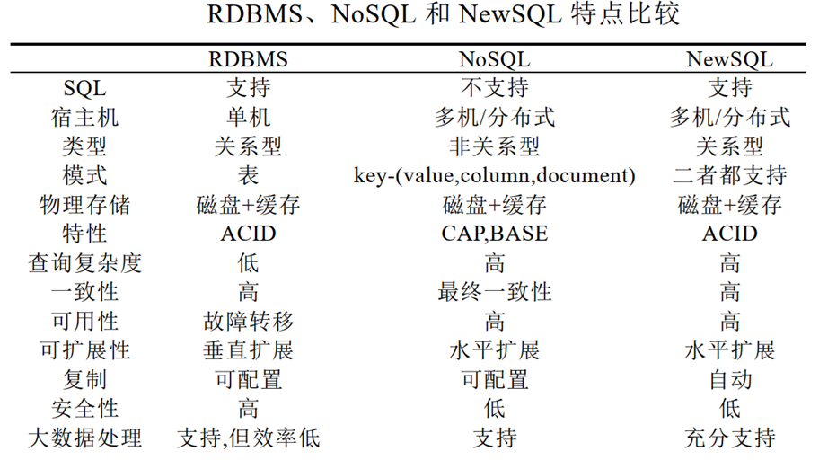
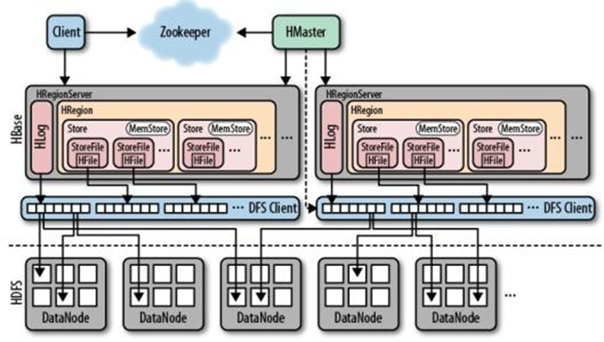

NoSQL总结

# 1 NoSQL数据库概述

## NoSQL数据库特点

1. 易于数据分散和扩展
容易把数据分散到多个服务器，容易进行大量写入操作

2. 高性能


3. 多样性的数据模型

|类型特点|键值数据库|列族数据库|文档数据库|图形数据库|
| ------------- | -------------------------------------- | ---------------------------------------------------- | ---------------------------------------------------- | ------------------------------------------------------------ |
|相关产品|Redis|HBase|MongoDB|Neo4J|
|应用|数据缓存，减轻服务器压力|分布式数据存储与管理|存储、索引并管理面向文档的数据或者类似的半结构化数据|复杂、互连接、低结构化的图结构场合，如社交网络、推荐系统等|
|优势|扩展性、灵活性好、大量写操作时性能高|查找速度快、可扩展性强、容易进行分布式扩展、复杂性低|灵活性高、复杂性低、数据结构灵活，支持事务|灵活性高、支持复杂的图形算法、可用于构建复杂的关系图谱|
|劣势|无法存储结构化信息、条件查询效率较低|缺少标准的查询语言，无法有效地支持多条件查询|查询性能不好，没有成熟的维护工具| 复杂性高、只能支持一定的数据规模|

## RDB NoSQL NewSQL比较

- RDB：关系型数据库
	- 使用SQL操作语言，具有ACID特性，保持数据的一致性，最小冗余，有成熟的技术，支持复杂查询
	- 适合单机，不适合在分布式环境中向外扩展，难以支持高并发的读写
	
- NoSQL：(Not Only SQL) 非关系型数据库
	- 存储的数据结构通常不是表、不支持join操作
	- 不同的nosql数据库之间没有明确的定义和统一操作
	- 但是松散、易于横向扩展，适合分布式
	- 具有特征：模式自由；建议备份；简单的应用程序接口；最终一致性；支持海量数据；不是SQL语言
	
- NewSQL
	- 提供与nosql相同的分布式，仍基于关系模型，保留SQL查询语言和ACID事务特性
	
	


# 2 NoSQL数据库理论基础

分布式系统中的数据一致性：所有节点都能访问到最新版本的数据

## 关系数据库事务特性ACID

- 原子性 Atomicity
事务中包含操作要么全做，要么全不做
由恢复系统实现

- 一致性 Consistency
事务开始前、结束后，数据库都处于一致性的状态；事务执行过程中可暂时不一致
由并发控制系统实现

- 隔离性 Isolation
一个事务不受其它并发执行事务的影响
由并发控制系统实现

- 持久性 Durability
事务提交后，对数据库永久影响；发生故障不能改变事务的持久性
由恢复系统实现

## 一致性模型

应用1、2、3相互独立，可对存储系统进行读写操作

- 强一致性 (即时一致性)
应用1写入一个值，保证后续应用对于该值的读取操作都会返回最新值
单副本数据必然保证强一致性

- 弱一致性
应用1写入一个值，无法保证后续3个应用对于该值的读取操作都会返回最新值

- 最终一致性——弱一致性的一种特例
不一致性窗口：应用1写入到后续3个应用对其读取之间的一段时间
在不一致性窗口内，如果没有其他写操作，可以保证后续应用读取到最新值

- 写后读一致性 Read after Write Consistency
自己写入成功的任何数据，下一刻一定能读取到，保证与自己最后一次写入的一致
由写入节点的主副本负责用户后续的读取操作

- 单调一致性 Monotonic Read Consistency
保证用户在读取到某个值后，不会出现比其更旧的值
将用户与副本建立固定的映射关系，避免在多个副本中切换

- 前缀一致性 Consistent Prefix
A和B有因果关系，要先读到A再读B
对原有数据添加后缀，保证读取数据的前后顺序

- 线性一致性 Linearizability
所有操作被记录在同一条时间线上，任意两个事件可比较先后关系
全局时钟

- 因果一致性 Causal Consistency
可比较部分事件 (同一节点内的事件、通讯节点的事件等) 的顺序，偏序关系
逻辑时钟

**一致性模型强度排序**

线性一致性 >  因果一致性 > { 写后读一致性，单调一致性，前缀一致性} 

## CAP理论

NoSQL是分布式系统，具有高度透明性：每个节点对用户是透明的，用户不区分本地和远程

CAP定理：在分布式系统中，Consistency 一致性、Availability 可用性、Partition tolerance 分区容错性，三者不可兼得

- 一致性 C (此处指强一致)
分布式系统中的所有数据副本，在同一时刻具有同样的值

- 可用性 A
每个请求，可以在一定时间内得到响应

- 分区容错性 P
*分区：分布式系统所分布在的一个自网络*
网络中断、消息丢失的情况下，仍然可以满足一致性或可用性

权衡方案：分布式系统通常在可用性和一致性之间权衡

- CA：放弃分区容错性，将所有数据放到一台机器上
关系数据库，可扩展性不强

- CP：放弃可用性，遇到分区问题时，受影响的服务需要等待数据一致，等待期间就无法对外提供服务
MongoDB、Hbase、Redis等

- AP：放弃一致性，接受数据只能“最终一致”
部分NoSQL数据库、互联网产品

## BASE模型

- Basically Availble：基本可用
分布式系统在出现不可预知故障的时候，允许损失部分可用性

- Soft-state：软状态/柔性事务
允许不同副本之间的数据同步存在延迟
*硬状态：原子性要求的多个数据副本始终一致*

- Eventual Consistency：最终一致性
保证最终数据能够达到一致，不需要实时保证强一致

**ACID与BASE的比较**

ACID|BASE
-|-
强一致性|最终一致
单机|面向分布式系统
难以适应变化|适应变化、简单、快速

## NWR模型

- N：数据所具有的副本数量
- R：一次读操作所需要的最小节点数量
- W：一次写操作所需要的最小节点数量
- W + R > N 保证强一致性
读数据和写数据的节点有重叠

几种特殊情况：

- 写操作要求高可用：W = 1，R = N
- 读操作要求高可用：R = 1，W = N
- 读写性能平衡：W = R = N/2+1

## 两阶段提交协议
two-phase commitment protocol

参与者：实际处理事务的机器
协调者：处理分布式事务的机器

- 请求阶段：
事物发起者首先向协调者发起事物请求
协调者通知参与者准备提交或取消事务
参与者表决同意(执行成功)或取消(执行故障)

- 提交阶段
当且仅当所有的参与者同意提交，事务协调者才通知所有的参与者提交事务，否则协调者将通知所有的参与者取消事务(回滚)

优点：实现简单
缺点：提交阶段如果有参与者没接收到，就会数据不一致

## 时间戳策略

- 每个节点为数据附加时间戳，设置全局时钟进行时间同步
- 事件的先后关系 a $\rightarrow$ b：事件a发生在事件b之前
a和b在同一个进程中，且a在b之前发生，则 a $\rightarrow$ b
a和消息发送方中的事件，b是接收方中的事件，则 a $\rightarrow$ b
有 a $\rightarrow$ b，b $\rightarrow$ c，则 a $\rightarrow$ c

- 无法确定先后的逻辑关系时，两者同时发生

- 逻辑时钟，局部/本地
如果事件a和事件b是同一个进程Pi中的事件，并且事件a在事件b之前发生，那么有：Ci(a) <  Ci(b)
如果事件a为进程Pi上某消息发送事件， 事件b为进程Pj上该消息接受事件，那么有：Ci(a) <  Cj(b)

## 向量时钟

在分布式环境中为各种操作或者时间产生偏序值

一组版本号，假设数据需要存放3份，向量维度就是3
每个数据库有一个版本号，从0开始，[A:0, B:0, C:0]

- 每次修改数据，本节点的版本号加1
- 每次同步数据，会有三种情况
本节点的向量版本都要比消息携带过来的向量版本低：取每个分量的最大值
本节点的向量版本都要比消息携带过来的向量版本高：直接丢弃要同步的版本
出现冲突，有的分量版本大，有的分量版本小：进行冲突仲裁，比如合并

## Paxos协议

核心：节点间如何确定并只确定一个值
不追求值的正确性、权威性、及时性，只追求一致性

**角色**

- Client：请求发起者，系统外部角色
- Propser：向集群提出议案，在发生冲突的时候进行冲突调节
	- 在执行周期中，可能会有多个议案被提出，但只能有一个多数派议案被选定
	- 议案需要有全局唯一编号n，并且全局递增
	- 议案Proposal：编号n + 内容value

- Acceptor：对议案进行投票，可接受不止一项议案
- Learner：没有参照参加
一个节点可以担当多个角色

**拜占庭将军问题**

在不可靠信道上试图通过消息传递的方式达到一致性是不可能的， 所以所有的一致性算法的必要前提就是安全可靠的消息通道

**协议的推导**

- Acceptor必须接受它收到的第一个议案
- 编号N0，值V0的议案被选定后，之后被选定的所有比N0高的议案，值也必须是V0
	- 议案[N0, V0]被选定后，所有比N0高的、且被所有acceptor接受的议案，值必须是V0
	- 议案[N0, V0]被选定后，proposer提出的编号更高的议案，值必须是V0
	- 对于任意的n和v，如果[n, v]被提出，则存在一个由半数以上的acceptor集合S，满足下面两个条件之一：
	没有accepter接受过编号小于n的议案
	如果有accpeter接受过编号小于n的议案，其中编号最大的议案的值是v

**两阶段**

每个acceptor维护3个记录：minProposal(可接受的最小编号), acceptedProposal(最新接受过的编号最大的议案编号), acceptedValuel(最新接受过的编号最大的议案value)

1. 广播prepare：找到已经被选定的值，拦截还没有完成的旧议案
	- propser选择一个编号n，广播prepare(n)
	- acceptor收到prepare(n)
		- if n > minProposal: minProposal = n
		- return 最新接受过的编号最大议案[acceptedProposal + acceptedValuel]
	- propser得到过半数acceptor的回应
		- if 存在acceptor返回已经接受过的议案，选出其中编号最大议案的value，作为自己议案的value
		- if 没有acceptor已经接受过议案，proposer可以继续使用自己提出的value

2. 广播accept：让acceptor统一一个值
	- propser用第1步骤中选择的n和value，广播accept(n, value)
	- acceptor收到accept(n, value)
		- if n >= acceptedProposal: 接受议案，更新自己的记录
		minProposal = acceptedProposal = n
		acceptedValuel = value
		- if n < acceptedProposal: 拒接议案，记录不变
		- return minProposal
	- propser得到acceptor的回应
		- if 存在返回值 > n (有acceptor最小能接受的编号比自己提出的要大): 返回第1步，届时会生成一个更大的编号
		- else：议案被成功批准


## NoSQL数据库水平扩展

- 垂直扩展：使用更好的服务器
- 水平扩展：将数据库运行在更多的机器组成的集群上

**数据库水平扩展的技术**

- 分片：将数据划分成不同的几份，在不同节点上存放不同的数据
可以将经常在一起访问的相互关联的数据分布在同一节点
*对比数据库分区：把一张表的数据分成N个区块，在逻辑上看最终只是一张表，但底层是由N个物理区块组成的*

- 复制：将一份相同的数据复制到多个节点上
	- 主从复制：主节点负责写入操作，将修改扩散到从节点，从节点主要处理读操作
	- 对等复制：所有节点地位相同，同一接受写和读操作

- 两者可同时使用：将数据分片，每一片都有主和从

**三种分片数据划分方式**

- 区间划分：将所有数据均匀划分为n个区间，将区间分布在节点上；随着数据增加，分布不均匀时，调整区间分布，可以允许每个节点持有多个区间，尽量减少数据迁移量
Mongodb

- 流量放置：每条元组被一次放置在下一个节点上，依次循环
- 一致性哈希：负载均衡算法

## 一致性哈希算法

- 单调性：存储新数据时，原有的已分配内容只能迁移到新区，不能被迁到旧区
- 环形hash空间：将value映射到32位空间 ($0~2^{32}-1$)

1. 把对象和存储服务器处理成整数，映射到hash空间
2. 沿顺时针方向将对象归入存储服务器

3. 增加存储服务器。如果某个数据对象顺时针方向上有新的更近存储区，将其归入到新存储区

4. 如果某存储服务器宕机，将受影响的数据对象归入顺时针方向上的下一存储区


# 3 文档数据库

## 基本内容

- 文档document：`字段: 值`，基于JSON表示，相当于RDB表的一行
	- 字段：相当于RDB的列名/属性，字符串类型
	- 值：包含多种类型，数字、字符串、数组、内嵌文档、ObjectId、Date等
	- 每个文档都有主键 `_id`，在集合内部唯一标识，默认类型为ObjectId，写入文档时自动生成
	- 在文档中可以内嵌文档、引用，如下方的cast字段下，值是数组，数组的每个元素是一个文档，该文档引用了存放演员信息的另一个文档
```
{
	"_id": ObjectId("2349789fhjk2348927")
	"title": "La La Land"
	"genre": [ "comedy", "drama", "music"]
	"release_date": 2016
	“cast": [
		{
			"name": "Ryan Gosling"
			"role": "Sebastian"
			"actor_id": ObjectId("32879tfg34")
		},
		{
			"name": "Emma Stone"
			"role": "Mia"
			"actor_id": ObjectId("3q34yr53434")
		},
	]
}
```

- 集合collection：一些document的集合，文档不要求字段相同——无模式，相当于于RDB中的表
- 数据库database：一些collection的集合，相当于RDB中是数据库

## 模式设计

**步骤**

1. 明确系统要涉及哪些动作、读or写、需要的数据信息、频率
2. 识别出有关联的数据、对象，可以仿照ER模型画图
2. 内嵌 or 引用
	- 范式化：将数据分散到多个集合，在集合之间进行数据引用
	- 反范式化：将数据嵌入到一个文档中
	- 

## 架构

**Replica Sets** 

- Replica Set 中的一个成员被选为主节点，负责处理所有写操作，并将写操作的结果同步到其他副本
-  Replica Set 中的其他成员称为次要节点，它们复制主节点的数据，并用于读操作，从库同步主库的日志
- 当primary宕机后，secondary自动转换为主，当原primary重新启动后，又会自动切换回去

**Sharding**

- Shard Server ：存储实际数据的分片
- Config Server：一个 collection 存储在多个shard 中，需要为该 collection 指定一个 shard key，决定该条文档属于哪个 chunk。 Config Servers 存储：所有 shard 节点的配置信息、每个 chunk 的 shard key 范围、 chunk 在各 shard 的分布情况、该集群中所有 DB 和 collection 的 sharding 配置信息。
- Route Process：这是一个前端路由，客户端由此接入，然后询问 Config Servers 需要到哪个 Shard 上查询或保存文档，再连接相应的 Shard 进行操作，最后将结果返回给客户端。客户端只需要将原本发给 mongod 的查询或更新请求原封不动地发给 Routing Process，而不必关心所操作的文档存储在哪个 Shard 上。

## 应用案例

- 用电信息采集
- 商品信息存储
- 文章及评论管理
- 日志数据

# 4 Key-Value数据库

## 数据模型

- 唯一标识的字符串key + 任意大小的数据域value
- 用hash table存储key和其指向数据值的指针

**数据类型**

- String：二进制字节序列
- List：有序的一组string
- Set：无序的不重复string集合
- Hash：键值对的集合，例如python的的字典
- Zset：有序的一组不重复string，通过每个string对应的score(浮点数)进行排序，对应值相同时，按照字典序排序

## 模型设计

- 键的表示：`表名:id`
用冒号分割，前面相当于RDB中的一个表，比如学生、老师，冒号后面写上自定义的id (很多数据库都是插入数据后自动生成id，但是这里键是自己命名的字符串，可以写程序的时候进行递增变化)，也可以嵌套着用冒号
举例：在电影售票系统下的电影表，其中一项电影实体的键可表示为，`db_project:movie:2`

- Hash使用场景：很典型的关系数据库表，例如电影


- Zset使用场景：实现对一组实体按照某个数字性质进行排序，实体通常用它的键名表示，score就是这个数字性质的取值；例如有序地存储电影的评分


- Set使用场景：只记录一组实体，例如某用户看过的所有电影


- redis中，RDB中的一行数据被分开存放到一个个key-value单元中，为了能表示不同数据单元之间的关系，就需要用key的命名来表示层次关系，对于某一类事物的不同实体，在key中加入一个数字表示的id用以区分和定位

## 应用案例

文章投票网站后台：单击文章旁的上下箭头进行投票

- hash存放每一个文章的实体的数据 `article:183`
- zset按照发布时间和评分有序存放文章id `score` `time`
- 为每个文章实体维护一个用户投票名单，防止投票重复 `voted:183`
- 文章类型分组：为每个类型群组创建一个set，存放同属于该类型的文章ID `type:study`
- 对一个分组下的所有文章集合，将其和文章按照分数的有序集合相交，可以得到按照文章评分排序的分组文章zset `score:study`


# 5 图数据库系统

## 图数据库简介

**其他数据库对关系表达的不足**

- 关系数据库：SQL的递归代价比较高
- Key-value、文档和列存储数据库：存储的是无关联的值 / 文档 / 列，难以用于关联数据
添加关联的策略：在数据中内嵌入另一个数据标识符，会导致代价增加、也难以表达反向

**异构图：**包含不同类型节点和链接

**Neo4j简介**

- 高性能NoSQL 图数据库
- 使用图的相关概念描述数据模型：把数据保存为图中的节点以及节点之间的关系
- 在图上进行查找和遍历：深度搜索、广度搜索

**Neo4j特点**

- 逻辑上和物理上都是存储图结构
- 支持ACID
- 高可用性 ，易扩展到大量数据
- 可以通过工具快速检索

**使用场景**

- Navigate deep hierarchies.
- 找到举例较远的实体之间的联系
- 发现实体之间的相互关系
- 例如社交网络、支付网络、道路网

## 属性图模型 

Property graph model

[neo4j官方文档对图数据库的介绍](https://neo4j.com/docs/getting-started/appendix/graphdb-concepts/)

- 节点 Node：图中的实体
	- 节点可有多个标签label，表示不同类别，例如`Person` `Actor`
	标签上也可以附加元数据如索引和约束
	- 一个节点可以有多个属性property(键值对)，例如`name:‘Tom Hanks’` `born: 1956`
	
	- 使用Cypher创建节点`CREATE (:Person:Actor {name: 'Tom Hanks', born: 1956})`

- 标签 Label：将不同的节点进行分类，有同一个标签的节点属于同一类型

- 关系 Relationship：描述起始节点、终点节点之间的关联
	- 关系有方向(单向)、起始节点、终点节点
	尽管关系是有向的，但是可以从任意一个方向navigate
	一个节点可能有到自己的关系
	- 关系有类型type，表示关系属于哪一种类别，例如`ACTED_IN`
	- 关系可以属性(键值对)，例如`roles: ['Forrest']` `performance: 5`
	- 节点可以有任意数量和类型的关系
	
	- 使用Cypher创建关系`CREATE ()-[:ACTED_IN {roles: ['Forrest'], performance: 5}]->()`

- 关系类型 Relationship type
	- 一个关系只能由一个类型
	- 如上图前面加一个`:`用以区分

- 属性 Property：用来在节点和关系上存储信息的键值对
	- 属性的value可以由不同的数据类型，如例如number, string, 单一数数据类型的list(array)

- 命名习惯
	- 节点标签，大写单词开头 `:VehicleOwner`
	- 关系类型，大写表示，下划线链接 `:OWNS_VEHICLE`
	- 属性，除了第一个字母之外，大写单词开头，`firstName`

## 模型设计

1. 识别出数据实体作为节点
	- 通常来讲，节点对应着现实世界中的实体，可以在场景中识别名词来得到
	- 注意，一种实体的不同实例对应不同的节点

2. 设计节点标签
	- 可以用通用名词、一组事物来识别节点的标签，例如交通工具、用户、电影等
	- 
	
3. 识别出节点之间的关系
	- 找到场景中的动作或名词，例如表演、管理、观看
	- 
	
4. 设计属性
	- 通过询问一些和实体有关的问题，或者思考用户想要查询什么样的内容，来找到实体和关系的属性
	- 通常，我们将前面步骤中识别出的实例名字作为属性的一部分，附上键如title、name
	- 

**关系模型转换成图模型**

- 实体表 - 节点标签
- 行 - 节点
- 列 - 节点属性
去除技术主键，例如某些数据库中插入数据后自动建立且递增的主键，这种主键对业务用户没有直接意义
保留业务主键，通常与实体自然属性关联，例如人员的职工编号

- 外键/关系表 - 关系

**NOSQL转换成图模型**

- key-value：如果value中记录了别的key，这表明他们是相互关联的，可以在此至少构建出图


- document：文档的内嵌和引入都可以体现出图的关系

## Neo4j应用案例

- 知识图谱
- 保险欺诈
- 社交推荐

# 6 列族存储数据库

**Hbase数据库中表的特点：**

- 大：一个表有上亿行，上百万列
- 面向列：面向列存储、管理、检索
- 系数：为空的列不占用存储空间，表可以设计的非常稀疏

**使用场景**

- 不适合：数据分析、数据量少、有跨表的事物
- 适合：单表数据量超千万、数据分析需求若、简单的业务查询
- 总结：以低成本来存储海量的数据并且支持高并发随机写和实时查询

**HBase vs RDB**

区别|Hbase|RDB
-|-|-
数据类型|字符串|很丰富
数据操作|简单的插入、查询、删除、清空，表与表之间分离|增删改查之外，还有函数、链接操作
存储模式|列族存储，不同列族的文件分离存储|基于表格结构和行模式存储
修改操作|修改数据的实质是插入新版本，旧有版本被保留|替换修改
可伸缩性|可以轻松横向扩展|通常需要纵向扩展

## 数据模型

- 行键：主键，定位一行数据的唯一值，表中记录按照行键的字典序存储行，例如`201201`
- 列族 Column Family：列的类别，由任意多个列组成，表中的每一行有相同的列族，例如`info` `course`
	- 列 Column：归属到列族中，由列修饰符来标识每一列，例如`info:S_Name` `info:S_Sex` `course:1001`
- 时间戳 Timestamp：数据产生的时刻，表示值的版本，例如 `t10` `t9`
- Cell：行键、列族、列标识的组合，值的数据类型是字符串


- 物理存储时按列族存储


## 模型设计

- 按照业务域来划分表，表中的数据不要求是同一个类型，同一个表中可以存储不同结构的数据
- 列族设计
	- 大多数表设计一个列族就够了
	如果需要多个列族，可以设计多张表满足需求
	表中列族数量不超过3个
	- 多列族情况下，各列族数据的数量级要一致

- 版本设计：最大版本的默认值为1，不建议设置太高

**模型转换**

- 将neo4j转成hbase
	- 实体节点对应行
		- 节点属性中可以唯一标识节点的属性，提出来作为行键
		- 同一类型的节点属性合并为一个列族，每个属性作为列族中的列
	- 实体之间的所用关系合并成一个”关系”列族，关系type作为列族中的列
	- 不用特意得提前设计好列族中有哪些列，一个节点一个节点得遍历，将属性和关系添加到表中即可
	- 时间戳：每个行键对应的时间戳从上往下主键减小，不同的行键有各自独立的时间戳

## HBase实现



- HMaster服务器：负责管理，增删改查、负载均衡、HRegion分配
- 多个HRegion服务器：响应IO请求，包含Hlog、HRegion
	- HRegion：每个表被分成了多个region，存放到了不同服务器的HRegion中
	    - HRegion由多个Store组成，每个Store保存一个列族
	        - Store里有一个MemStore和多个StoreFile
	        - 用户写入的数据首先会放入MemStore
	        - MemStore满了flush成一个StoreFile，以HFile格式保存在HDFS上
	- HLog记录数据的所有变更
	数据被写入MemStore之前，先将数据写入预写日志，再保存日志
	出现问题后，MemStore中未持久化的数据会丢失，可以通过查看Hlog进行恢复
	不同表的日志会放在一个HLog中
	如果HRegionServer下线，需要将上面和HLog进行拆分

## 应用案例

- 银行Hbase读写设计
- HBase在新能源汽车监控系统中的应用
- HBase 在人工智能场景的使用

# NOSQL的比较和选择

- 文档型：数据具有层次结构、经常需要查询嵌套字段的场景；常用于支持灵活的、不断变化的数据结构，
    - 博客文章，评论，点赞
    - 产品信息
    - 用户信息

- 键值型redis：

    - 数据缓存，减轻DB服务器压力，提高系统响应

    - 计数功能：每天的注册用户数

    - 微博的点赞数、评论数、转发数和浏览数

    - 发帖排行榜

    - 存储点赞、签到、打卡这样的简单信息

    - 每个商品/事务的所有标签

    - 显示最新的项目列表：新内容发表，将ID添加到redis列表，在内存中常驻缓存
- 图数据库：适用于处理复杂的关系型数据，如社交网络、推荐系统、网络拓扑等
- 列族存储型：适用于大规模的、需要高度横向扩展的分布式系统
    - 搜索引擎：从网络上抓取新页面，并将页面内容存储到 HBase 中
    - 捕获增量数据：存储监控参数，广告效果和点击流


