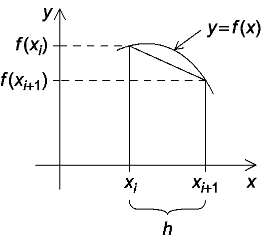

# 2 Distributed Memory Programming with MPI

## Writing your first MPI program

**Identifying MPI process：**非负整数序号

p个进程：0，1，2，...，p-1

### 编译与执行

**Compilation 编译**

mpicc  -g  -Wall  -o  mpi_hello  mpi_hello.c

- 编译命令
- \g：生成debug信息
- \-Wall：输出所有的warining
- \-o：生成可执行文件，文件名列在后面 mpi_hello
- 最后一位：.c源文件 mpi_hello.c

**Execution 执行**

mpiexec  -n  \<number of processes>   \<executable>

- mpiexec：执行命令
- \-n：在后面指明进程数量
- executable：可执行文件

### MPI Programs

- C语言：包含main函数，include了一些头部
- 加入头文件`mpi.h`
- MPI定义的标识符以`MPI_`开头，之后的单词首字母大写并且用`_`连接

### MPI Components

**MPI_Init**

MPI初始化

在这之前不可以有其它的MPI调用

**MPI_Finalize**

MPI结束，释放被分配的资源

在这之后不可以有其它的MPI调用

**Communicators 通讯子**

一组进程，相互之间可以发送消息

在MPI_Init中定义通讯子，其中的进程会在程序开始的时候被创建

`MPI_COMM_WORLD`

`MPI_Comm_size`：传入通讯子 和 保存进程数量的变量 $\Rightarrow$ 获得进程数量
`MPI_Comm_rank`：传入通讯子 和 当前进程序号的变量 $\Rightarrow$ 获得当前进程序号

### SPMD 程序

Single-Program Multiple-Data：单程序多份数据进行任务并行

对1个程序编译

0号进程比较特殊：其它进程来做任务，0号进程接受别的进程传来的消息
使用if-else结构来实现：if !0号 do ... else (0号进程)...

### Communication

**sprintf**

将本进程的信息、进程号、进程数打印到一个变量中

**MPI_Send** and **MPI_Recv**


- `recv_comm` = `recv_comm`：通讯子要相同，保证发送进程和接受进程在一个通讯宇宙中
- `recv_tag `= `send_tag`：非负整数作为消息标识
- `dest` = r, `src` = q：目标地址和源地址是传递消息的两个进程号
- `recv_type = send_type`,  `recv_buf_sz` >= `send_bug_sz`：数据类型一致，可接受的大小要比发送的大小大
- `*_buf_p`：指向通讯数据的指针

对于一些未知的参数，接受方可以进行如下设置：

- 发送方未知：`src` = `MPI_ANY_SOURCE`
会按照进程结束的顺序接收到结构
- tag未知：`tag` = `MPI_ANY_TAG`

使用`MPI_Recv`后接收到的`status`，可以获取发送方、标签、数据大小

- `status.MPI_SOURCE`
- `status.MPI_TAG`

- 数据大小：`MPI_Get_count(&status, recv_type, &count)`
  无法直接对status访问，通过`MPI_Get_count`函数获取到`coun`t中

缓冲与阻塞

- MPI_Send根据实际发送的数据大小，小于临界值会buffer，大于临界值会阻塞
- MPI_Recv总是会阻塞，直到匹配的信息被接收

## The Trapezoidal Rule in MPI

### 梯形法则




将一个曲线下方的面积平分成n分，曲线的x轴范围为 \[a, b]


串行计算的伪代码

```
h = (b-a)/n  //计算被分割的每一区域的h
result = (f(a)+f(b))/2.0
for (i=1; i<=n-1; i++) {  //遍历x1...xn_1
	xi = a + i*h  //xi坐标与a坐标的差为i倍h
	result += f(xi)
}
result *h = result
```

### 梯形法则的并行化

并行程序的四个基本步骤

1. 将问题分解为不同类型的子任务
2. 找出任务之间的通讯桥梁
3. 将任务聚合为复合任务
4. 将复合任务映射到中心

梯形法则的两个子任务

- 计算每个梯形的面积
- 将已经计算好的面积进行相加

并行计算的伪代码

```pseudocode
// 假设进程个数comm_sz可以平分n
h = (b-a)/n
local_n = n/comm_sz  // 每个进程负责处理的梯形数
local_a = a + my_rank*local_n*h  //获取当前进程的起始位置
local_b = local_a + local_n*h   //获取当前进程的结束位置
local_integral = Trap(local_a, local_b, local_n, h)  //计算当前进程的梯形面积
if my_rank!= 0:
	send local_integral to process0
else:  //主进程process0
	total_integral = local_integral
	for (proc=1; proc<comm_sz; proc++):
		receive local_integral from proc
		total_integral += local_integral
if my_rank == 0:
	print result
```

## IO

**Ountput**

所有的进程都可以执行输出
当有多个进程向相同的设备输出时，输出的结果会是不可预计的
可以让所有的进程输出给process0，最后由0号同一输出

**Input**

大多数MPI只允许0进程访问`stdin`
由process0读取数据，并发送给其它的数据

## Collective communication

### Tree-structured communication


nMPI derived datatypes.

nPerformance evaluation of MPI programs.

nParallel sorting.

nSafety in MPI programs.