# chap2 并行硬件和软件

## Basics of caching

2.2.1

缓存：访问速度更快的内存地址集合

CPU缓存：与CPU位于同一块芯片，或者位于其他芯片达能更快地访问


## Cache mappings

2.2.2

规定：从主存中取出一行后应该放在缓存中的哪个位置

- **Full associative 全相联：**任意位置
- **Direct mapped 直接映射：**每行对应一个唯一的缓存位置
- **n-way set associative n路组相联：**每行可以放在n个缓存位置的其一

当有多个可以放入的位置（直接映射和n路组相联），还需要决策替换其中的哪一个

16行主存和4行缓存之间的分配示例：

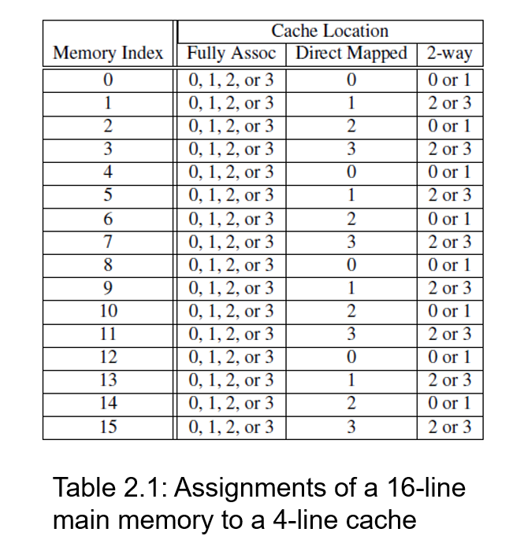

## Caches and programs

2.2.3

第一个嵌套循环比第二个的性能更好：

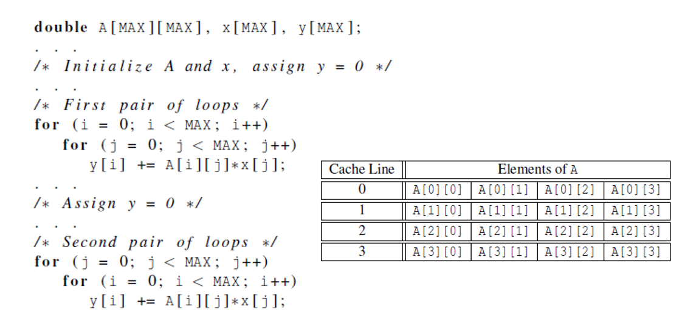

c语言以行主序在主存中存储二位数组。

当期望访问数组的某一元素但不在缓存中时，就会从主存中按顺序取出缓存可容纳的一行进行替换。

如果不按行读取数组，而是按列读取数组，可能导致很快就会命中失败，需要再一次访问主存。

如果对数组按行读取可以增加命中率，减少读取主存的次数，从而性能更好。

## Instruction Level Parallelism

2.2.5

让多个处理器部件或功能单元同时执行指令，以此来提高处理器的性能

两种实现指令级并行的方法：

- **Pipelining 流水线**：按阶段安排功能单元，上一阶段的功能单元输出是下一个单元的输入
- **Multiple issue 多发射**：复制出多个功能单元，每个单元同时执行不同的指令，没有依赖关系的指令才能同时执行

**流水线例子：**计算 $9.87 \times 10^4+6.54 \times 10^3$

涉及到下面7个计算步骤：取数、比较指数、指数移位对齐、相加、结果规格化、结果舍入、结果存储

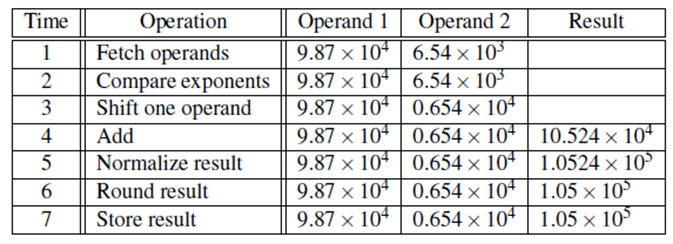

假设每个operation需要1ns，需要循环1000次浮点数相加，最终需要7000ns

把以上的7个步骤分配到7个独立的硬件或功能单元，上一个单元的输出作为下一个单元的输入

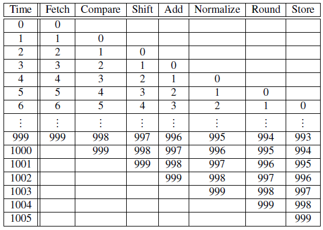

时间5之后，流水线每个时间可以产生一个结果，而不是上图中7个时间产生一个结果

尽管完整的一次浮点数相加仍需要7ns，但是加入流水线后1000次相加只用1006ns

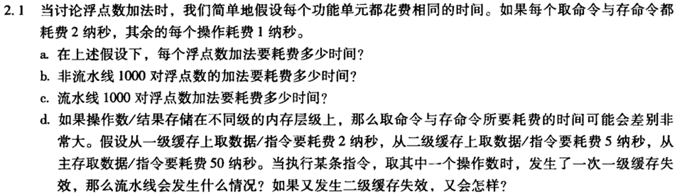

> a. 9ns
>
> b. 9 $\times$ 1000 = 9000ns
>
> c. 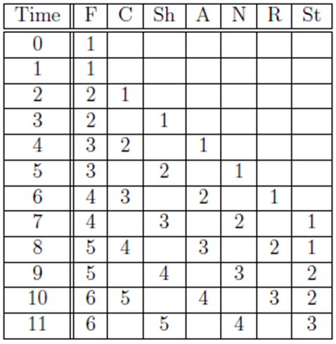
> 	1000 $\times$ 2 + 7 = 2007ns
>
> d. 一级缓存取操作数失败 -> 取数时间变为 2+5=7ns
> 	二级缓存取操作数失败 -> 取数时间变为 2+5+50=57ns
> 	取数时间如果延长，流水线上后续相加任务需要进行等待，延长的时间会使得最终的流水线完成时间也会有相应的延长

## Flynn’s Taxonomy

2.3.1

Flynn分类法：按照计算机可以同时管理的指令流和数据流数目，对系统进行分类

- SISD：一次执行一条指令、存取一个数据项；冯诺依曼系统
- SIMD：单指令流 多数据流；把数据分散到不同的处理器，对它们执行相同的指令
- MISD：多指令流 单数据流
- MIMD：多指令流 多数据流；有一组独立的处理单元，每个处理单元都有自己的控制单元和ALU

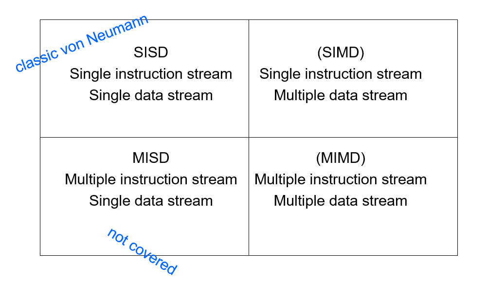

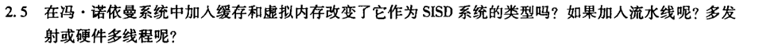

硬件多线程：一种并行机制，确保当前线程被阻塞时，系统还可以继续运行其它线程

> 加入缓存和虚拟内存没有改变它的类型，因为这只引入了硬件上的改变，目的是为了提高系统性能和内存管理效率，但是没有改变指令流和控制流，所以仍然是SISD类型
>
> 如果流水线中同一时刻只存在一种指令，则是SIMD系统；如果流水线中同一时刻会对多个数据项执行不同的指令，则是MIMD系统 ==???这里有疑问==
>
> 多发射是复制出多个功能单元，每个单元同时执行不同的指令，没有依赖关系的指令才能同时执行。每个处理单元都是独立的，指令流和数据流都不同，所以是MIMD系统
>
> 硬件多线程是一种并行机制，确保当前线程被阻塞时，系统还可以继续运行其它线程。这允许多个线程同时执行多个指令流，如果这些线程处理不同的数据流，则是MIMD系统

## Cache coherence

2.3.5 缓存一致性

程序员对缓存什么时候更新没有直接控制，所以在多核系统中，如果不同处理器的缓存中存储了共享变量的副本，则一个处理器更新该变量时，其它的处理器也应该进行相应的更新

两种保证一致性的策略：

- **Snooping Cache Coherence 监听一致性**
- **Directory Based Cache Coherence 基于目录的一致性**

监听一致性 

- 多个核共享一个总线，总线上传递的信号可以被其它核看到
- 某一个核更新它缓存中的变量副本时，会通过总线广播这一更新信息
- 如果其它核在监听总线，就可以得知该变量已被更新，并对自己缓存中的同一变量标记为非法
- 广播是针对所有核的，频繁广播会使得系统性能下降

基于目录的一致性

- 使用一个”目录“数据结构来存储每个内存行的状态
- 当一个变量被更新，查询目录，将包含该变量的内存行状态标记为非法
- 需要额外的存储空间，但变量更新时只需要和存储了这个变量核交流即可

## Speedup of a parallel program

2.6.1

**加速比S** = 线性执行时间 / 并行执行时间


**效率E** = 加速比S / 处理器数量p

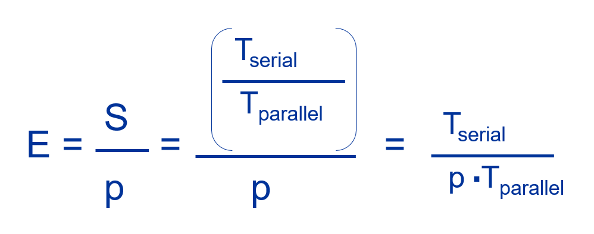

阿姆达尔定律：**加速比有上限**

假设：

1. 只能对串行程序的90%实施并行
2. 可并行部分加速比理想化为p，随进程数线性增加
3. $T_{serial}$ = 20s

可并行部分的并行执行时间为：
$$
T_{parallel}^{'} = \frac{T_{serial}^{'}}{S} = \frac{0.9 \times T_{serial}}{p} = \frac{18}{p}
$$

不可并行部分的串行执行时间为：
$$
(1-0.9) \times T_{serial} = 2
$$

**并行版本的总执行时间为：**
$$
T_{parallel} = \frac{18}{p} + 2
$$

**真实加速比为：**
$$
S = \frac{T_{serial}}{T_{parallel}} = \frac{20}{\frac{18}{p} + 2}
$$

随着p不断增加，加速比会趋近于10，但是不会超过10

**超线性 Superlinear：**加速比S > 处理器个数p

示例

- 单核程序cache有限，多核程序可以将所有数据放入cache（加入多核程序处理同一个数据）
- 并行DFS可以快速搜索目标结果

# chap3 MPI

分布式内存的并行编程

## MPI reduce

3.4.2

在全局上进行operator指定的运算操作

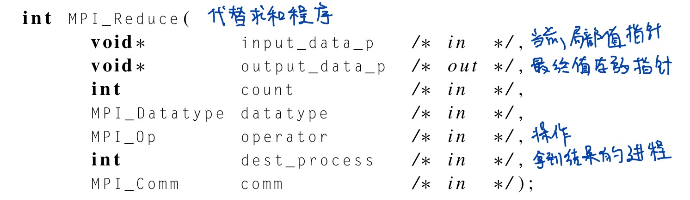

## Collective vs. Point-to-Point Communications

3.4.3 集合通信与点对点通信

集合通信：涉及通讯子中所有进程的通信

点对点通信：MPI_Send 和 Rec

- 通讯子中的所有进程需要调用同一个集合通信函数

- 每个进程传递给集合通信函数的参数需要相容

- `dest_process` 指定的进程才会使用 `output_data_p`参数，但其它进程依旧需要往里面传入一个相应参数

- 点对点通信通过标签tag和通讯子来匹配

    集合通讯只通过通讯子和调用的顺序来匹配

**Multiple calls to MPI_Reduce**

假设3个进程都调用了MPI_Reduce来进行求和，并将目标进程设置为0号

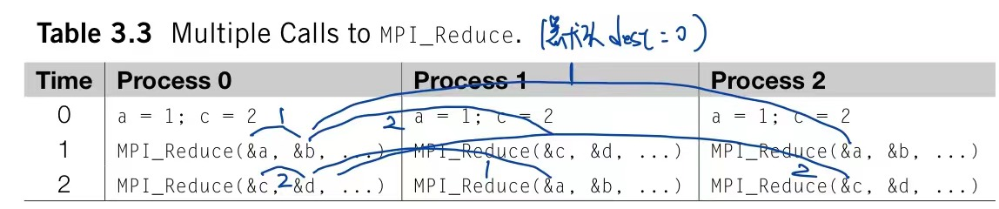

b = 1 + 2 + 1 = 4

d = 2 + 1 + 2 = 5

## **Partitioning options**

3.4.6 数据分发

分发向量/数组数据到不同进程时，需要对划分方法进行决策

- <span id ="块划分">**块划分 Block partitioning：**</span>为每个进程分发连续的数据分量

- **循环划分 Cyclic partitioning**：挨个给进程分发分量，一次发一个

- **块-循环划分 Block-cyclic partitioning：**挨个给进程分发分量，一次发指定个数

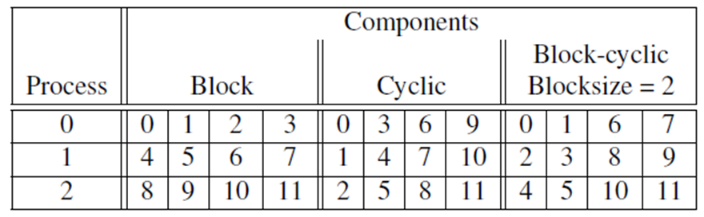

示例中进程数=3，等待分发的分量个数=12

# chap4 pthread

共享内存的并行编程

## Matrix-Vector Multiplication in pthreads

4.3 矩阵向量乘

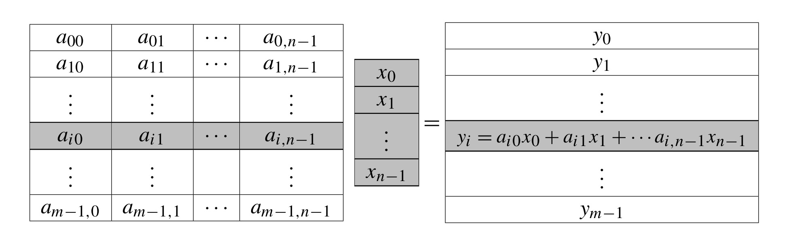

矩阵 A $\times$ 向量 x = 向量 y

将目标向量y的计算，分发给不同的线程，通常分块划分[（见上）](#块划分)，每个线程平分y的分量进行计算

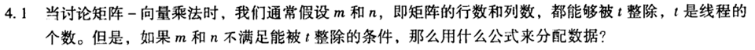

```pseudocode
# n为等待分发的分量个数，p为线程数目

# 计算商：每个线程计算的分量数目
quotient = n/p
# 计算余数：被剩下的分量数目
remainder = n%p 

# 计算第一个分量下标 first_i
# 将剩余的分量分给标号小的线程
if rank < remainder:
	# 这些线程比别人多算1个分量
	n_count = quotient + 1
	# 由于线程标号从0开始，所以前面有rank个线程计算
	first_i = rank * n_count
else:
	# 其余线程计算原定分量数目
	n_count = quotient
	# 多余的内容已被前面的线程算过，所以要加上余数
	first_i = rank * n_count + remainder  

# 计算最后一个分量下标 last_i
# 不减1的话，结果是下一个线程的第一个分量下标
last_i = first_i + n_count -1
```

# chap5 openMp

共享内存的并行编程

## _OPENMP

5.1.3

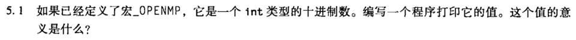

```
#ifdef _OPENMP
#	include <omp.h>
#endif

int main(int argc, char* argv[]) {
# ifdef _OPENMP
	printf("_OPENMP = %d\n", _OPENMP);
# else
	printf("OPENMP not defined.");
# endif
	return 0;
}
```

`_OPENMP` 可以用于检查，只有编译器支持openmp时，其值才有意义，代表的是OPENMP标准的发布时间 201511

## 消除数据依赖

5.5.2

在循环中，计算可能依赖于先前循环的计算结果，但是openmp并不会检查依赖，这会造成错误

类似于"找规律"，让循环中的计算只依赖于迭代量 i，并得到一个公式

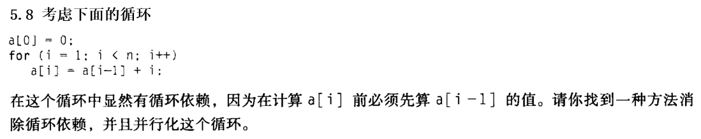

```
# pragma opm parallel for num_threads(thread_count) \
	default(none) private(i) shared(a, n)
for (i=0;i<n;i++)
	a[i] = i*(i+1)/2
```

设定了 `default(none)`：我们要显示声明变量的作用域

`private()`：其中包含循环中进程的私有变量

`shared()`：其中包含循环中进程之间共享的变量

## 奇偶排序

奇偶排序：将排序分为两种阶段——奇阶段和偶阶段

- 奇阶段：下标为计数的分量与右方分量比较，小的保留在左边

- 偶阶段：下标为偶数的分量与右方分量比较，小的保留在左边

5.6.2

简单并行奇偶排序：分别在奇阶段和偶阶段内部使用pragma for从句

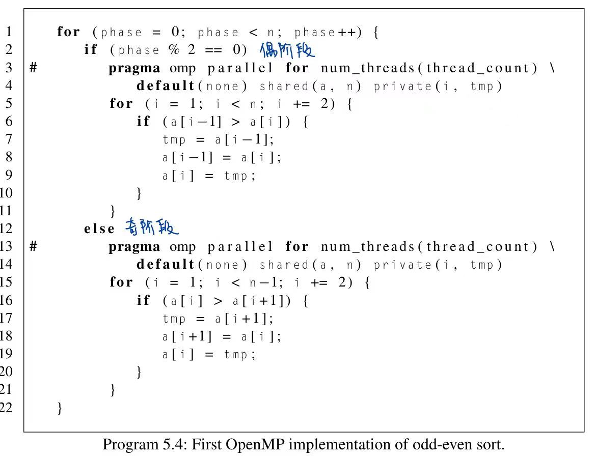


简单版存在的问题：

- 每一个phase中，需要等待所有线程都执行结束，才能进入下一个phase
- 创建和结束线程的开销：在每一次外层循环开始或结束时，都会创建或合并pthread

改进：

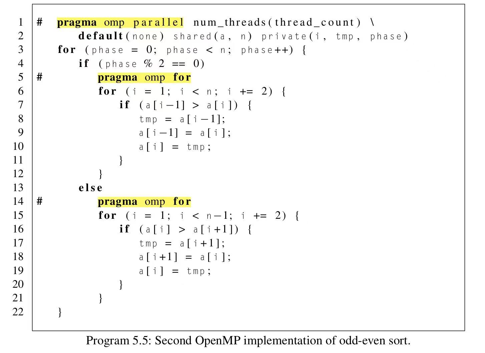

- 在进入外层循环前使用 `parallel` 指令，创建好一些pthread

- 在进入内层循环前使用 `for` 指令，让程序只使用已经创建好的pthread
- 第一个版本中， `parallel for` 指令则会每次都创建新的

##  Cache伪共享

5.9

线程之间没有共享任何变量，共享了同一个缓存行，一个线程修改了此行中的变量，会使得整个缓存行在其它线程中标记为非法，其它线程就只能前往主存再次获取变量，这使得它们访问主存的行为看起来像是在共享变量

## 矩阵向量乘法中的Cache问题

Ax=y


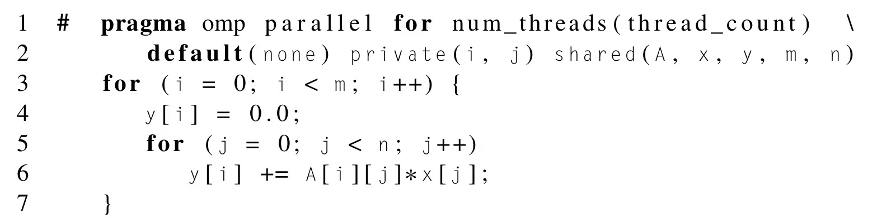

假设我们要计算的y的分量很少，可以在一个缓冲行放下；每个线程对该行中的某一个分量进行修改，虽然其它线程不读取这个分量，但是这一行的缓冲内容都会失效，其它线程就需要去主存中读取自己对应的分量

修改上面的矩阵乘法，使得每个线程私有存储自己处理的分量，计算完成后将其更新到共享变量中，这样就减少了修改共享变量的次数

```
# pragma omp parallel num_threads(thread_count) \
	default(none) private(i,j,sum) shared(A,x,y,m,n)
  {
#  	pragma omp for
	for (i=0; i<m; i++) {
		sum = 0.0;  #加入私有变量
		for (j=0; j<n; j++)
			sum += A[i][j]*x[j];
		y[i] = sum
	}
  }
```

# CUDA

## CUDA架构

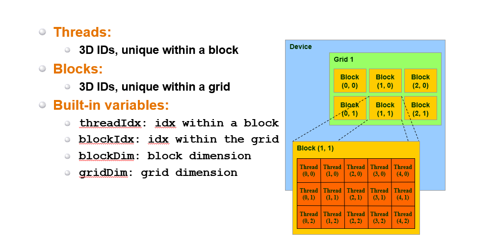

- 一次内核启动有一个网格 grid

- 每个网格包含若干个线程块 block

- 每个线程块包含若干个线程 thread

## idx计算

当blockDim和gridDim都为1时

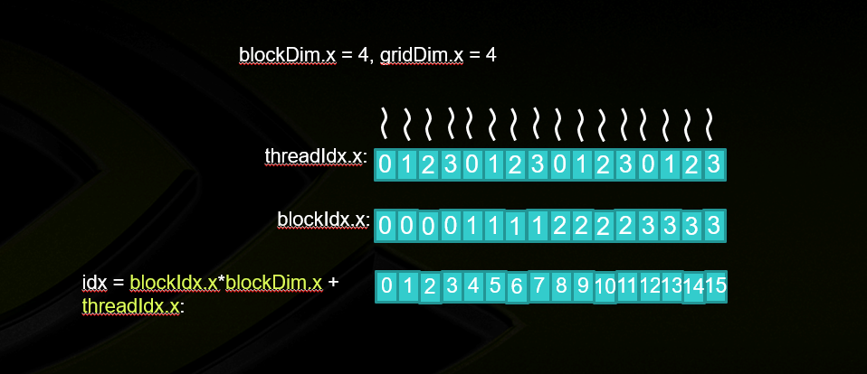

- gridDim.x = 4：一共有4个block，blockIdx.x $\in$ {0,1,2,3}

- blockDim.x = 4：1个block里有4个thread，threadIdx.x $\in$ {0,1,2,3}

- idx = blockIdx.x\*blockDim.x + threadIdx.x

## CUDA程序基础理解

长度为 N 的向量加法

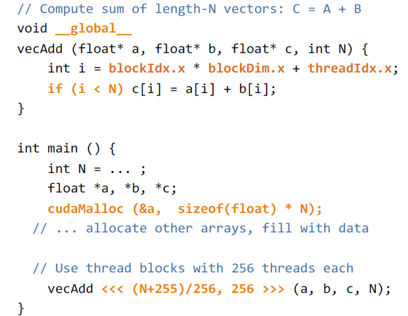

- `__global__` 放在核函数定义的开头
- 对于每个 `id < 向量长度N` 的线程，计算一次对应 `id` 的分量加法
    - 线程 `id` 的计算：`idx = blockIdx.x * blockDim.x + threadIdx.x`

- 核函数调用时，函数名之后、参数之前加入`<<<线程块数目,每个线程块内线程数目>>>`
- 给定线程块内的线程数 `p`，则线程块数目 = ` (N+p-1)/p`
    - 可以保证分量个数 `N` 无法整除线程数 `p` 时，可以多分出1个线程块

- 使用函数管理GPU上的内存
    - `cudaMalloc()` 分配
    - `cudaFree()` 释放

## 线程块内的线程同步

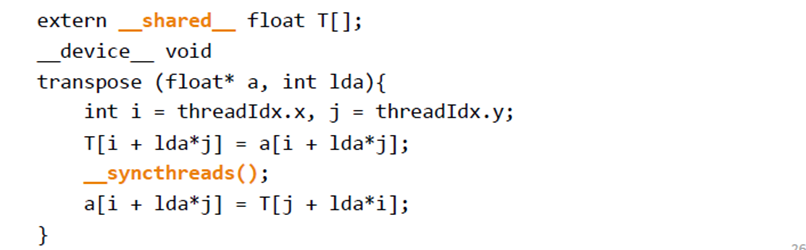

- 使用 `__share__` 声明线程块内的共享变量
- 使用 `__syncthreads()` 同步对共享变量和全局变量的访问
    - 在写完共享变量之后调用
    - 所有线程需要执行相同的` __syncthreads()`
- 不同线程块之间不能用这个方法同步

## Reduction in CUDA

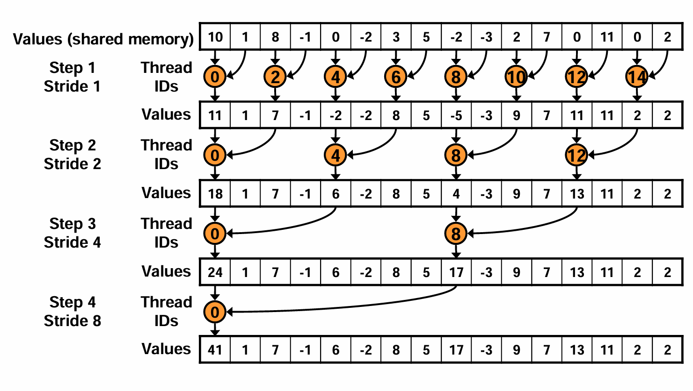

- s：相加的两个变量的间隔 stride

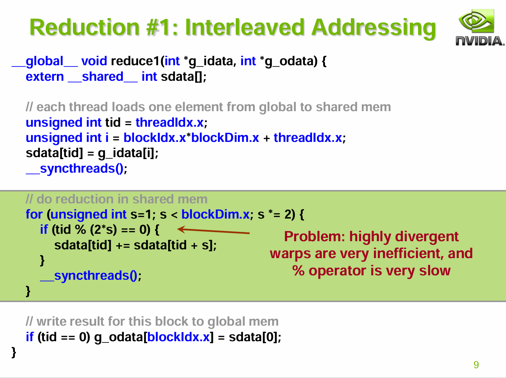

*warp：在一个block中，一个warp包含32个并行thread，并执行同一个指令*

- warp divergence：同一个warp中的所有thread必须执行相同指令，在遇到控制流语句时，如果线程进入了不同的分支，则除了同一时刻正在执行的分支外，其余分支都被阻塞了

- 模运算比简单的比较操作更复杂，且会导致 warp 内线程在执行判断时的路径不一致

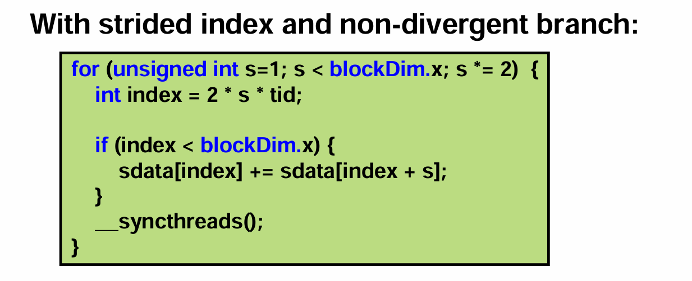

- 通过线性计算出 index
- 分支判断时使用简单的小于比较
