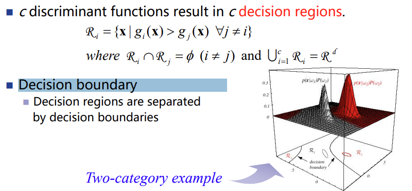
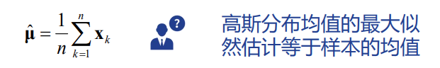
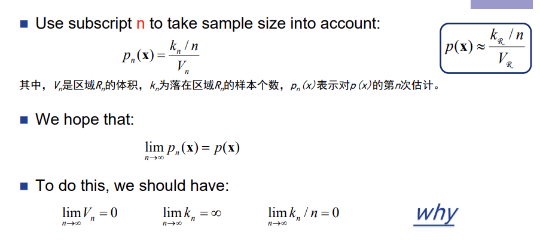
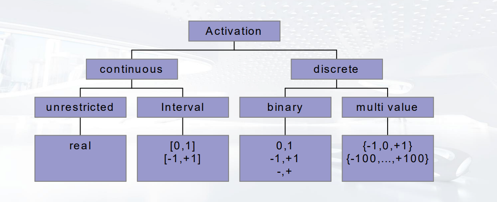

机器学习

# 1 Introduction

## DL&ML&AI

## 数据挖掘

- 定义：
通过对大规模观测数据集的分析，找到确信关系，将数据以可理解、易使用的新颖方式来概括数据

- 挖掘对象：
知识、隐藏的关系、潜在事实
对决策制定或理解任务本质有利的信息

- 数据种类：
文本数据、网络数据、图像、音频等等

## 机器学习

- 定义：
A computer program is said to learn from experience E with respect to some class of tasks T and performance measure P, if its performance at tasks in T, as measured by P, improves with experience E

- 特征 Feature：做出判断的依据
- 标签 Label：结论

### 机器学习模型

- 监督学习 Supervised learning：训练数据有标签
- 无监督学习 Unsupervised learning：训练数据无标签
- 半监督学习 Semi-supervised learning：有部分子集有标签
约束聚集算法 constrained clustering
主动学习 active learning
- 强化学习 reinforcement learning

### 验证集和交叉测试

- 保留一部分标签数据作为验证机
- 验证集的大小：
    - 没有验证集：只学习训练数据不一定有好的测试效果(泛化能力问题)，对有标签的数据进行验证，可以调整模型
    - 标签数据太少时，验集就不够
    - 验证集越大越好，模型越可靠
- 交叉测试：实施k此学习，轮换训练集、验证集

# 2 贝叶斯决策论

## 基本概念

**相关符号和概念**

- $x$ $\in$ $R^d$：d维特征向量
- $\Omega$ = {$\omega_1$, $\omega_2$, ..., $\omega_c$}：c种类别的集合
$\omega_i$ 是一类

- $P(\omega_i)$：先验概率 (prior probability)
$\omega_i$ 类的样本个数占总样本数的比例

- $P(x|\omega_i)$：似然 (likelihood)
可以看成 $\omega_i$ 条件下的概率密度函数

- $P(x)$：evidence probability
$P(x)$ $=$ $\sum_{i=1}^c$ $P(x|\omega_i) \cdot P(\omega_i)$ 
x的概率密度函数，由全概率公式根据条件概率密度和先验概率求得

- $P(\omega_i|x)$：后验概率 (posterior probability)
给出有一组特征的向量x，此种情况下属于$\omega_i$ 的概率

**计算公式**

**最小错误率贝叶斯决策**

- 错误率

- 决策类别 = arg max P($\omega _i$|x) $\Leftrightarrow$ min P(error|x)

## 广义贝叶斯决策论

Generalized Bayes Decision Rule

**最小风险贝叶斯决策**

- A = { $\alpha_1$,  $\alpha_2$, ...,  $\alpha_a$ }：a种可能采取的行为集
- $\lambda$ $(a_i|\omega _j)$ = $\lambda _{ij}$：类别为 $\omega _j$ 时采取行动 $a_i$ 的风险
- $R(\alpha _i|x)$ = $\sum _{j=1}^c$ $\lambda$ $(a_i|\omega _j)$ $P(\omega_j|x)$：条件风险
- $\alpha(x)$：根据x选择行为$\alpha$的一种决策方法
- 总风险 R = $\int$ $R(\alpha(x)|x)$ $\cdot$ $p(x)$ $dx$
- 最小风险贝叶斯决策：对于所有可能的行动，i = 1 ... a，计算条件风险 $R(\alpha _i|x)$ ，并选择行为 $\alpha_i$ 使得条件风险最小化

最小化后的总风险：贝叶斯风险

**两类分类问题**

- 假设行为 $\alpha_i$：决策判定类别为 $\omega_i$
- $\lambda_{ij}$ = $\lambda$ $(a_i|\omega _j)$ ：类别为 $\omega _j$ 时误判为 $a_i$ 所引起的损失

采用最小风险贝叶斯决策，当似然比满足如下时，判定类别为 $\omega_i$ ( 即采取行动 $a_i$ )

经过计算推断，当$\lambda _{11}$ = $\lambda _{22}$ = 0；$\lambda _{12}$ = $\lambda _{21}$ = 1 时，最小错误贝叶斯决策是最小风险决策的一个特例
$$
R(\alpha _1|x) < R(\alpha _2|x) \Leftrightarrow P(\omega_i|x) > P(\omega_2|x)
$$

推断过程见ppt

**判别函数 Discriminant Function**

- 每个类别 $\omega_i$ 有一个判别函数 $g_i(x)$，i =1 ... c
- 如果对某一个类别 $\omega_i$和样本x，如果 $g_i(x)$ **大于**所有其他判别函数值，则将x分类为 $\omega_i$

- 风险最小化：$g_i(x)$ = $-R(\alpha _i|x)$

- 最小错误率 / 最大概率：$g_i(x)$ = P($\omega _i$|x)
可以转化为下面的形式，但是我不明白为什么 P(x) 可以被去掉  : (

- 两者关系

**决策区域 Decision Region**

- 每个判别函数  $g_i(x)$ 有一个决策区域 $R_i$
- 在 $R_i$ 中，想该区域中的任何样本分配给 $\omega_i$
即在 $R_i$ 中，判别函数 i 比 任何其他判别函数的值都要大

- 决策边界 Decision boundry：分割决策区域的边界

- 仔细辨别可以看出，上面的例子中，判别函数 $g_i(x)$ 为 $P(x|\omega_i)$ $P(\omega_i)$

**样本服从概率分布**

- d维向量空间上的 X = $(x_1, x_2, ..., x_d)^T$，服从一个d维的联合概率分布 p(X) = p(x1, x2, ..., xd)

- 向量的期望E[X] = $\mu$ = $(\mu_1, \mu_2, ..., \mu_d)^T$，在各个分量上取边缘分布的期望值

- 当样本服从已知概率密度函数公式的分布，比如高斯分布，可以根据公式 $g_i(x)$ = $lnP(x|\omega_i)$ + $lnP(\omega_i)$，将公式代入到 $P(x|\omega_i)$中，计算出判别函数
	
	

# 3 参数化估计

计算后验概率的两种方案

- 对相对频数进行计数，计算出所有的 $P(x|\omega_i)$ 和 $P(\omega_i)$
    - 但是训练样本有限，并不能很好的通过计数来学习
- 进行密度估计：通过样本数据估计概率密度函数，推出潜在的概率分布
    - 参数化估计：假设数据服从的概率分布已知，但是参数未知，通过最大似然估计等方法估计出参数
    - 非参数化估计：不假设数据服从的具体概率分布，直接从数据中构建概率密度函数

**参数估计**

- D = { D1, ..., D2, ..., Dc}：对训练样本集D，所有标记类别为$\omega_i$的样本分到一个集合Di
	- Di样本集中的样本都是独立同分布的
	- P($\omega_i$) = |Di| / $\sum_{j=1}^c|D_j|$

- 假设某类别下$\omega_i$，样本分布具有一些参数 $\theta_i$
	- 例如服从正太分布：p(x|$\omega_i$) ~ N($\mu_i$, $\Sigma_i$)
	$\mu_i$ 和 $\Sigma_i$： $\theta_i$
	- 如果X为d维随机变量，$\Theta_i$ 则包含 d+d(d+1)/2 个自由参数

- 我们使用 Di 来估计未知的参数向量 $\theta_i$ = $(\theta_1, \theta_2, ..., \theta_m)^T$

- 最大似然估计：参数是客观存在但是未知的固定量；通过最大化训练样本的似然函数取得。
- 贝叶斯估计：将参数视为已知先验概率分布的随机变量；通过训练样本获得参数的后验概率分布

## 极大似然估计

Maximum-Likelihood Estimation

**概率与似然**

- 概率：描述参数已知时，随机变量的输出结果
- **似然：**已知随机变量的输出结果，未知参数的可能取值
- 最大似然估计：通过证据对参数进行推断，并得到最可能的参数

**极大似然估计**

- 给出一个样本集D，每个样本都独立，且来自于某个具有参数的分布整体，p(x|$\theta$)，极大似然估计的目标选取一个 $\hat{\theta}$ 使得数据的发生概率最大
理解为，在某个参数值下，该样本集D发生的概率是0.5，在另一个参数下概率是0.8，那我们就认为模型复合第二个参数

- 样本集：D = {x1, x2, ..., xn}
- 根据独立变量的乘法公式：P(D|$\theta$) =P(x1|$\theta$) P(x2|$\theta$) ... P(xn|$\theta$) 
对于n个训练样本，将参数作为函数自变量，对每个样本的概率密度函数进行累乘

- 似然函数：L($\theta$|D) = P(D|$\theta$) = $\prod_{i=1}^n$ p($x_i$|$\theta$)
- 最大似然估计：$\hat{\theta}$ = arg max L($\theta$|D)
	- 通常情况下对似然函数取log
	
- 求解方法：l($\theta$|D) 对 $\theta$ 各个分量求偏导 = 0

**高斯分布的极大似然估计**

- 均值未知、方差已知

- 均值和方差都未知

**正态总体的极大似然估计**

## 贝叶斯估计

Bayesian Estimation：将参数看作随机变量

- P($\omega_i$|x) = P($\omega_i$|x, D)
- P($\omega_i$|D) = P($\omega_i$)
- P(x|$\omega_i$, D) = P(x|$\omega_i$, Di)
	

假设每个类都是独立的：
$$
P(x|\omega_i, D_i) \Leftrightarrow P(x|D)
$$

不会

# 4 非参数化估计

参数估计的问题：假定的参数形式可能于实际情况不一致

**密度估计**

- 当一个区域很小，上面的概率密度函数p(x)几乎不变，一个向量x落在区域中的概率为：p(x)$\cdot V_R$
V是区域体积

- 假设有n个x独立同分布于p(x)，其中会有$k_R$个落在区域中，一个样本落在区域中的概率为：$k_R$/n
- p(x) ≈ ($k_R$/n) / $V_R$

- 加入下标n，对样本集进行考虑：p($x_n$) ≈ ($k_n$/n) / $V_n$
	- 
	- 固定$V_n$：Parzen窗
	- 固定$k_n$：k最近邻

## Parzen窗

**窗函数**

- 在x处定义一个棱长为$h_n$的超立方

- 窗函数 $\varphi$ ( (x-x') / $h_n$ )：
	
	- x'在窗中，函数值为1
	- x'不在窗中，函数为0

**估计概率密度函数**

- $k_n$ 在x处超立方体中样本个数：对所有样本的窗函数值求和
- $p_n(x)$：parzen概率密度函数

- 概率密度函数$p_n(x)$：对于任意一个样本x，根据n个训练样本点到x的距离，固定窗宽度$h_n$，计算出x处的概率密度
    - $h_n$较大时，窗比较大，$p_n(x)$比较平缓
    - $h_n$较小时，窗比较大小，$p_n(x)$比较有凸起

$p(x|\omega_i)$ 就可以根据上面的方法，把类别i的所有训练样本提出来，计算x在这些样本上的概率密度函数，就可以使用贝叶斯公式进行计算了

**$V_n$的选择**

- n $\rightarrow$ $\infin$时：$V_n$ $\rightarrow$ 0；$n \cdot V_n$ $\rightarrow$ $\infin$
窗体积趋于0的速度要比1/n区域0的速度满：让Vn尽量小，但响应样本要尽量多

- $V_n$ = $V_1$ / $\sqrt{v}$
- 合理选择初始体积$V_1$

## k最近邻

- 对p($x_n$) ≈ ($k_n$/n) / $V_n$：固定$k_n$
- 概率密度函数$p_n(x)$：对于任意一个样本 x ，生成一个单元包括进距离 x 最近的 k 个邻居，用单元的体积作为 $V_n$

**$k_n$的选择**

- n $\rightarrow$ $\infin$时：$k_n$ $\rightarrow$ $\infin$；$V_n$ $\rightarrow$ 0
- $k_n$ = $\sqrt n$

**距离度量方法**

**k近邻算法流程**

- 给定测试样本x，计算它与训练集中每个样本的距离
- 找出距离x最近的k个训练样本
- 由k个样本的多数类决定x的类

**k近邻算法的决策边界**

- 将不同的类划分开来；决策边界上的点距离它周围的样本一样近
- 训练数据集越多，决策边界会越复杂

**优点：**

- 原理简单；可解释性强；
- 决策边界非常灵活

**缺点：**

- 如果噪声数据比较多，k近邻对噪声很敏感，边界过拟合
增大k，边界会平滑，但是会欠拟合

- k值不好确定
	- 解决办法：将一部分标记数据作为验证集，在验证集上验证不同k值的准确率，选择错误率最小的那个k
	- 交叉验证(补充)：
- 计算量大：样本会很多，特征会很多

# 5 线性判别函数

## 线性判别函数

[判别函数](#判别函数)

**线性判别函数 Linear Discriminant Function**

- 优点：好计算、分析、学习
- 通过最小化准则函数进行学习，例如最小化训练误差
- 缺点：训练误差小并不能保证测试误差小——过拟合

**二分类情况**

- d维样本，考虑 d+1个参数 (w是d维，wo是常量)

## 判定面

**判定面 Decision Surface**

- 在特征空间中，线性判别函数通过一个超平面将空间划分成两部分
- 向量w代表超平面的方向
- 参数wo决定超平面的位置

**增广空间下的判定面**

- 增广权向量a：将wo和w合并
- 增广特征向量y：在原特征向量前面加入分量“1”
wo对应系数为1，w对应样本的d个维度

- 判定面：$a^Ty$ = 0 —— 穿过增广特征空间的零点

**线性可分**

- 对一组样本y1, y2, ..., yn，两种标签$\omega$1, $\omega$2
- 如果可以找到一个向量a，满足以下两个条件，则说明样本集线性可分
	- 如果 $y_i$ 为$\omega$1，$a^T$ $y_i$ > 0
	- 如果 $y_i$ 为$\omega$2，$a^T$ $y_i$ < 0

**解空间 Solution Region**：所有符合线性可分条件的向量a的集合

## 参数学习

**准则函数**

- 表示对一个解的惩罚值或者损失值
- 学习目标：最小化准则函数

**梯度下降法**

- 对一个准则函数，计算其对参数的梯度，沿着梯度反方向更新参数，可以达到准则函数的局部最优
- 每次更新w = w - $\alpha$ $\Delta$w
- $\Delta$w：梯度
- $\alpha$：学习率，控制下降的速度

**Newton**方法

- 与梯度下降法相比，每次不止计算梯度(一阶导)，还有计算黑塞矩阵(二阶导)
- 利用梯度值和黑塞矩阵值对参数进行更新
- 比梯度下降法更好，但是黑塞矩阵奇异时不可用

# 6 神经网络

## 感知机和学习机制

Single-Layer Perceptron Network & Learning Rules

- 给定输入向量 $\vec{x}$，权重 $\vec{w}$，偏执 b
    - $\vec{x}$ 理解为一个样本，在多个特征上有不同的取值，构成一个向量
    - 每个分量都有一个权重，构成权重向量
- 将 $\vec{x}$ 和  $\vec{w}$ 点乘 (分量求和) + b
    - u = $\sum_{i=1}^{m}{x_iw_i}$
    - v = u + b
- 把结果放入激活函数 $\varphi(x)$，得到输出 y
    - y = $\varphi(\sum_{i=1}^{m}{x_iw_i+b})$

**激活函数**

**学习机制**

- 前提：训练集线性可分，二分类
- 简化：为$\vec{x}$加入一个恒为1的分量$x_o$，对应权重$w_0$为偏执b
	- y = $\varphi(\sum_{i=0}^{m}{x_iw_i})$ = $\varphi(\vec{w}^T \cdot \vec{x})$
	- $x_o$ = 1
	- $w_0$ = b
- 假设激活函数 $\varphi(x)$为符号函数
	- $\vec{w}^T \vec{x} \leq 0$，y = 1
	- $\vec{w}^T \vec{x} < 0$，y = -1
- 有监督，所以我们知道每一个样本的真实类别 l = 1 or -1
- 对于一个样本$\vec{x}$，计算 y = $\varphi(\vec{w}^T \vec{x})$
	- 若 ly = 1 ：样本预测类别与真实类别一致，分类正确，w不变
	- 若 ly = -1：样本预测类别与真实类别不一致，分类错误，w = w + $l \alpha \vec{x}$
	$\alpha > 0$，l=1就加上一个修改值$\alpha \vec{x}$，l=-1就减去一个修改值$\alpha \vec{x}$

**权重空间场景下的学习机制** Learning Scenario in Weight Space

- 对一组样本，会产生一个权重空间，在权重空间中的权重 $\vec{w}$，可以正确分类样本

**最小均方学习** Least Mean Square Learning

- 最终目标是最小化所有样本d与y完全平方差的求和：
	- 
	- k = 1...p，p是样本个数
- 利用梯度下降法，求出 $\Delta \vec{w}$

## 多层感知机

Multilayer Perceptron

- 输入层：输入向量 $\vec{x}$ 的n个分量
- 隐藏层：
    - 对输入层向量 $\vec{x}$ 或上一个隐藏层向量 $\vec{h}_{i-1}$ 作用一个权矩阵W，加上偏置b，再放入激活函数，得到当前隐藏层的$\vec{h}_i$
    $\vec{h}_{i-1} \cdot W+b=a_i$
    $\varphi(a_i)=h_i$
    上一层向量分量个数为n，本层分量为m个，则W为$m \times n$，b为$m \times 1$
    - 如果不加入激活函数，就变回单层感知机了
    - 隐藏层的层数和层的大小为手动设置的参数

- 输出层：由隐藏层计算出的向量 $\vec{o}$，分量个数 = 类别个数

- 非线性激活函数：为神经网络引入非线性因素，可以逼近一个非线性的决策边界
只使用线性激活函数，则无论多深的网络最终输出也不过是所以输入的简单线性组合

- 向前传播：通过训练数据和权重参数计算输出结果
反向传播：通过导数链式法则计算损失函数对各参数的梯度，并根据梯度进行参数的更新

## 反向传播

Back Propagation Learning Algorithm

**损失值**

- 总损失值：对一次迭代使用的所有样本损失值求平均

梯度下降最小化

**过程**

- Forward pass

z对w的偏微分就是连接w的输入值

- Backward pass
  
  
  
  

**总结**

- forward pass：从前往后计算$\partial z$ / $\partial w$ = 权重所连接单元的激活函数输出值

- backward pass：从后往前计算$\partial C$ / $\partial z$
如果是最后一层，$\partial C$ / $\partial z$
如果是中间层，$\partial C$ / $\partial z_i$ = $\varphi'(z)$ \* [$w_j * \partial C / \partial z_j$ + $w_k * \partial C / \partial z_k$]

- $\partial z$ / $\partial w$ \* $\partial C$ / $\partial z$ = $\partial C$ / $\partial w$

**批量更新和随机更新**

- 批量 batch：每次使用所有训练样本计算梯度，对w进行更新
  优点：梯度向量更精确；可并行计算；固定学习率
  缺点：需要大量时间、存储空间
- 随机 stochastic：每次随机使用一个样本，对w进行更新；
  优点：速度比批量快；适合大量的数据集
  缺点：梯度向量不精确

**BP算法的优点**

- 代表性强、应用广泛
- 容易实现
- 泛化能力强：学习后应用在新数据上的表现

**BP算法的缺点**

- 需要花很长时间收敛
- 梯度下降只保证局部收敛
- 模型可能过拟合，虽然在训练样本中损失函数降低为0，但是可能在新函数上表现较差
- 黑盒模型：难以对神经网络内部的工作原理进行解释
- 没有可靠的方法评估BP的学习质量
- 网络可能出现瘫痪：学习停止

BP是非增量式 (non-incremental) 学习：接受到的新数据时，需要和历史数据一起重新训练

## 径向基函数神经网络

Radial-Basis Function Networks

**径向基函数：**函数值依赖于输入点与中心点的距离
$$
\varphi(x,c) = \varphi(||x-c||)
$$
**PBF神经网络**

- 单隐藏层神经网络
- 使用径向基函数作为隐藏层神经元的激活函数
    - 每个隐藏层神经元的径向基函数有不同的中心点
    - 径向基函数作用与输入$\vec{x}$，实施非线性变化
- 输出层是对隐藏层神经元输出的线性组合

- PBF神经网络适用于呈现簇 (cluster) 结构的数据

# 7 决策树

- 从根节点开始，自上而下进行决策
- 非页节点：对某个属性进行决策
- 叶节点：最终判断出的类别

## CLS算法

Concept Learning System

- 如果一个节点中的所有样本属于同一类(或为空)，将节点标记为该类别，然后停止
- 否则，选择一个属性，根据属性值将节点分成子集，并为子集各创建一个节点，路径上标记对应的属性取值
- 缺点：没有指定选择属性的原则、方法、先后顺序，选择属性的顺序会对学习产生影响

## ID3

Iterative Dichotomizer version 3 迭代二叉树

- 信息熵 Entropy(S) = $-\sum_{k} {p_k}$ $log_2p_k$
p_k：样本类别k在样本集合S中的比例
- 信息增益 Gain(S, A) = Entropy(S) - $\sum_{v}$|Sv|/|S|Entropy(Sv)
对样本集合S，选择一个属性A进行划分，A的某一个取值v
Sv：在A上值为v的样本集合
Entropy(Sv)：Sv集合的信息熵
- ID3算法每次选择信息增益最大的属性进行划分

**Windowing：**适用于数据集很大的归纳式 (inductive) 学习

- 在训练样本中随机选出一个样本子集
- 将算法应用在子集上，形成一个规则 rule(此处为决策树)
- 再遍历剩余训练样本，找到规则的特例，将特例加入其中

**优点**

- 每次都选信息增益最大的属性，可以保证划分后的子集purity最大，不确定性小

**坏处**

- 信息增益对于有更多取值的属性有偏向性 
- 只适用于离散型的特征
- $\Rightarrow$ 需要C4,5和CRAFT算法

## C4.5

- 分裂信息 Split Information (S, A) = - $\sum_{v}$|Sv|/|S|$log_2$|Sv|/|S| (基于属性取值的信息熵)
- 信息增益比 Gain Ratio (S, A) = Gain(S, A) / SplitInformation(S, A)
- 每次选择信息增益比最大的属性进行划分

**离散属性：**适当进行泛化，可以支持更复杂的数据集

**连续型特征**

- 将连续型属性的取值排序
- 找到相邻的标签类别不同的两个样本，作为一个候选分裂点
- 计算所有候选分裂点的信息增益比，选择最大的那个进行分裂

**剪枝**

- 防止决策树过拟合
	- Reduced error pruning 错误率降低剪枝
	自底向上进行剪枝，使用验证集来评估每个子树 (包括原始决策树) 的准确率，选择准确率最高的
	**ID3**使用
	- Rule post-pruning：对决策树生成的规则进行剪枝
	将决策树转化成规则，从根节点岛叶节点的每条路径都是一个规则
	**C4.5**使用
	
	针对每个规则，通过移除某些前提条件，以提高这个规则的准确度 (可用验证集测量)
	将剪枝后的规则按照准确度进行排序，新的样本实例按照这个排序进行分类
	

**对缺失值的处理**

- C4.5可以处理不完整的信息
- 某一个属性A可能存在缺失的取值
- 分配A的频率最高的属性取值
- 分配目标标签相等中的频率最高的取值
- 分配概率给每个可能取值

## CART

Classification And Regression Tree 分类和回归树

**分类树**

- 使用基尼指数 (Gini index) 衡量数据的不纯度或不确定性
- Gini(D) = $\sum_{k}$ $p_k(1-p_k)$ = 1 - $\sum_{k=1}^K$ ${p_k}^2$
	集合D中，样本点数据第k类的占比为pk
- Gini(D, A) = $\sum_v$ |Dv|/|D| Gini(Dv)
	集合D经过特征A分割后，不确定性为Gini(D, A)
	- 当A有多个取值，每个取值都可以算作一个分裂方法，A=v and A≠v
	

- 选择基尼指数**最小**的属性进行划分

**回归树**

- 对划分后的所有子集，每个子集i计算目标变量的平均值 $\bar{y}_i$
- 计算每个样本的目标值与其所属子集$\hat{y}_i$的平方误差 $y-\bar{y}_i$
- 将所有平方误差求和
- 选择平方误差最小的属性进行划分

# 8 集成学习

Ensemble Learning

- 集成学习：构建并结合多个**不同**的学习器来完成学习任务
	- 算法不同
	- 相同算法但选择的参数不同
	- 训练集的特征不同
	- 训练集不同
- 分为boosting 和 bagging
- 好处：提高模型的性能；降低模型选择不当(过拟合/欠拟合/算法错误/超参数配置错误)的可能性

- **Homogenous Ensemble：**学习器使用的算法相同，但是让训练数据不同，以此生成不同的模式
Data 1 ≠ Data 2 ≠ ... Data m
Learner1 = Learner2 = ... = Learner m

- 使学习器训练集不同的方法：
	- Bagging：Resample training data
	- Boosting：Reweight training data

## Bagging

**B**ootstrap **agg**regat**ing**

- bootstrap：有放回取样
    从 n 个样本的训练集中，又放回的取出 n 个，最终 (不重复) 样本有 m 个 ($\approx$ 63.2%n)
	剩余未被采样样本可作为验证机

- aggregation：聚合
	- 分类问题：把所有学习器的结果看作“投票”，票数多的作为最终结果
	- 回归问题：对所有结果取平均值

**算法流程**

- 有放回取样，每次进行与训练集样本容量相等次数的取样
- 利用取样集训练1个基学习器 (base learner)
- 重复上面两步骤，直到训练出T个模型；可并行化训练
- 对一个预测数据，将T个基学习器结果结合

**Unstable learning algorithms**

- 训练集上微小的变化会使得预测值有较大的变化
	- 神经网络
	- 决策树
	- 回归树
	- 选特征子集的线性回归
- Baaging在不稳定的学习算法上有更好的表现
- 稳定的学习算法 Stable learning algorithms：K近邻

**随机森林**

- 有放回抽样，训练出多棵不同的决策树
- 在决策树的训练过程中引入属性选择：每次划分节点时，不再考虑所有特征，而是从所有特征中随机选择一部分特征进行考虑

## Boosting

将一组弱学习器提升为强学习器

- 先从初始训练集训练出一个base learner
- 根据base learner的表现对训练样本的分布进行调整，使先前基学习器做错的样本在后续学习中可以得到更多关注 (增加权重)
- 将调整后的样本集用来训练下一个学习器
- 重复进行上面两部，直到base learner的数目达到指定值T
- 将T个学习结果进行加权结合

个体学习器之间存在强依赖关系，必须串行生成

**AdaBoost 自适应增强**

Adaptive Boosting

- 对于N个训练样本，初始时所有样本的权重为 1/N
- 对每一个学习器，得到一个错误率 $\varepsilon$
根据错误率，为分类正确的样本和错误的样本，在原权重的基础上更新权重
- 基于当前训练样本的权重，训练下一个样本
- 不断重复上两步骤，直到学习器个数达到预定T值，停止算法
- 根据错误率计算出每个学习器不同的权重，对T个结果根据权重进行线性组合

**Bagging 和 Boosting的比较**

比较|Bagging|Boosting
-|-|-
基学习器的训练数据|训练集不同|样本相同，但是权重不同
基学习器的关系|独立，可并行计算|强依赖关系，必须串行生成
聚合结果|投票计数/平均|每个分类器有响应权重，加权结合
优点|可并行、速度快 过拟合风险低|泛化能力强
缺点|模型能力有天花板|串联计算较慢 可能过拟合 对噪声敏感

# 9 支持向量积

Support Vector Machines

## 数学原理

KKT 对偶性 向量计算 拉格朗日乘子 梯度 优化

**拉格朗日乘子法**

在微积分和最优化中都学习过此概念

## VC维、结构化风险最小化

**VC维**

- 衡量模型复杂度和学习能力
- f($\alpha$)：标签行为的集合
- 对样本集任何一组可能的标签方式，在 f($\alpha$) 中都能找到一个行为使两种标签一致——样本点被f($\alpha$)shattered
- VC维：可以被f($\alpha$)shattered的最大样本数量
- Rn的VC维数为n+1：在空间Rn中，≤n+1个样本点时，一定存在一个超平面对样本完成划分

**结构风险最小化**

- 经验风险和测试(学习能力，和VC维有关)进行权衡
- 看不懂

## SVM基本型

对一组二分类样本点，找到一个划分超平面 $w^Tx+b$ = 0

- $w^Tx_i+b$ ≥ +1时：$y_i$ = +1
$w^Tx_i+b$ ≥ -1时：$y_i$ = -1
合并后等价于$y_i(w^Tx_i+b)$ ≥ 1

- 上两式取等时分别为正负超平面
正负超平面之间存在一个间隔
位于正负超平面上的点称为支持向量 support vector

- 3个距离

- 原问题/基本问题：最大化间隔，等价于最小化w模长

**转化成对偶问题**

## SVM软间隔

- 计算好SVM基本型之后，当加入一个新的测试样本，可能会出现异常情况：样本标记错误
- 同时考虑间隔 (收入) 和错误标记损失 (成本)，最大化“利润”
- 软间隔有一定容错率，在间隔距离和错误大小之间找到平衡

## SVM 核函数

- 核函数：提供高纬度向量的相似度测量，获得数据的高纬度差异，以此来进行判断

- 对于非线性分类，SVM引入核技巧，利用核函数将原始特征空间映射到一个更高维的特征空间，在这个更高维的空间中，样本变得线性可分

# 10 聚类

Clustering

- 聚类：将数据分成由相似样本组成的多个簇

## K-Means聚类

**算法步骤**

输入：簇的数目k；有n个数据对象的数据集D

1. 从D中任意选择k个对象作为初始簇的中心
2. 遍历所有对象，计算其与各个簇中心的欧式距离，指派给最近的簇
3. 更新所有簇的均值：对象求和 / 样本数量
4. 返回步骤2，直到均值不再发生变化

输出：k个簇的集合

优点：

- 原理直观
- 参数少，只有k
- 可解释性强

缺点：

- 对数据分布敏感
- 对离群点敏感
- 对k的选择敏感

## DBSCAN聚类

- 邻域半径：R
- 最少点数目：MinPts

**3种点**

- 核心点：邻域半径R内样本点数 ≥ MinPts
- 边界点：在某个核心点的邻域内，但不是核心点
- 噪声点：既不是核心点也不是边界点

**4种关系**

- 密度直达：Q为核心点，P在Q的邻域内，则称Q到P是密度直达的
- 密度可达：Q到P之间有一个直接密度可达链
存在一个链P1, P2, ..., Pn, P1=Q, Pn=P：任意Pi+1是从Pi密度直达的 $\Rightarrow$ P是从Q密度可达的

- 密度相连：存在一个对象O，使得从O到P和Q是密度可达的 $\Rightarrow$ P和Q是密度相连的

- 非密度相连：两个点没有密度相连关系

**算法步骤**

1. 遍历所有样本，找出所有满足R的核心点
2. 任意选择一个核心点，找到其所有密度可达的样本，生成簇
3. 从剩余核心对象中，在选出一个并生成簇
4. 重复执行，直到所有核心对象都被遍历

优点：

- 可发现任意形状的聚类 (算法自动确定簇的个数)
- 对噪声不敏感

缺点：

- 调参复杂，对参数敏感
- 计算复杂

