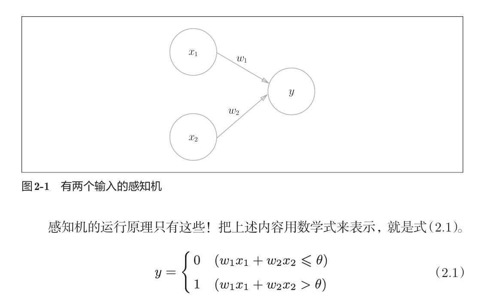
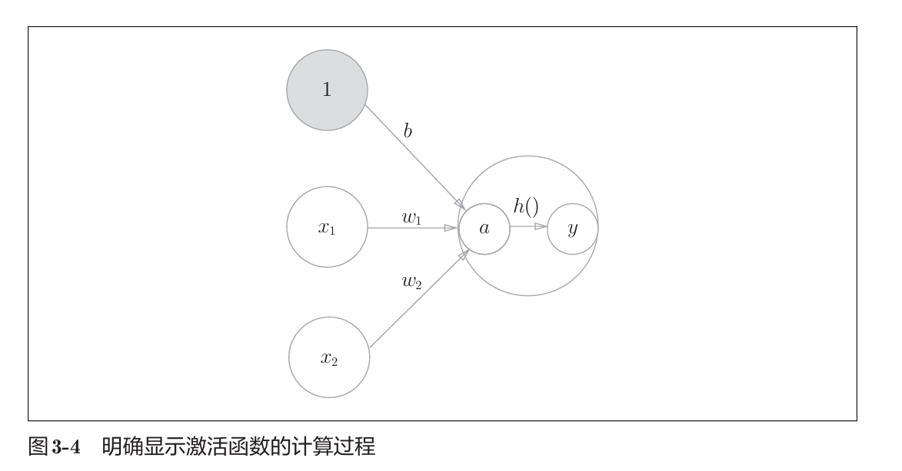
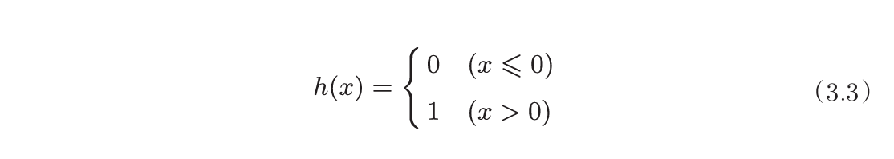
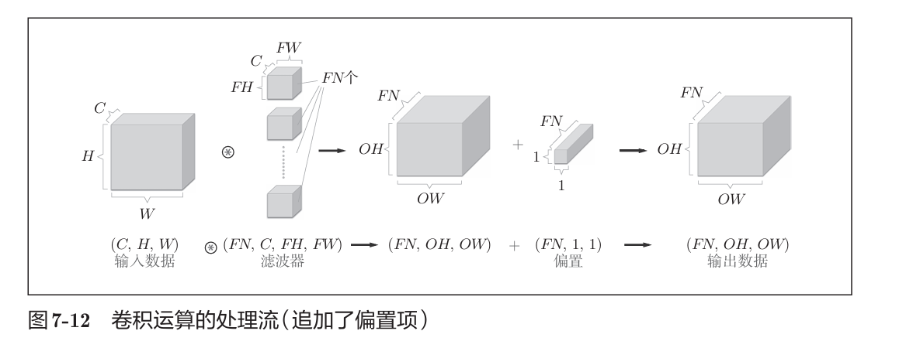
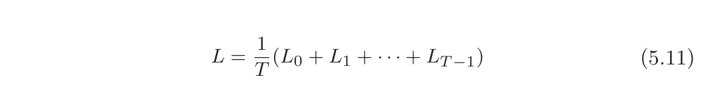

深度学习总结

# 全连接神经网络

## 神经网络基础

### 感知机

感知机：接收多个输入信号，输出一个信号

- 权重
    - 偏置参数b：用于控制神经元被激活的容易程度
    - 权重参数wi：用于控制各个信号的重要性

- 神经元 / 节点：图中的圆圈
    - 神经元被激活：将输入信号乘以权重、加上偏置，送入神经元，当这个总和超过 了某个界限值时，才会输出1

**单层感知机的局限**

- 无法实现异或门（可以实现郁与门或非门）

- 只能表示一条直线分割的线性空间
- 多层感知机可以实现异或门（2层）、表示非线性空间

## 神经网络

- 输入层：最左侧一列的神经元
- 中间层 / 隐藏层：中间的神经元
- 输出层：最右侧一列的神经元

- 层与层之间存在权重和激活函数

### 激活函数

输入信号的加权和为 a，通过激活函数 h 转换为输出信号 y

- [sigmoid函数](#sigmoid函数2)

- 阶跃函数

- [ReLU函数](#ReLU函数2)

- softmax函数：
	- 输出为 0-1 之间的实数，输出总和为 1
	- softmax 用于分类问题时，第 i 个输出分量表示第 i 类分类的概率
	- 指数函数单调，保持了各个元素之间的大小关系

**sigmoid函数和阶跃函数的比较**

比较|sigmoid|阶跃函数
-|-|-
平滑性|平滑|从0到1的跃迁
可导性|从0到1连续可导|0处不可导
取值范围|(0,1)|只能取0或1

共同点：

- 输入小时，输出接近0（为0）；输入增大，输出接近1（为1）
- 均为非线性函数

**神经网络的激活函数必须使用非线性函数**

如果使用线性函数，加深神经网络的层数没有意义，n层神经网络也可以看作1层。为了发挥叠加神经网络层的优势，激活函数必须使用非线性函数。

**输出层的激活函数与损失选择**

- 回归问题：恒等函数 + 平方和误差

- 分类问题：softmax函数 + 交叉熵误差，输出层的神经元数目 = 分类类别数目

    二分类可以用sigmoid + 交叉熵误差，输出层 1 个神经元

### 概念定义

- **线性空间：**由直线分割而成的空间
- **非线性空间：**由曲线分割而成的空间
- **多层感知机（multi-layered perceptron, mlp）：**叠加了多层的感知机
- **预处理：**对神经网络的输入数据进行某种特定的转换
- **正规化：**把数据限定到某个范围内的处理
- **批处理：**对数据进行批量式输入，一次 输入数据的集合称为批batch，一次处理的数量称为batch_size
	数值计算库对数组和矩阵运算进行了优化，使用批处理可以加快计算速度
- **端到端机器学习：**传统的机器学习需要人工构建特征，而深度学习去掉了这一人工工作，可以从原始数据中直接获得目标结果
- **恒等函数：**将输入按原样输出

## 神经网络的学习

### 损失函数

估计模型输出与真实值之间的差距，给模型优化指引方向

- 均方误差

- 交叉熵误差：只计算正确标签对应的维度
    - $y_k$：神经网络输出的第 k 维
    - $t_k$：监督数据/标签的第 k 维

**损失函数的计算时机**

- 单个数据计算一次：上图公式即为此种情况

- 遍历全部数据中的N个计算损失和，需要除以N进行正规划

- **mini-batch学习**：从全部数据中选出一批数据，对每个mini-batch学习、计算损失，将上方N替换为一批的数据数量

**为什么要设定损失函数**

我们的目标是希望模型的预测值尽可能接近真实值，所以需要损失函数尽可能小，反向传播会根据损失函数的值计算梯度来更新参数，梯度的更新方向让损失函数不断减小

**为什么不能用识别精度作为指标**

因为识别精度对微小的参数变化没有反应，所以导数在绝大多数地方都会变为0，导致参数无法更新

### 梯度法

**神经网络学习的目标：**找到使损失函数最小的权重参数

**梯度法：**通过不断地沿梯度方向前进，逐渐减小函数值的过程

**学习率：**决定在多大程度上使用梯度来更新参数

**梯度法的局限**

- 虽然梯度法是要寻找梯度为 0 的地方，但是那个地方不一定就是最小值，可能是局部的极小值

- 当函数很复杂且呈扁平状时，学习可能会进入一个几乎平坦的地区，导致学习无法前进

### 神经网络的学习步骤

1. mini-batch：从训练数据中随机选出一部分数据
2. 计算梯度：以mini-batch为单位，求出各个参数的梯度
3. 更新参数：将参数沿梯度方向进行微小更新
4. 重复1-3步

### 概念定义

- **机器学习中数据分类：**训练数据（监督数据）、测试数据、验证数据
- **泛化能力：**处理未被观察过的数据的能力，使用测试数据来评价
- **过拟合：**对某个数据集过度拟合，而无法处理其他数据集

- **超参数：**由人工设定的参数，例如学习率、神经元数量、迭代次数、mini-batch大小等，而神经网络参数是通过训练得到的

- **随机梯度下降法 SGD：**使用随机选择的mini batch数据进行梯度下降更新参数
- **epoch**：一种单位，表示把所有训练数据均学习一次时的更新次数

## 误差反向传播法

一种高效计算权重参数梯度的方法

### 计算图与反向传播

- 计算图

    - 节点：运算

    - 边：参与运算的中间数据

- 计算图的正向传播：从计算图的出发点到结束点的传播

- 计算图的反向传播：从计算图的结束点到出发点的传播
    - 当前节点函数的局部导数 $\times$ 上游传来的值，然后再传递给前面的节点
	
	- 计算图的链式法则：上游值 = 上游中所有节点的局部导数乘积
	
	- **加法节点的反向传播：**将上游值原封不动地传给下一节点
	
	- **乘法节点的反向传播：**上游值 $\times$ 另一方输入信号的值
	

**练习：画出计算图和其反向传播**

第一个（最右侧）反向传播的导数值为1

### 激活函数层的反向传播

- [ReLU函数](#ReLU函数1)
    - 正向传播输入 > 0：反向传播将上游值原封不动传递下去
    - 正向传播输入 <= 0：反向传播的信号会在此处消失

- [sigmoid函数](#sigmoid函数1)
    - 导数 = $y^2 * e^{-x} = y(1-y)$ （写成了y的形式，带入y值计算）

### Affine层的反向传播

单个数据版本

批版本的Affine层：一批数据由有N个

axis=0：如果N行数据，在每一个列的维度上将N行数据求和，作为图中参数B一个维度的更新

### Softmax和交叉熵误差层的反向传播

- 神经输出 $y_i$ - 标签数据 $t_i$

- 输出值和标签越接近，反向传播的值就越小，前面层学到的内容就越小

### 概念定义

- **正向传播：**数据从输入层开始，经过逐层计算达到输出层
- **反向传播：**在输出层计算损失函数的梯度，从输出层反向传播到输入层
- **链式法则：**复合函数的导数 = 构成复合函数的各个函数的导数的乘积
- **数值微分：**利用微小的差分求导数的过程，适合于计算机的计算
- **梯度确认：**确认反向传播求出的结果和数值微分求出的结果一致
- **Affine层：**正向传播中进行的矩阵乘积的层

**数值微分和误差反向传播法比较**

- 数值微分：不容易出错，但是计算费时

- 误差反向传播法：计算高效，但是过程实现复杂、容易出错

## 与学习相关的技巧

### 参数更新

- **随机梯度下降法 SGD：**使用随机选择的 mini batch 数据进行梯度下降
	
	- 简单，容易实现
	- 搜索路径可能会沿“之”字形移动，因为梯度方向并没有指向最小值方向，而是指向了下降速度最快的方向
- **Momentum：**采用了物理上的动量思想
  
  - v 对应物理上的速度，v 的更新表示物体在梯度方向上的受力

- **AdaGrad：**为参数的每个元素适当地调整学习率，梯度大的学习率会变小
  
  - 由于累加的中间变量会不断增大，导致梯度更新量可能会变为 0 ，无法更新
- **Adam：**结合Momentum的“动量法”和AdaGrad的学习率衰减
  - 设置3个超参：学习率、一次动量系数、二次动量系数

### 权重初始化

- **Xavier初始值：**参数所连接的前一层有n个神经元时，使用标准差为 $1/\sqrt{n}$ 的高斯分布

    适合激活函数是sigmoid

- **He初始值：**参数所连接的前一层有n个神经元时，使用标准差为 $\sqrt{2/n}$ 的高斯分布

    适合激活函数是ReLU

**为什么不将权重初始值设为一样的值**

反向传播时所有的权重都会有相同的更新值，导致无法学习

### Batch Normalization

在神经网络中插入一个正规化的层

以学习时的mini-batch为单位，对数据进行均值 0、方差 1 的正规化

优点

- 加快学习速度
- 减少对初始值的依赖
- 抑制过拟合

### 正则化：抑制过拟合

- **权值衰减：**对大的权重参数进行惩罚
    - 将惩罚项 $1/2 \lambda W^2$ 加到损失函数上
    - W是权重
    - $\lambda$是超参，设置得越大、对权重施加的惩罚越重
- **Dropout：**在学习的过程中随机删除神经元
    - 训练时，随机选出隐藏层的神经元，然后将其删除，被删除的神经元不再进行信号的传递
    - 测试时，不删除神经元，但输出要乘上训练时的删除比例

**过拟合的原因**

- 模型拥有大量参数、表现力强
- 训练数据少

**集成学习和dropout的联系**

集成学习让多个模型单独进行学习，推理时再取多个模型的输出的平均值。

dropout 随机删除神经元，相当于学习了不同的模型并连接起来，推理时对神经元输出乘以删除比例，可以取得模型的平均值，与集成学习的效果类似。

### 验证超参

**常见的超参**

各层神经元数量、batch大小、学习率、权值衰减中的 $\lambda$

**训练、验证、测试数据的用途**

训练数据：用于**学习参数**（权重和偏置）

验证数据：用于**评估超参**的好坏，调整超参

测试数据：在最后使用，确认**泛化能力**

**为什么不能用测试数据评估超参数的性能呢？**

如果使用测试数据调整超参数，超参数的值会对测试数据发生过拟合

**超参数的最优化过程**

1. 设定超参数的范围
2. 从设定的超参数范围中随机采样
3. 使用步骤 2 中采样到的超参数值进行学习，通过验证数据评估识别精度
4. 重复步骤2、3，根据它们的识别精度结果，缩小超参数的范围
5. 超参数范围缩小到一定程度时，从中选出一个超参数值

### 概念定义

- **学习率衰减：**随着学习的进行，学习率逐渐减小
- **梯度消失：**反向传播中梯度的值不断趋于0
- **表现力受限：**存在多个神经元的输出几乎相同
- **过拟合：**只能拟合训练数据，但不能很好地拟合不包含在训练数据中的其他数据
- **集成学习：**让多个模型单独进行学习，推理时再取多个模型的输出的平均值

# 卷积神经网络

在全连接网络中加入 Convolution - ReLU - [Pooling，可选]

**全连接层存在什么问题？**

忽略了数据的形状，参数量巨大、容易过拟合

## 卷积层

- **卷积运算：**对输入数据应用滤波器
    - 输入数据和滤波器的通道数相同
    - 滤波器在输入数据上滑动，将其元素和输入数据对应元素相乘，然后再求和
    - 通道方向上有多个特征图时，在通道方向上再将元素累加

- **填充（padding）：**向输入数据的周围填入固定的数据（比如0）
    - 目的是为了调整输出的大小：如果每次进行卷积运算都会缩小空间，某个时刻的输出大小就可能变为1，导致无法再应用卷积

- **步幅（stride）：**滤波器滑动的位置间隔

**练习：计算输出大小**

把长和宽分别带入：
$$
\frac{输入大小 + 2倍填充 - 滤波器大小}{步幅} + 1
$$
当输出大小无法除尽时，可以进行报错、或四舍五入

**结合方块图思考**

- 多通道、单滤波器的情况
    - 输入数据通道数量 = 滤波器通道数量
    - 滤波器个数 = 输出数据层数
    - 偏置层数 = 输出数据层数

- 多通道、多滤波器的情况

## 池化层

- 对卷积后的输出，使用窗口、有步幅地压缩空间大小

- 最大池化：滑动窗口，保留窗口内最大的元素
- 平均池化：滑动窗口，计算出窗口内所有元素的平均值，并保留下来

*上图是按步幅2进行2×2的Max池化时的处理顺序*

**池化层的特征**

- 没有要学习的参数：池化只是从目标区域中取最大值或平均值
- 通道数不发生变化：计算是按通道独立进行
- 对微小的位置变化具有鲁棒性：输入数据发生微小偏差时，池化仍会返回相同的结果

## CNN可视化

- 滤波器在不同层级上捕捉输入特征图的特征
- 随着层次变深，提取的信息愈加高级

## 具有代表性的CNN

LeNet 和 AlexNet

## 概念定义

- **全连接：**相邻层的所有神经元之间都有连接
- **特征图：**卷积层的输入和输出数据，输入数据称为输入特征图（input feature map），输出数据称为输出特征图（output feature map）
- **乘积累加运算：**再CNN中，将滤波器元素和其位置对应的输入元素相乘，然后再求和
- **池化（Pooling）：**缩小高、长方向上的空间的运算

# 深度学习

**提高识别精度的技术**

集成学习、学习率衰减、Data Augmentation（数据扩充）等

**加深层的好处**

- 减少网络参数、扩大感受野
- 分层次地分解需要学习的问题、地传递信息，使学习更加高效
- 提高网络性能和表现力

**深度学习高速化**

使用GPU，分布式学习，位数精度缩减

**深度学习应用**

物体识别、物体检测、图像分割，图像标题的生成、图像的生成、强化学习，还有之后的自然语言处理

## 概念定义

- **深度学习：**加深了层的深度神经网络
- **数据扩充（Data Augmentation）：**人为地扩充输入图像的数据量，比如施加旋转、移动等微小变化
- **感受野（receptive field）：**神经网络中神经元看到的输入区域
- **迁移学习：**在某个领域学到的知识可以被应用于其他领域

# 文本表示和word2vec

**单词的表示方法**

- 基于**同义词词典**的方法
- 基于**计数**的方法
- 基于**推理**的方法：word2vec

## 同义词词典

**同义词词典是什么？**

将同义词或近义词归类到同一个组中，定义词汇之间的关系，例如“上位-下位”关系、“整体-部分”关系

**同义词词典的问题**

难以顺应时代变化，人力成本高，无法表示单词的微妙差异

## 基于计数的方法

### 共现矩阵

- 上下文：某个单词周围的单词

- 窗口大小：单词左边和右边的各具有的上下文单词个数

- **共现矩阵（co-occurence  matrix）：**各行对应相应单词的向量
    - C [i, j]：j 出现在 i 的上下文中的频数
    - 是对称矩阵

    
- 向量相似度：**余弦相似度**
    - 两个向量在多大程度上指向同一方向

- 相似单词的排序：当某个单词被作为查询词时，将与这个查询词相似的单词按降序显示出
    1. 取出查询词的单词向量
    2. 求出查询词和其他单词的向量余弦相似度
    3. 基于相似度的结果，降序显示它们的值

下面是对计数法的改进

### 点互信息

- **点互信息（Pointwise Mutual Information， PMI）**
	- PMI 值越高，相关性越强
	
	- P(x, y)：x 和 y 同时发生的概率
	- P(x)：x 发生的概率；P(y)：y 发生的概率
- 用共现矩阵求PMI
    
    - N：语料库中的单词个数
    - C (x, y)：共现矩阵中x和y的共现次数
    - C (x)、C (y)：单词 x 和 y 分别的出现次数
- **正的点互信息（Positive PMI，PPMI）：**解决单词共现次数可能为 0 的问题
	
	- 当PMI是负数时，将其视为0
	- 将单词间的相关性表示为大于等于 0 的实数

### 降维

- 定义：减少向量维度，同时尽量保留重要信息

- 思想：在数据中发现一个新轴，用新轴上的投影值来表示各个数据点的值

- 降维方法：对PPMI矩阵作奇异值分解

    - SVD：将任意矩阵分解为 3 个矩阵的乘积 $X = USV^T$

        

    - 从U中选取靠前的几列作为降维后的单词向量，减少了单词的维度

        

**基于计数的方法的问题**

SVD的复杂度是$O(n^3)$，计算量较大

## 基于推理的方法：word2vec

**什么是基于推理的方法？**

引入神经网络，接收上下文信息作为输入，输出各个单词的出现概率，模型学习的产物是单词的分布式表示。

**神经网络中单词的处理方法**

先将单词转化为固定长度的向量，用独热编码表示，这样输入层的神经元数可以固定下来。

独热编码和词向量矩阵的乘积可以看作，提取词向量矩阵中对应编号的行向量。

### CBOW模型

continuous bag-of-words 连续词包模型

根据上下文预测目标词来训练模型，获得单词的分布式表示

- 参数：每个单词均有上下文词向量和中心词向量两种嵌入表示

    - 输入测权重 W

    - 输出测权重 W'

- 输入：c 个（窗口大小）上下文词的独热编码
    - 将 c 个独热编码 $\times$ W 再求平均 $\Rightarrow$ 得到隐藏层结果 h，表示上下文单词的综合语义向量
    - h $\times$ W' $\Rightarrow$ 得到上下文语义和所有中心词向量的相关性，再进行softmax $\Rightarrow$ 得到中心词的预测概率分布 y
    - 将 y 同实际中心词的独热编码 t 计算交叉熵作为损失，以此通过梯度下降法更新参数W和W'
- 输出：中心词的预测概率分布向量，每一维度结果表示对应编号的词作为中心词的概率

**为什么中间层/隐藏层的神经元比输入层要少？**

中间层需要将预测单词所需的信息压缩保存，从而产生密集的向量表示。产生中间层结果h的工作相当于”编码“，从h获取单词概率分布的过程相当于“解码”

**CBOW模型只是学习语料库中单词的出现模式**

如果语料库不一样，学习到的单词的分布式表示也不一样。

**选择哪个权重矩阵作为单词的分布式表示？**

A. 只使用输入侧的权重 

B. 只使用输出侧的权重 

C. 同时使用两个权重

在skip-gram中选择输入侧的权重最有效，GloVe方法中将两个权重相加

 ### Skip-gram模型

可以看作CBOW的逆过程：根据中心词预测上下文词

- 参数：每个单词均有上下文词向量和中心词向量两种嵌入表示

    - 中心词向量矩阵 W

    - 上下文词向量矩阵 W'

- 输入：1个中心词的独热编码

    - 将1个中心词的独热编码 $\times$ W $\Rightarrow$ 得到中心词的词向量h

    - 进行 c 次 h  $\times$ W' 并 softmax $\Rightarrow$ 得到 c 个上下文词的预测概率分布 y1,...,yc

    - 将c个预测结果与实际上下文词的独特编码作交叉熵计算损失

- 输出：c 个（窗口大小）上下文词的概率分布向量

**CBOW模型和skip-gram模型使用哪一个？**

语料库规模增大时，在低频词和类推问题上，skip-gram模型表现更好

CBOW模型比skip-gram模型速度快

### 基于计数与基于推理的比较

- 共同点：
	- 都依赖于分布式假设
	- 两者的相似性准确度难分上下

不同点比较|基于计数|基于推理
-|-|-
学习机制|一次性处理**全部**学习数据|使用**部分**学习数据逐步学习，可以**并行化**
向词汇表添加新词时|从头开始计算|允许参数的**增量学习**
分布式表示的性质|编码单词的相似性|还可以理解更复杂单词之间的模式

### word2vec的改进

**word2vec存在的问题**

- 随着词汇量的增加，独热编码维度会增加，占用内存大

    独热编码和输入侧权重矩阵的乘积计算量很大

    $\Rightarrow$ 加入Embedding层

- 隐藏层状态和输出测重矩阵的乘积的计算量很大

    Softmax层的计算量大

    $\Rightarrow$ 加入负采样 Negative Sampling

#### Embedding层

- 保存单词的分布式表示

- 正向传播时：从权重参数中直接抽取单词 id 对应行向量，代替原先的向量矩阵乘法

- 反向传播时上层传来的梯度只对 id 对应的特定行更新

    某个 id 被多次取出时，梯度需要累加到对应行

#### 负采样

- 负采样的关键：用二分类拟合多分类

- 对正例和采样出的若干个负例求损失并相加，作为最终的损失

- 负采样的采样方法：基于语料库中各个单词的出现次数求出概率分布，根据这个概率分布采样
    - 对原来的概率分布取0.75次方，使低频单词的概率稍微变高

**在CBOW中，如何将多分类问题转化为二分类问题？**

给定某上下文时，用某一个单词是或否出现作为二分类问题，从输出侧权重中提出该单词对应的向量，与中间层结果 h 内积，使用sigmoid函数转化为概率 y

使用交叉熵计算损失：目标单词如果实际出现损失为 - log y；单词如果没有出现，损失为 -log(1-y)。t 是表示单词是否出现的标签。

sigmoid函数和交叉熵误差组合，使得经过sigmoid层后反向误差传播的梯度是 y - t，这促进 y 尽可能地接近 t

**如果只选择稀有单词作为负例会怎样呢？**

在现实问题中，稀有单词基本上不会出现，处理稀有单词的重要性较低。

### word2vec结果

- 分布式表示内嵌了单词含义，对于在**相似上下文**中使用的单词，单词**向量空间**上会处于**相近的位置**

- 是可以基于**向量的加减法运算**来求解类推问题

- word2vec的**迁移学习能力**非常重要，其分布式表示可以应用其它的自然语言处理任务

- 语料库越大，结果越好

    根据语料库选择最佳的模型，模型不同，精度不同

    单词向量的维数必须适中
    

## 概念定义

- **WordNet：**著名的同义词词典，使用单词网络，可以计算单词之间的相似度

- **语料库：**用于自然语言处理研究和应用的文本数据

- **分布式表示/词嵌入：**示将单词表示为固定长度的密集向量

- **分布式假设：**某个单词的含义由它上下文的单词形成

- **PTB数据集：**经常被用作评价提案方法的基准语料库，大小合适

- **word2vec：**最初用来指词向量工具，在某些语境下也指w其中的两个神经网络模型，CBOW模型和skip-gram模型

- **编码：**将输入的信息压缩，产生密集的向量表示，人类无法解读

- **解码：**从被压缩编码的信息中获得期望结果RNN

- **参数的增量学习：**将之前学习到的权重参数作为下一次学习的初始值

- **二分类：**处理的是答案为“Yes/No”的问题

# RNN

## 简单RNN

### RNN架构

- 时序输入：$(x_0,x_1,...,x_t,...)$

    mini-batch中数据要按顺序输入

- 对应输出：$(h_0,h_1,...,h_t,...)$

- 各个时刻的RNN层接收该层的输入 $x_t$ 和前一层的输出 $h_{t-1}$
	
	- Wx：当前输入 $x_t$ 的权重
	- Wh：上一层输出 $h_{t-1}$ 的权重
	- b：偏置
- RNN具有环路，可以在内部记忆隐藏状态

### 基于时间的反向传播

Backpropagation Through Time，简称BPTT

按时间顺序展开（如上图）RNN之后，可以使用常规的误差反向传播法

问题：处理长时序数据时

- 计算机的内存使用量会增加
- 梯度消失

解决办法：**Truncated BPTT**

#### 截断的BPTT

- 按照适当长度截断反向传播的连接，但仍维持正向传播的连接，所以块与块之间依旧需要按顺序输入数据

- 以各个被分开的块为单位完成反向传播

### 简单RNN的梯度消失和梯度爆炸

由于反向传播应用了链式法则，如果小于 1 的梯度不断相乘会导致梯度趋于0，大于 1 的梯度不断相乘会导致梯度趋于无穷

- 应对梯度消失：使用 LSTM、GRU 等 Gated RNN
- 应对梯度爆炸：梯度大于某个阈值时进行梯度裁剪
    - 符号 $\hat{g}$：表示所有参数的梯度

### RNN语言模型

基于RNN的语言模型

- 每个时刻按顺序传入一个单词
- Embedding层：将单词id转化为单词的分布式表示
- Softmax层：输出在词汇表上的概率分布，表示下一个将要出现单词的概率
- 计算loss时，对参与计算的 T 个时刻数据取平均损失

**生成下一个单词的方式**

- 确定性的：每次选择概率最高的单词
- 概率性的：根据概率分布进行选择，概率高的单词容易被选到，概率低的单词难以被选到，这样每次采样到的单词都不同

**语言模型的评价**

- 困惑度：表示概率的倒数，困惑度越小越好
- 先根据交叉熵计算出 N 个数据上的损失 L
- 困惑度 = $e^L$

**针对[语言模型](#语言模型)的改进方法**

- 设置 2-4 层的 LSTM 可以有较好的结果

- 在深度方向上插入 dropout 层，最好不要在时序方向上插入dropout，这会导致原本不断记忆的信息反而丢失了
    - 变分 dropout 倒是可以用在时间方向上
- 将 LSTM 层前后的 Embedding 层和 Affine 层进行权重共享

## LSTM

- LSTM：Long Short-Term Memory（长短期记忆）的缩写，意思是可以长（Long）时间维持短期记忆（Short-Term Memory）

- Gate：控制数据流动的门，用sigmoid函数求门的开合程度（0.0 ~ 1.0）

    LSTM是Gated RNN

- **记忆单元 c：**在LSTM之间接收和传递数据，但不向其他层输出
	
- **输出门 o：**管理隐藏状态 $h_t$ 的输出
	$$
	o = \sigma(x_t W_x^{(o)} + h_{t-1}W_h^{(o)} + b^{(o)})
	$$
	- $\sigma()$：sigmoid函数
	- $W_x^{(o)}$：输入 $x_t$ 的输出门权重
	- $W_h^{(o)}$：上一时刻状态 $h_{t-1}$ 的输出门权重
	- $b^{o}$：输出门偏置
	$$
	h_t=o\odot tanh(c_t)
	$$
	- $h_t$ 的计算需要用到更新后的$c_t$，并用输出门 o 控制输出程度

- **遗忘门 f：**管理上一时刻记忆 $c_{t-1}$ 的遗忘程度
	$$
	f = \sigma(x_t W_x^{(f)} + h_{t-1}W_h^{(f)} + b^{(f)})
	$$
	- 计算形式和 o 相同，但权重是 f 的

- **新增记忆单元 g：**当前时刻的新增信息
	$$
	g = tanh(x_t W_x^{(g)} + h_{t-1}W_h^{(g)} + b^{(g)})
	$$
	
- **输入门 i：**对新增信息 g 进行控制
	$$
	i = \sigma(x_t W_x^{(i)} + h_{t-1}W_h^{(i)} + b^{(i)})
	$$
	
- f 控制 $c_{t-1}$，i 控制 g，得到 $c_t$

$$
c_t=f \odot c_{t-1} + i \odot g
$$

*门的控制量用sigmoid计算、记忆单元的控制量用tanh计算*

**不会发生梯度消失（或梯度爆炸）的原因**

LSTM的反向传播时没有矩阵的乘积计算，而是元素的乘积计算，而且每次都会基于不同的门值进行元素的乘积计算

回顾乘法节点的反向传播， $c_{t-1}$ 的梯度为上流值乘上f，如果 f 越小，则 $c_{t-1}$ 的梯度也会越小；f 控制记忆程度，f 小表明想要忘记先前的记忆，两种趋势正好一致。而如果 f 不想忘记，$c_{t-1}$ 的梯度也不会发生退化。

## seq2seq

seq2seq 模型也称为 Encoder-Decoder 模型

### seq2seq模型原理

- Encoder 编码器：对输入数据进行编码，将任意长度的文本转换为一个固定长度的向量
    - 由多个时刻的 Embedding 层和 LSTM 组成
    - 输出向量 h：LSTM 层的最后一个隐藏状态

- Decoder 解码器：对被编码的数据进行解码
    - 接收编码器的输出向量 h
    - 分隔符 \<eos> 指示解码器开始或结束
    - 上一时刻的输出是下一时刻的输入

**如何输入可变长度的时序数据？**

使用padding，在多余位置插入空白字符，从而使所有输入数据的长度对齐

### seq2seq的改进

- 反转输入数据（Reverse）：反转输入数据的顺序，可以加快学习速度、提高精度，使梯度传播更平滑
- 偷窥（Peeky）：将编码器的输出 h 分配给所有时刻的Affine层和 LSTM层

### seq2seq的应用

- 机器翻译
- 自动摘要
- 问答系统
- 邮件自动回复

### seq2seq的问题

编码器输出的向量是固定长度，可能导致溢出

## 概念定义

- Time RNN层：将T个时刻的RNN连接起来，每个RNN使用相同的权重，最终权重梯度是各个RNN层的权重梯度之和
- sateful：用于指定是否保存上一时刻隐藏状态的参数
- 语言模型：将单词序列解释为概率来建模自然语言
- 停用词表：生成文本时不被采样的单词

- padding 填充：用无意义数据填入原始数据
- argmax节点：用于获取最大值索引的节点

# Attention

针对seq2seq只能输出固定长度向量进行改进

## 改进seq2seq编码器

- 使用编码器各个时刻的LSTM隐藏状态ht，组成输出矩阵hs，将hs传递给解码器
	- hs 可以视为各个单词对应的向量集合
	- 编码器可以根据输入语句的长度，成比例地增加编码信息

## 改进seq2seq解码器：Attention

- Attention Weight层：输出 hs 中各个单词的重要程度权重 a
    - $h_t$ 与 $hs$ 作内积，求出相似度 s
    - 用 softmax 对 s 正规化，得到 a
    - a 表示 $hs$ 中各个单词向量与 解码器隐藏状态 $h_t$ 的相似度

- Weight Sum层：计算出上下文向量 c
    - 根据各个单词重要度权重 a，对 hs 进行加权求和，得到 c

- Attention层：由 Attention Weight 与 Weight Sum组成
    - 输入：当前时刻的LSTM输出h，编码器的输出矩阵hs；相当于学习两个时序数据之间的对应关系
    - 输出：上下文向量 c
    - 放在LSTM 和 Affine层之间，将 c 和 h 拼接输入给Affine

**为什么不直接从hs中选择一个与ht有对应关系的向量？**

因为选择操作无法进行微分，而我们先用内积再softmax归一化求出权重，用权重加权求和，这样的运算是可微分的，可以基于反向传播进行学习

**Attention的其他使用方法？**

让Attention输出成为下一时刻LSTM的输入；Self-Attention

## 概念定义

- 残差连接：跨层连接的技巧，将某层输出跨过一层传播到前面，这样即便加深了层，梯度也能正常传播，不会发生梯度消失或爆炸
- Self-Attention：自注意力机制，Attention关注解码和编码之间的关系，Self-Attention关注自己对自己的关系
