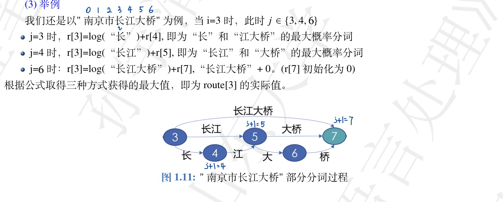
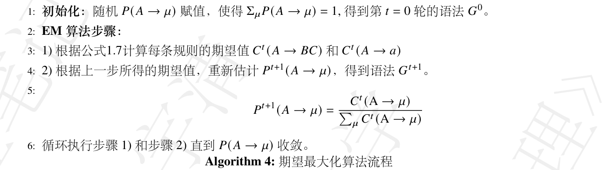
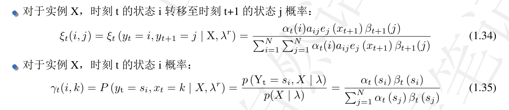
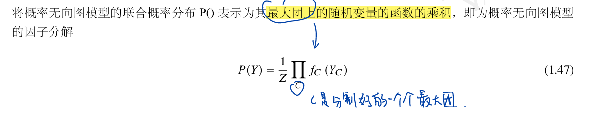
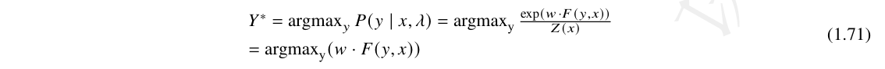
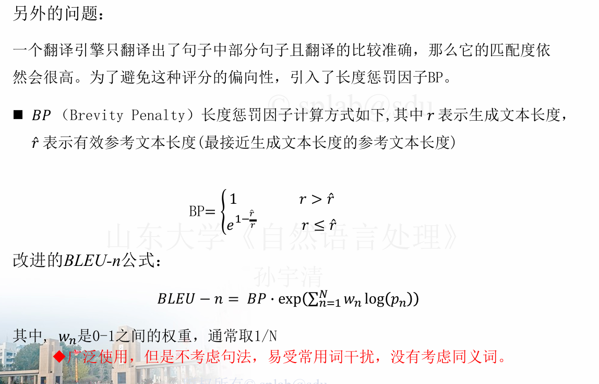
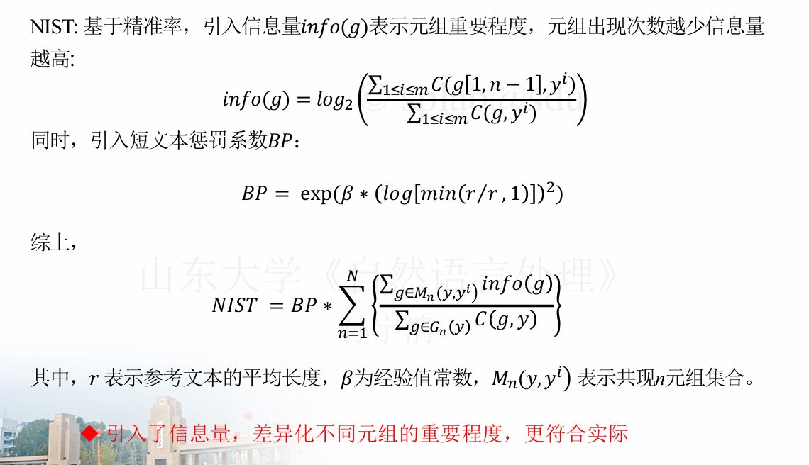
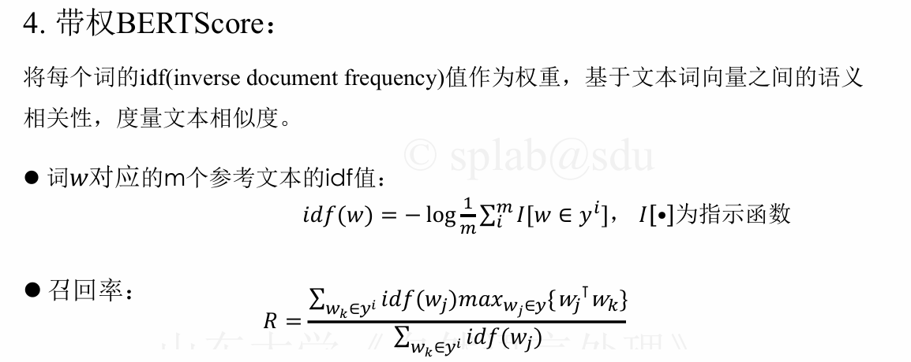

自然语言处理总结

# 1 词汇向量化

**词汇：**具有一定语义和功能的最小语言单位

**词素：**语言中不可再分割的的音形义结合体，是组成词的基本结构单位

**词汇向量化的分类**

- 离散编码表示：离散的高维整数向量，向量维度和语义可理解和解释
    - 独热编码
- 分布式表示：稠密的低维实数向量，多个维度共同刻画词汇语义和词汇之间的关系，每个维度不直接对应特定的含义
    - 基于词汇[共现矩阵分解](#共现矩阵分解)的稠密向量
    - [word2vec](#word2vec)
    - [GloVe](#GloVe)

## 基于统计的词汇向量

依据词汇在文档中出现的上下文环境和全局语料库来构建词汇向量

### 共现矩阵

- “词-词”共现矩阵：给定窗口大小，统计窗口内词与词共同出现的数
- “词-文档”共现矩阵：对应词在特定文档中出现的频次
- 词汇向量表示为共现矩阵中的行向量

### <span id="共现矩阵分解">共现矩阵分解</span>

- 奇异值分解SVD：将共现矩阵分解为3个矩阵的乘积 $X = USV^T$

    

- 根据 S 中的 k 各较大奇异值，选择U中的对应列作为降维后词向量的维度

    

优点：包含全局统计信息；只选择了含有重要信息的少数维度，便于后续计算和分析

缺点：初始向量维度为词表大小，导致SVD分解计算量大；词向量语义缺乏可解释性

## <span id="word2vec">预训练分布式词向量方法 Word2Vec</span>

语义分布假说：

- 词汇的语义有不同维度，具体语义与它的上下文有关
- 词汇的上下文越相似，语义越接近

### CBOW模型

continuous bag-of-words 连续词包模型

根据上下文预测目标词来训练模型，获得单词的分布式表示


参数：每个单词均有上下文词向量和中心词向量两种嵌入表示

- 上下文词向量矩阵 W
- 中心词向量矩阵 W'

输入：c 个（窗口大小）上下文词的独热编码 $x_1+x_2+...+x_c$

输出：中心词的预测概率分布向量，每一维度结果表示对应编号的词作为中心词的概率

- 将 c 个独热编码 $\times$ W 再求平均 $\Rightarrow$ 得到隐藏层结果 h，表示上下文单词的综合语义向量

$$
h = \frac{1}{c}W^T(x_1+x_2+...+x_c)
$$

- h $\times$ W' $\Rightarrow$ 得到上下文语义和所有中心词向量的相关性，再进行softmax $\Rightarrow$ 得到中心词的预测概率分布 y

$$
u = W'^Th\\
y = softmax(u)\\
$$

- 将y同实际中心词的独热编码计算交叉熵作为损失，以此通过梯度下降法更新参数W和W'

    假设中心词独热编码为 t，其中 $t_o$ 分量为1，o是正解索引

$$
E=-\sum_{k=1}^{|V|} t_k log y_k= -log(y_o) = -log(softmax(u_o))\\ 
=-log(\frac{exp(u_o)}{\sum_{j=1}^{|V|}exp(u_j)})\\
=-u_o + log(\sum_{j=1}^{|V|}exp(u_j))
$$

 ### Skip-gram模型

可以看作CBOW的逆过程

参数：每个单词均有上下文词向量和中心词向量两种嵌入表示

- 中心词向量矩阵 W
- 上下文词向量矩阵 W'

输入：1个中心词的独热编码

- 将1个中心词的独热编码 $\times$ W $\Rightarrow$ 得到中心词的词向量h
- 进行 c 次 h  $\times$ W' 并 softmax $\Rightarrow$ 得到 c 个上下文词的预测概率分布 y1,...,yc
- 将c个预测结果与实际上下文词的独特编码作交叉熵计算损失

输出：c 个（窗口大小）上下文词的概率分布向量

### 优化算法

以上两个模型在softmax时都对词典里的V个词进行遍历计算，导致计算量很，有两种优化算法：

- 层次化Softmax
- 负采样

#### <span id="层次Softmax">层次Softmax</span>


- 根据字典中的词频构建一个哈夫曼树
    - 树的叶节点表示词汇表中的一个词：词频越高，离树根越近
    - 把整个树看作一种特殊的神经网络：除叶子节点之外，每个节点代表一个模型参数，并且都有sigmoid激活函数用于二分类

- 输入的独热编码经过词向量的嵌入矩阵 $W_{vn}$后，在此处作为哈夫曼树的输入向量 $x_w$
- 利用最大似然思想对二分类概率累积来构建似然函数，从而学习到词向量的嵌入矩阵

**计算过程**


- w：目标单词，对应于树上的一个叶节点
- $x_w$：哈夫曼树输入向量，此时的目标单词为w
- $\theta_j^w$：从根节点到w的路径上，第 j 个非叶子节点对应的模型参数
- $d_j^w$：从根节点到w的路径上，前往第 j 个节点的边的哈夫曼值
- $l_w$：从根节点到w的路径上的节点数

从根节点开始前往目标词w的过程中，将路径的左右选择看作二分类问题

- 沿编码为1进行选择的概率：$\sigma(x_w \cdot \theta)$
- 沿编码为0进行选择的概率：$1-\sigma(x_w \cdot \theta)$
- 任意一个节点 $\theta_{j-1}^w,j\in[2, l_w]$，选择左边还是右边的概率如下：

$$
P\left(d_j^w\middle|\ x_w,\theta_{j-1}^w\right)=\sigma\left(x_w\theta_{j-1}^w\right)^{1-d_j^w}\left(1-\sigma\left(x_w\theta_{j-1}^w\right)^{d_j^w}\right)
$$

沿着路径对多个二分类概率进行乘积即可得到词汇概率
$$
P=\prod{\sigma\left(x_w\theta_{j-1}^w\right)^{1-d_j^w}\left(1-\sigma\left(x_w\theta_{j-1}^w\right)^{d_j^w}\right)}
$$
用最大似然估计的思想最大化这个概率：先取对数得到L，再计算梯度
$$
E=logP=\sum\left(1-d_j^w\right)log\sigma\left(x_w\theta_{j-1}^w\right)+d_j^wlog\left(1-\sigma\left(x_w\theta_{j-1}^w\right)\right)\\ 
\frac{\partial E}{\partial\theta_{j-1}^w}=x_w\left(1-d_j^w-\sigma\left(x_w\theta_{j-1}^w\right)\right)\\
\frac{\partial E}{\partial x_w}=\sum{\theta_{j-1}^w\left(1-d_j^w-\sigma\left(x_w\theta_{j-1}^w\right)\right)}
$$
**优点：**计算量减少，层次化softmax由于构建了哈夫曼数，计算量变为了logV

**缺点：**如果目标词w是生僻词，出现的频率少，那么到w的哈夫曼路径会比较长，从而影响计算效率

#### <span id="负采样">负采样</span>

不直接对整个词表计算概率分布，给定正例和几个随机采样的负例，在其之上用二分类拟合多分类，对正例和负例求累加的损失

**负采样的损失函数计算**

给定某上下文时，用某一个单词 w 是或否出现作为二分类问题

从中心向量权重中提出该单词对应的向量 $v'_w$，与中间层结果 h 内积，使用sigmoid函数转化为概率 P(w)
$$
P(w)=\sigma(v'_w \cdot h)
$$
由于sigmoid函数比较特殊，用其计算交叉熵，损失函数可化简为：

- 若 w 是正例：$E=-log(P(w))$
- 若 w 是负例：$E=-log(1-P(w))$

正例和负例的损失累加为：
$$
E = -log(\sigma(v'_{正例} \cdot h))-\sum_{wj}^{负例集合}log(\sigma(v'_{wj} \cdot h))
$$
**负采样的采样方法**

- 基于语料库中各个单词的出现次数求出概率分布，需根据这个概率分布进行采样
- 对原来的概率分布取0.75次方，使低频单词的采样概率稍微变高

$$
p(w) = \frac{count(w)^{3/4}}{\sum_u^Vcount(u)^{3/4}}
$$

### <span id="Word2Vec优点">Word2Vec的优缺点</span>

**优点：**

- 考虑了词汇与上下文的关系
- 维度比独热编码和共现矩阵要少
- 可以利用负采样和层次softmax来加速训练过程
- 训练好的词向量可在自然语言处理任务上复用

**缺点：**

- 只利用了局部的窗口，缺少全局信息的
- 词向量是静态固定表示的，难以反应一词多义，无法根据特定场景来动态适配和更新

## <span id="GloVe">融合全局信息的GloVe方法</span>

GloVe（Global Vectors）

结合了两种分布式词向量模型：

- 局部上下文窗口法：利用局部的上下文特征

- 全局矩阵分解：利用语料库的全局统计特征

**全局统计信息：词汇共现概率矩阵**


- $P_{ij}=P(j|i)=X_{ij} / X_i$：词 j 出现在词 i 上下文中的共现概率
    - $X_{ij}$：在词 i 的上下文中，词 j 出现的次数
    - $X_i = \sum_k X_{ik}$：：在词 i 上下文中所有词汇出现的总次数（对第 i 行求和）
- $Ratio=P_{ik}/P_{jk}$：共现概率之比

**共现概率比的规律**

Ration|单词 j k 相关|单词 j k 不相关
-|-|-
**单词 i k 相关**|$\rightarrow$ 1|$\rightarrow$ $\infty$
**单词 i k 不相关**|$\rightarrow$ 0|$\rightarrow$ 1

**GloVe的优化目标：**任意3个词向量 $w_i,w_j,w_k$可以反应全局统计的共现概率比的规律

假设经过某种未知函数F对3个词向量进行作用，从而得到共现概率比Ratio
$$
F\left(w_i-w_j,w_k\right)=F\left(\left(w_i-w_j\right)^Tw_k\right)=P_{ik}/P_{jk}
$$
在向量的线性空间中，对向量内积来表示相关性，对向量减法来表示向量差异
$$
F\left(w_i-w_j,w_k\right)=F\left(\left(w_i-w_j\right)^Tw_k\right)=P_{ik}/P_{jk}
$$
指数函数exp可以将差和商联系起来
$$
exp\left(\left(w_i-w_j\right)^Tw_k\right)=exp\left(w_i^Tw_k\right)/exp\left(w_j^Tw_k\right)=P_{ik}/P_{jk}
$$
由此可得出
$$
exp\left(w_i^Tw_k\right)=P_{ik}=X_{ik}/X_i
$$
等式两边取对数
$$
w_i^Tw_k=log\left(X_{ik}\right)-log\left(X_i\right)\tag{1}
$$
向量满足对称性
$$
w_i^Tw_k=w_k^Tw_i
$$
$$
w_k^Tw_i=log\left(X_{ik}\right)-log\left(X_k\right)\tag{2}
$$
（1）（2）两个等式左边相等，但是因为 $log(X_i) \neq log(X_k)$ ，等式右边不等。

对（1）引入偏置 $b_i$ 吸收 $log(X_i)$，同时添加 $b_k$ 保持对称性。此时如果 $w_i^Tw_k + b_i+b_k=log(X_{ik})$ 就可以满足对称性，所以我们要让这个等式左右两边尽量接近，从而有了损失函数
$$
J=\sum_{i,j}\left(w_i^Tw_j+b_i+b_j-log\left(X_{ij}\right)\right)^2
$$
根据 $X_{ij}$ 设计一个权重 f 来加权，最终确定损失函数
$$
J=\sum_{i,j}{f\left(X_{ij}\right)\left(w_i^Tw_j+b_i+b_j-log\left(X_{ij}\right)\right)^2}
$$
函数 𝑓(𝑋𝑖𝑗) 反映了两个词共现次数越多，在代价函数中的影响应当越大，但是过高的词频会导致低频率的词汇学习不足，因此采取了折中的思路


**优点：**同时考虑了上下文和全局信息；容易并行计算

**缺点：**消耗的存储资源更多；也难以解决一词多义

## WordNet

WordNet是普林斯顿大学开发的英文词典，将词汇按照词性分成名词、动词、形容词、副词四个大类，并按照词义来组织词汇

- 将相同语义概念的词汇分组到同义词集合中

    有多个词义的单词可以出现在多个同义词集合中。

- 同义词集合之间有多种关系：

    - 同义关系
    - 反义关系
    - 上下位关系
    - 整体部分关系

- 25个独立起始概念：没有上位关系的同义词集合

    其它的同义词与独立起始概念有上下位关系，由此构成25个独立的层次结构

**WordNet和同义词库有什么区别？**

WordNet从几个抽象概念开始、按照层次结构来组织同义词、在同义词集合之间包含各种关系

同义词库通常只是列出具有相同含义的单词

## 分布式词向量评估

- 词汇语义相关性：选择待比较词汇，计算余弦相似度
    - 设词汇 wa 是 wb 语义上最为接近的词汇，则两者的余弦相似性应该最小


- 词类比分析：针对具有相同关系的两对词汇，其对应的词向量之差应该近似


## 问题思考

**为什么要词汇向量化？**

向量比单个实数携带更多信息，向量在符号空间和计算空间之间建立联系，并在向量中最尽可能地保留词汇的重要信息，以及方便后继计算

**预训练词向量的意义** 

将单词转化为向量表示，使得计算机可以更好地理解和处理自然语言

训练好的词向量可以在其他同领域任务上进行复用，减少再次训练所需的资源

**在基于全局矩阵分解的词向量方法中，进行SVD分解的意义何在？** 

降维，解决矩阵稀疏的问题；减少计算量和存储空间。

**Skip-gram 和 CBOW 模型的整体思想存在怎样的关系？** 

CBOW用上下文预测中心词，skip-gram用中心词预测上下文，相互是对方的逆过程

**同样是基于共现矩阵，GloVe相比于全局矩阵分解的方法有什么优势？**

在共现矩阵基础上，引入了共现概率之比，可以更好地表达词汇类比关系，向量的语义质量也会更高

对于共现频率较低的词对，GloVe采用了加权函数来减小这些词对在优化过程中的影响

GloVe的优化目标直接在共现词对上进行操作，计算复杂度较低，存储需求相对较小；而SVD是对整个共现矩阵操作

GloVe的解释性更强

**相较于离散型词向量，分布式词向量有何优势？**

更好地表示词汇之间的语义关系，通过向量运算实现词汇的比较

维度更低，减少计算量和存储量

**负采样在实际应用中十分常用，它的基本思想是什么？** 

见[负采样](#负采样)

**请阐述层次化softmax的基本思想、作用、优缺点以及词汇预测过程，写出详细公式。**

见[层次Softmax](#层次Softmax)

**你认为预训练词向量方法Word2Vec带来主要贡献有哪些？**

见[Word2Vec优点](#Word2Vec优点)

**WordNet是什么？简述其构成。其和同义词库有什么区别？**

见wordnet

**请分别阐述Word2Vec、Glove词向量的基本原理和优缺点。**

见Word2Vec和Glove


# 2 分词

## <span id="分词挑战">分词挑战</span>

- 语言的固有歧义：同一句话可以有不同的分词方式，对应的意义也不同
- 语言的开放性和动态性：新词
- 语言学词汇规范难以量化评估问题：难以定义“词”

## <span id="分词评估">分词评估</span>

### 专家评估

- 语义不变：符合原句语义
- 语法合理：符合一般语法规则
- 分词全面：覆盖不同尺度的词汇

### 基于监督数据的内部评估

A：标注数据的分词结果集合
B：实际预测的分词结果集合
A $\cap$ B：重合的部分就是正确部分


- 精准率
$$
Precision = \frac{|A \cap B|}{|B|}
$$

- 召回率
$$
Recall = \frac{|A \cap B|}{|A|}
$$

- F值：精确率和召回率的调和平均
$$
F1 = \frac{2*P*R}{P+R}
$$

### 基于登录词的内部评估

表外词OOV（OutOfVocabulary）：未在词典中登录的新词

- 登录词召回率
$$
IV Recall = \frac{|A \cap B \cap 词典|}{|A \cap 词典|}
$$

- 表外词召回率
$$
OOV Recall = \frac{|(A \cap B) - 词典|}{|A- 词典|}
$$

### 外部评估

根据不同的下游任务做出评价

### <span id="新词的相关统计指标">新词的相关统计指标</span>

- 内部凝固度：使用点互信息衡量词的搭配（collocation）是否合理


- 自由运用程度：使用信息熵衡量一个词的左邻字与右邻字的丰富程度


## 基于规则的分词算法：最大匹配算法

### <span id="前向最大匹配">前向最大匹配</span>

1. **从左到右**取出字符串中的m个字符作为匹配字段
    （m是词典里最长词条的字符个数）

2. 查找词典并进行匹配
    - 若匹配成功：将该字段作为一个词进行切分
    - 若匹配失败：将该字段的**最后**一个字去掉，剩余字段再次匹配；不断重复匹配过程，直到切分出一个单词

3. 从字符串中去掉匹配好的单词，回到第1步

### <span id="后向最大匹配">后向最大匹配</span>

与前向一致，但是**从右到左**读取字符，匹配失败时删去字段中**第一个**字

### <span id="双向匹配">双向最大匹配</span>

分别执行前向和后向，采用汇总策略

- 两者匹配结果相同：任一分词结果即为最终分词结果
- 两者匹配结果不同，且分词词数不同：选择分词数较少的作为分词结果
- 两者匹配结果不同，且分词词数相同：选择单字数较少的作为分词结果
- 两者匹配结果不同，且分词词数、单子数相同：任选其一

## 基于统计的分词算法

### 概率语言模型分词方法

基于规则的分析算法并不能很好地处理歧义

输入字符串C，存在有歧义的分词结果𝑆1和𝑆2，比较条件概率𝑃(𝑆1|𝐶)和𝑃(𝑆2|𝐶)，作为选择分词结果的依据
$$
\frac{𝑃(𝑆1|𝐶)}{𝑃(𝑆2|𝐶)}=\frac{𝑃(𝑆1)}{𝑃(𝑆2)}
$$
任务目标：找出具有最大概率的分词结果

假设某一个分词结果 S=w1,w2,...,wl，wi是一个词汇

- 1元语言模型：
$$
P(s)=P(w_1,w_2,...,w_l)=P(w_1)\times P(w_2)\times ... \times P(w_l) \\
𝑃(w_j) 为词w_j在语料库中出现的\frac{词频}{总词数}
$$


- [n元语言模型](#ngram)：当前词汇只和前N-1个词相关
$$
P(s)=P(w_1,w_2,...,w_l)=\prod_{j=1}^{l}P(w_j|w_{j-N+1},...,w_{j-1})
$$

一般取log计算防止下溢

### 基于最大概率的词典匹配分词算法

**步骤1：找出句子中所有可能成词情况，生成有向无环图**

- 针对每一个匹配词汇，下标区间为[i: j]，创建关联顶点i和j+1的边

- 每一条从起点到终点的路径就是给一个分词结果


**步骤2：采用动态规划查找最大概率路径**

将词频信息作为每条边的选择依据，从后往前计算
$$
p(sentence[i:j])=\frac{freq(sentence[i:j])}{n}∝\\log(\frac{freq(sentence[i:j])}{n})\\=log(freq(sentence[i:j]))-log(n)
$$
$$
route[i]=max\{p(sentence[i:j])-log(n)+route[j+1\}
$$

- 𝑠𝑒𝑛𝑡𝑒𝑛𝑐𝑒[𝑖 : 𝑗]：下标区间为[𝑖 : 𝑗]的词汇
- 𝑓𝑟𝑒𝑞( 𝑠𝑒𝑛𝑡𝑒𝑛𝑐𝑒[𝑖 : 𝑗] )：下标区间为[𝑖 : 𝑗]的词汇在文本中的词频
- n：文本中的词汇总个数
- 𝑟𝑜𝑢𝑡𝑒[i]：第 i 个节点开始的后向路径的最大概率



## 问题思考

**什么是中文分词？为什么要进行中文分词？如何评估中文分词结果？**

中文分词将一段中文文本切分成有意义的词汇，目的是为了更好地进行自然语言处理，如命名实体识别、机器翻译、词性标注等。

[评估方法见上](#分词评估)

**中文分词问题有哪些挑战？详细说明。** 

[分词挑战见上](#分词挑战)

**分别简述前向最大匹配算法和后向最大匹配算法，讨论两者在什么情况下会产生相同的分词结果，在什么情况下会产生不同的分词结果？如何解决这种分歧？**

[前向最大匹配算法](#前向最大匹配)和[后向最大匹配算法](#后向最大匹配)

因为匹配方向不同，词典中也会有多个匹配词语，就会产生不同的分词结果

解决方法：[双向匹配算法](#双向匹配)

**基于统计的新词发现有哪些评价指标？** 

[新词的相关统计指标](#新词的相关统计指标)

**详细说明BiLSTM-CRF模型在分词任务上的技术细节，给出公式。** 

BiLSTM+CRF是基于神经网络的分词方法。还未看

**中文分词有哪些相关工具？各有什么优点和缺点？**

jieba, SnowNLP, HanLP ,NLRIP,......

# 3 语言模型

## 语言模型定义

语言本身具有一定的统计规律和基本结构，可以用数学模型来描述

两种常见任务：

- 计算一个词汇序列或句子的概率，从而识别该句子是否是一个合理的案例

- 对一个词序列之后可能出现的下一个词指派概率

## 统计语言模型/N元语言模型

###定义

从概率统计角度建模句子词汇的上下文特性的数学模型

根据前面出现的N−1个词语猜测下面一个词语的概率模型

- 元组：指不可分割的最小语言单位，通常是词汇，也可以是字符或短语
- 𝑁元组：有语义关联的连续 N 个元组的序列

**token与type**

- token数目：关注词语在文中出现的次数
- type数目：文本内出现的不同词语总数

### <span id="ngram">具体内容</span>

k阶马尔可夫假设：下一个状态只依赖于前k个状态

- <span id="词序列概率估计">词序列 $x^1,...,x^n$ 的概率估计：</span>
*前k个状态是独立的，所以不使用条件概率*


- 特定词汇$x^i$的最大似然估计：
cnt()为该词序列在语料库中出货先的次数
$$
P(x^i|x^{i-k},...,x^{i-1})=\frac{cnt(x^{i-k},...,x^{i-1},x^i)}{cnt(x^{i-k},...,x^{i-1})}
$$

- 以二元语法模型为例：当前词汇与前一词汇共同出现的频率/当前词汇出现频率
$$
P(x^i|x^1,...,x^{i-1})\approx P(x^i|x^{i-1})=\frac{cnt(x^{i-1},x^i)}{cnt(x^{i-1})}
$$

### 示例过程

**假设给定的词汇表为：【“中国”，“制造”，“走向”，“世界”，“创新”，“娱乐”，...】，构建二元语言模型的过程如下**

1. 统计不同词汇两两共现的频率矩阵


2. 统计每一个词汇出现的频率


3. 将步骤1得到的共现矩阵除以每一行对应的词汇频率，得到二元语言条件概率结果

    例如：第1行除以 cnt(中国)=2300，第2行除以 cnt(制造)=828

    列：当前词汇，行：前一个词汇


**计算句子“中国制造走向世界”的概率**

P(中国制造走向世界) = P(中国) \* P(制造|中国) \* P(走向|制造) \* P(世界|走向）= 2300/42886×0.1857×0.0386×0.1439 = 0.00005531

**预测“中国制造”的下一个词**

由于是2元模型，所以看“制造”对应的行哪个概率最大，我们选取“走向”


### N元语言模型问题

- 未知词情况 / 表外词OOV：使用一个特殊标记\<UNK>对未知词进行统计，把所有表外词看作一个词
- 零或极小概率问题：某些词汇组合不会出现，导致计数为零，条件概率为零
    - 拉普拉斯平滑：将所有的计数加 1 再进行归一化，保证计数大于零
    - 加k平滑：将所有的计数加 k 再进行归一化
    - 线性插值：使用低阶元组估计高阶元组的线性插值
    - Good-Turing 打折法：利用训练集中出现次数为𝑐+1的𝑁 元语法概率去估 计该训练集中出现次数为𝑐的𝑁元语法概率

## 基于神经网络的语言模型

### 固定窗口大小的神经网络语言模型

- 输入：目标预测词汇窗口内单词的独热向量
- 将输入映射为向量序列，采用多层感知机进行向量变换
- 输出：经过softmax后得到的词汇表上概率分布
- 窗口按照输入文本自左至右滑动，覆盖所有文本内容

**缺点：**固定大小的窗口使得上下文内容有限

### 基于循环神经网络的语言模型

- 序列结构的网络流
- 将上一次神经网络的输出和下一次的输入一起进入神经网络

- 共享不同时刻之间的权重参数


- 输入：文本序列的独热向量 $x^1,x^2,...,x^T$
- Embedding层：将独热向量变成词嵌入
    - E：词嵌入权重
$$
e^t=E x^t
$$

- RNN层：接收词嵌入和上一个时刻的隐藏状态，通过两者的权重参数计算出当前的隐藏状态 
    - $W^h$：传递状态的权重
    - $W^e$：输入单词的权重
$$
h^t = \sigma(W_h h^{t-1} + W_ee^t + b1)
$$

- 输出层：对当前隐藏状态经过参数变换后使用softmax激活，输出词表上的概率分布
    - $U$：隐藏状态输出的权重


$$
\hat{y^t} = softmax(Uh^t+b2)
$$

- 损失计算：使用交叉熵计算每个时刻的损失，再求平均计算总的损失函数
    - 真实值 $y^t$ 是下一时刻输入的独热编码 $x^{t+1}$

$$
J^t=CrossEntropy(y^t,\hat{y^t})\\
J=\frac{1}{T} \sum_{t=1}^T J^t
$$

- BPTT：基于时间的反向传播算法

**RNN的优缺点**

- 优点：
    - 输入长度自由
    - 支持长距离的语义传播
- 缺点
    - 每个时刻依赖于上一时刻，无法并行计算，速度较慢
    - 长序列文本下，存在梯度消失和梯度爆炸

### 长短期记忆网络LSTM

- LSTM：Long Short-Term Memory（长短期记忆）的缩写，意思是可以长（Long）时间维持短期记忆（Short-Term Memory）
- Gate：控制数据流动的门，用sigmoid函数求门的开合程度（0.0 ~ 1.0）


**记忆单元 c：**在LSTM之间接收和传递数据，但不向其他层输出
	
**输出门 o：**管理隐藏状态 $h_t$ 的输出

$$
o = \sigma(x_t W_x^{(o)} + h_{t-1}W_h^{(o)} + b^{(o)})
$$

- $\sigma()$：sigmoid函数
- $W_x^{(o)}$：输入 $x_t$ 的输出门权重
- $W_h^{(o)}$：上一时刻状态 $h_{t-1}$ 的输出门权重
- $b^{o}$：输出门偏置
$$
h_t=o\odot tanh(c_t)
$$
- $h_t$用更新后的$c_t$计算，用输出门o控制输出程度

**遗忘门 f：**管理上一时刻记忆 $c_{t-1}$ 的遗忘程度
$$
f = \sigma(x_t W_x^{(f)} + h_{t-1}W_h^{(f)} + b^{(f)})
$$

- 计算形式和o相同，但权重是遗忘门f的

**新增记忆单元 g：**当前时刻的新增信息
$$
g = tanh(x_t W_x^{(g)} + h_{t-1}W_h^{(g)} + b^{(g)})
$$

**输入门 i：**对新增信息 g 进行控制
$$
i = \sigma(x_t W_x^{(i)} + h_{t-1}W_h^{(i)} + b^{(i)})
$$

f 控制 $c_{t-1}$，i 控制 g，得到 $c_t$
$$
c_t=f \odot c_{t-1} + i \odot g
$$


LSTM的优缺点

- 优点：通过门控状态来控制传输状态，保留长距离记忆，并忘记不重要的信息
- 参数变多，使得训练难度加大

## 语言模型的评估：困惑度

- 外在评估：是把语言模型嵌入到某个应用中，测试应用在嵌入模型前后的性能改变，但是测试代价高
- 内在评估：独立于下游应用进行评估，常见指标是困惑度

**信息论的性质**

1. 概率小的事件具有更高信息量
2. 概率大的事件具有较小信息量
3. 相互独立的事件信息量可累加

**困惑度的计算过程**

- 语言L有一个长度为n的词序列x1,x2,..,xn，将其作为一次随机事件

- 模型M和语言L的交叉熵近似为：
$$
H(x^1,x^2,...,x^n)=-\frac{1}{n}logP(x^1,x^2,...,x^n)
$$

- 困惑度 = 2的交叉熵次方：
    - 其中[P(x1,...,xn)](#词序列概率估计)的概率估计见上文
$$
perplexity(x^1,x^2,..,x^n)=2^{H(x^1,...,xn)}\\=P(x1,...,x^n)^{-\frac{1}{n}}\\\sqrt[n]{\frac{1}{P(x^1,...,x^n)}}
$$

- 二元语法模型的困惑度：
$$
perplexity(x^1,...,x^n)=\sqrt[n]{\frac{1}{P(x^1)\prod_{i=2}^nP(x^i|x^{i-1})}}
$$

**困惑度的解释**

- 交叉熵衡量模型M和自然语言L的差距，因为交叉熵是语言熵的上界，所以交叉熵越小就越接近语言熵，交叉熵越低的语言模型越好
- 指数函数保留单调性，困惑度数值越小，模型越好，与测试数据更适应

**困惑度评价的局限性**

- 近似评估：困惑度计算依赖于测试数据集，不能完全反映语言的本质

    测试数据需要足够大

- 统计偏差：测试数据与训练数据存在差距时，不能很好地进行评价

    训练数据需要足够大

- 信息泄露：如果我们使用一个封闭词汇测试集，由于事先我们已经知道这个测试集中的词是什么，这将大大地降低困惑度

    比较两个语言模型，要求它们使用相同的词汇表

## 语言模型的应用

- 语音识别
- 机器翻译
- 文本生成
- 问答系统
- 文本你就错
- 推荐系统

# 4 句法分析

句法分析是自然语言处理中的基础性工作，它分析句子基本成分和结构，或是词汇之间的依存关系（并列， 从属等）

转化生成语法：语言具有无限性、离散型、层次性

## 上下文无关文法

*编译原理学过，下面可跳过*


**乔姆斯基范式文法：**每个规则的右部是两个非终极符号，或是一个终极符号


- 与上下文无关文法可以等价转换
- 二叉性

### CYK算法

对乔姆斯基范式文法的分析算法

- 给定句子：词的序列 w1,s2,...,wn

- 二维矩阵 P(i, j）：[i, i+j-1]上可以被规约的非终结符集合
    - i：第1个词的位置
    - j：从 i 开始之后的 j 的词，包括 i

```
for i in [1...n]:
	j = 1  //分析跨度为1个词的情况
	if (词i满足 A->词i):  把A加入P(i,1)

for j in [2...n]:  //按跨度分别算
	for i in [1...n-j+1]:   //遍历起始点
		for k in [1...j-1]: //在跨度内进行分割，分割后左半边有k个词，右边有j-k个
			对每条规则 A->BC
			if (B in P(i,k) and C in P(i+k,j-k)):
				把A加入P(i,j)

if (S in P(1,n)):  成功
else:  失败
```


## 概率上下文无关文法

歧义问题：对于相同的非终结符串，存在不同的分析结果

解决方案：为文法规则引入概率，选择概率最大的分析结果 $\Rightarrow$ 概率上下文无关文法


**概率上下文无关文法的三个基本问题**

- 计算由文法 𝐺 产生词串 𝑊 的概率：𝑃(𝑊|𝐺) $\Rightarrow$ 向内算法与向内向外算法
- 词串 𝑊 对应有多种可能的语法树，选择哪一棵最好的分析树？$\Rightarrow$ 维特比算法
- 如何调整文法 𝐺 中规则的概率参数，使得生成语料库所有词串 𝑊 的概率 𝑃(𝑊|𝐺) 最大？$\Rightarrow$ 基于期望最大化算法的模型优化

**概率上下文无关文法的优缺点**

- 优点：针对发生句法歧义的情况，选择最大概率结果，提高文法的容错能力

- 缺点：概率上下文无关文法基于规则独立性假设，没有考虑到词汇语义与上下文对结构分析的影响

### 向内算法


内部概率 𝛼𝑖,𝑗(𝐴)：生成词串 𝑤𝑖,...,𝑤𝑗 的概率

- $i \neq j$：
$$
\alpha_{i,j}(A)=\sum_{所有可能的A\rightarrow BC}P(A \rightarrow BC)\alpha_{i,k}(B)\alpha_{k+1,j}(C)
$$

- $i = j$：
$$
\alpha_{i,j}(A)=P(A \rightarrow w_i)
$$

**内向算法流程：**自底向上计算


**内向算法示例**


### 向内向外算法

外部概率 𝛽𝑖,𝑗(𝐴)：A推出的串 𝑤𝑖...𝑤𝑗 有上下文 𝑤1...𝑤𝑖−1 和 𝑤𝑘+1...𝑤𝑛 的概率概率


分为A在某一生成规则的左边𝐶→ 𝐴𝐵、A在一规则的右边：𝐶→𝐵𝐴两种情况

公式：

$$
\beta_{i,j}(A) = \sum_{所有C\rightarrow AB}P(C \rightarrow AB)\beta_{i,k}(C) \alpha_{j+1,k}(B)  \\
+ \sum_{所有C\rightarrow BA}P(C \rightarrow BA)\beta_{h,j}(C)\alpha_{h,i-1}(B)
$$


示例：


### 计算最大概率句法的维特比算法

计算给定词串 𝑊 的最大概率句法分析结果

- 𝛿𝑖,𝑗 (𝐴)：从非终结符 𝐴 推导出 𝑊 中词串 𝑤𝑖...𝑤𝑗 对应的最大概率
-  𝑡∗：𝑊 在生成文法 𝐺 下最大概率的分析树

自底向上动态规划算法，先算最底层，上一层借助低层进行计算


## 基于期望最大化算法的模型优化


**期望公式**


**期望最大化EM算法过程**

主要分为期望计算步 E 与 最大化概率计算步 M

- E：计算每个规则的期望值
- M：使用最大似然估计，更新每个规则的概率
- 重复E步骤和M步骤，直到收敛（参数变化的小于某个阈值或达到最大迭代 次数等）



## 依存句法

### 依存句法理论与性质

**依存句法树公理**

- 根节点唯一性：句子中存在唯一的独立成分，即核心成分
- 连通性：除了核心成分外，其它成分均直接依存于某一成分
- 唯一父节点：依存是二元关系，任何一个成分只能直接依存一个成分
- 投射性/封闭性：（关系无交叉）如果词p依存于词q，那么p和q之间的任意词r就不能依存到p和q所构成的跨度之外的词 汇，即任意构成依存的两个单词构成一个笼子，它们之间的所有单词只可内部交互

**依存句法分析任务**

输入句子𝑆=𝑤0𝑤1...𝑤𝑛，找出句子中所有单词之间的依存关系，输出依存句法树

$\Rightarrow$ 为每一个头词（head）找到其依存词（dependent, 修饰头词），并判断两者之间的依存类型

**依存句法分析方法的分类**

- 基于规则的方法：类似CYK的动态规划算法、基于约束满足的方法、确定性分析策略等
- 基于统计的方法：生成式依存分析方法、判别式依存分析方法、确定性依存分析方法
- 基于深度学习的方法

### 基于状态转移的依存句法分析

**基于转移的句法分析器**

- 栈 S：存放正在被分析的词
    - 初始：只包含个节点ROOT
- 缓冲区 $\beta$：存放还未被分析但在等待的词
    - 初始：有序地包含句子中所有单词
- 依存关系集合：存放已经被分析器预测好的依存关系
    - 初始：为空

句法分析器不断进行**transition操作**，直到缓冲区为空且栈中只有根节点

- SHIFT：移走缓冲区的第一个词，将其压入栈中

- LEFT-ARC：栈的第二个元素S[2]出栈，将其作为第一个元素S[1]的依存词

    添加依存关系 r ( S[1]，S[2] )

    *每次删去子节点，保留父节点*

- RIGHT-ARC：栈的第一个元素S[1]出栈，将其作为第二个元素S[2]的依存词

    添加依存关系 r ( S[2]，S[1] )

每一步骤中，使用**神经网络**选择3个操作中的1个


### 没看：基于图的依存句法分析

## 评价指标


# 5 文本序列标注

## 文本序列标注

<span id="文本序列标注">**文本序列标注：**</span>给定文本和预定义标签集合，对于文本中的每个元素进行标记，元素可以是词汇或字符

**<span id="文本序列标注任务">常见的文本序列标注任务</span>**

- 中文分词：对中文文本进行词汇切分

    分词任务的数据需要标明词的开始、结尾、中间等字符来作为标签，以准确识别出文本中的词语边界。

- 词性标注 POS：对文本中的每个词进行词性预测

    需要根据词语在句子中的上下文信息，以此来判断其词性

    词性标注可以是分词的下游任务，因为首先需要明确出哪些字符组成了一个词，词性的标注才有意义。

- 命名实体识别 NER：根据预先定义的实体类别，识别文本中具有特定意义的实体

**文本序列标注模型分类**

- **生成式**序列标注模型：建模文本序列和标签序列的联合概率
    - 隐马尔可夫模型
- **判别式**序列标注模型：建模给定文本序列时，标签序列的条件概率
    - 条件随机场模型

## 隐马尔可夫模型

### 基本概念

**HMM的两个假设**

- 齐次马尔可夫假设：当前状态只与前一刻状态有关
- 观测独立假设：当前的观测内容只与当前的状态有关

**隐马尔可夫模型五元组 (Q, V, p, A, E)**

- Q：隐藏状态集合；|Q|=N
- V：可观测状态集合；|V|=M
- p：初始状态的概率分布
- A：状态转移的概率矩阵
    - $a_{ij}$ = 由隐状态 $ q_i$ 转移至 $q_j$ 的概率
- E：状态发射的概率矩阵
    - $e_{jk}$ = 由隐状态 $q_j$ 发射至观测状态 $v_k$ 的概率

**<span id="HMM基本问题">HMM模型的三个基本问题</span>**

*此处是总结，公式详见下方*

- 观测序列的概率计算：评估输入的合理性
    - 𝑃(𝑋, 𝑌|𝜆)：依据假设和模型参数，顺序计算
    - 𝑃(𝑋|𝜆)：暴力求解 / 动态规划的前向算法 / 后向算法
- 观测序列的状态估计：预测 Y
    - 特定位置预测 𝑃 ( Yt=𝑠𝑖 |𝜆,𝑋 )；𝑃 ( Yt=𝑠𝑖, Yt+1=sj |𝜆,𝑋 )：计算前向概率和后向概率
    - 完整序列预测 $Y^{*}=agrmax_YP\left(y_1,y_2,\ldots,y_T\middle|\lambda,X\right)$：维特比算法
- 观测序列的模型学习问题：学习 $\lambda$
    - 有标记数据 $\lambda^{*}=argmax_{\lambda}P(X,Y|\lambda)$：最大似然估计
    - 无标记数据 $\lambda^{*}=argmax_{\lambda}P(X|\lambda)$：Baum-Welch算法 / 期望最大化EM算法

### 可观测序列的概率计算问题：评估

评价观测案例合理性/可能性

#### 已知观测序列和状态序列的概率计算

已知：模型 𝜆=(𝑆,𝑉,𝑝,𝐴,𝐸)；观测序列 𝑋 = (𝑥1,...,𝑥𝑇),；状态序列 𝑌 = (y1,...,𝑦𝑇)

计算：𝑃(𝑋, 𝑌|𝜆)


时间复杂度：$O(T)$ ——T次状态转移与发射

#### 已知观测序列的概率计算

已知：𝜆=(𝑆,𝑉,𝑝,𝐴,𝐸)；观测序列𝑋=(𝑥1,...,𝑥𝑇)

计算：𝑃(𝑋|𝜆)

特殊性：需要考虑所有可能的Y，$P(X)=\sum P(Y_i)P(X|Y_i)$

**方法1：直接利用模型概率计算X面对所有可能Y的概率和**

1. 列举所有长度为 T 的状态序列 $\hat{Y}=\{Y|len(Y)=T\}$
2. 对所有可能状态序列的条件概率求和

$$
P(X|\lambda) = \sum_{Y \in \hat{Y}}P(Y|\lambda)P(X|\lambda,Y)
$$

3. 每一个 Y 下的条件概率计算如下

$$
P(Y|\lambda)P(X|\lambda,Y)=(p_{y1}e_{y1x1})(a_{y1y2}e_{y2x2})...(a_{y_{T-1}y_{T}}e_{y_Tx_T})
$$

时间复杂度：$O(TN^T)$ ——计算T次N选1 和 T次状态转移与发射

方法2：动态规划的前向算法


方法3：动态规划的后向算法


### 可观测序列的状态估计问题：预测

#### 可观测序列特定位置的状态预测

已知：模型 𝜆=(𝑆,𝑉,𝑝,𝐴,𝐸)；观测序列𝑋=(𝑥1,...,𝑥𝑇)

计算：时刻 t 的状态概率 𝑃 ( Yt=𝑠𝑖 |𝜆,𝑋 )


- 前向概率 $\alpha_t(s_i)$ 覆盖 $x1,...,xt$
- 后向概率 $\beta_t(s_i)$ 覆盖 $x_{t+1}..,x_T$，
- 都刻画状态为 $s_i$ 的情况

计算：时刻 t 为状态 i 、t+1时为状态 j 的概率 𝑃 ( Yt=𝑠𝑖, Yt+1=sj |𝜆,𝑋 )


#### 可观测序列的完整最大概率状态序列预测

已知：观测序列 $X\left(x_1,x_2,\ldots,x_T\right)$，隐马模型五元组 $\lambda$

计算：完整状态序列 $Y^{*}$
$$
Y^{*}=agrmax_YP\left(y_1,y_2,\ldots,y_T\middle|\lambda,X\right)\\=agrmax_YP\left(Y\middle|\lambda,X\right)\\=agrmax_YP\left(X\middle| Y,\lambda\right)P\left(Y\middle|\lambda\right)
$$
**维特比算法**每次计算以下两个元素：

- $k_t\left(i\right)$：到时刻 t 时，隐状态为$ s_i$ 的最大概率
- $\Psi_t\left(i\right)$：到时刻 t 时，隐状态为 $s_i$ 的最优前驱状态

1. **初始化：**t=1 时刻，遍历所有的隐状态 $s_1...s_N$

    - $k_1\left(i\right)=p_ie_i\left(x_1\right)$ 

        每个隐状态 $s_i$ 的最大概率 $k1(i)$ = 隐状态的初始概率 $p_i$ $\times$ 隐状态 $s_i$ 发射至 $x_1$ 的概率 $e_i\left(x_1\right)$

    - $\Psi_1\left(i\right)=0$：t=1时前面没有状态，前驱记为0

2. **递推**：t = 2, …, T 时刻

    - $k_t\left(i\right)=max_{j=1..N}\left[k_{t-1}\left(j\right)a_{ji}\right]e_i\left(x_t\right)$：

        遍历前一时刻隐状态 $s_j,i \in [1..N]$ ，求下面最大

        隐状态为 $ s_j$ 的最大概率 $\times$  $s_j$ 转移至当前状态 $s_i$ 的概率 $\times$ $s_i$ 发射至 $x_t$ 的概率

    - $\Psi_t\left(i\right)=argmax_{j=1..N}\left[k_{t-1}\left(j\right)a_{ji}\right]$：

        最大概率对应的那个 t-1 时刻 $s_j$ 序号 j

3. **终止**

    - $P^{*}=max_{j=1..N} k_T\left(j\right)$：最后时刻T时所有最大隐状态概率的最大值
    - $y^{*}=argmax_{j=1..N}\left[k_T\left(j\right)\right]$：最大概率对应的隐状态序号

4. **最优路径回溯**：t=T-1,…,1
    - $y^{*}_t=\Psi_{t+1}\left(y^{*}_{t+1}\right)$：求 t+1 时刻的最优隐状态的最优前驱状态序号

### 可观测序列的模型学习问题

#### 有标记数据的学习

目标：$\lambda^{*}=argmax_{\lambda}P(X,Y|\lambda)$

**最大似然估计方法：**用频数估计概率

1. 初始状态概率 $p_i$
    - 样本数：$|X|$
    - 状态 i 在时刻 t=1 出现的频数 $S_i$

$$
p_i=\frac{S_i}{|X|}
$$

2. 转移概率 $a_{ij}$
    - 统计所有【前面是状态 i 后面是 j】的组合的频数 $A_{ij}$
    - 分母：对于同一个 i，对所有可能的 j 的频数求和

$$
a_{ij} = \frac{A_{ij}}{\sum_{j=1}^N A_{ij}}
$$

3. 发射概率 $e_j(k)$
    - 状态是 j 且观测是 k 的情况的频数 $B_{j,k}$
    - 分母：对于同一个 j，对所有可能的观测 k 的频数求和

$$
e_{j}(k) = \frac{B_{jk}}{\sum_{k=1}^M B_{jk}}
$$

#### 无标记数据的学习

目标：$\lambda^{*}=argmax_{\lambda}P(X|\lambda)$

Baum-Welch算法：期望最大化EM算法，并引入前向概率后后向概率

- 随机初始化模型参数，记为 $\lambda^{(r=0)}$
- E 步：用可观测序列特定位置的状态预测公式来计算



- M步：最大化样本X的期望概率，更新模型为 $\lambda^{(r+1)}$
    - 用时刻 t 下，状态 i 转移至时刻 t+1 状态 j 的概率 $\zeta_t(i,j)$，估计新的状态转移矩阵
    - 用时刻 t 下，状态 i 和 观测值 k 的概率 $\gamma_t(i,k)$，估计新的发射矩阵
    - 用 t=1 时的 $\gamma_1(i)$，估计新的初始概率分布


- 迭代直到收敛，得到模型 $\lambda^{(n)} = (Q,V,p^{(n)},A^{(n)},E^{(n)})$

### <span id="HMM在文本序列标注上的应用">HMM在文本序列标注上的应用</span>

- 观测序列 X：文本句子

- 状态序列Y：标签序列
- 任务目标：计算 $\hat Y^{*}=argmax_YP(Y|X)$

优点：

- 齐次马尔科夫假设和观测独立假设可以简化计算

缺点：

- HMM的两个假设不能全面反映现实情况，但序列标注还和上下文等信息相关
- 模型学习中涉及联合概率 P(Y,X)，模型预测中涉及条件概率P(Y|X)，两者不完全匹配

## 条件随机场

### 基本概念

**马尔可夫随机场**

用概率无向图模型，表示多个随机变量的联合概率分布

- 随机变量：节点 $y_i$
- 随机变量 $y_i$ 和 $y_j$ 之间的依赖关系：边 $e_{ij}$

组成对、局部、全局马尔可夫性：没有边的节点，两两之间相互独立

**团与最大团**

- 团：一个团中任意两个节点均有连接
- 最大团：不能再加入节点的最大的团




**条件随机场**

判别式模型，给定一组输入随机变量 X 的条件下，另一组输出随机变量 Y 的条件概率分布模型 𝑃(𝑌|𝑋)

- 随机变量 Y 构成一个由无向图表示的马尔可夫随机场
- Y 中的每个节点只关注与自己直接相关联的点

**线性链条件随机场**

- 𝑋 = (𝑋1,𝑋2,...,𝑋𝑁), 𝑌 = (𝑌1,𝑌2,...,𝑌𝑛) 均为线性链表示的随机变量序列
- 条件概率分布 P(Y|X) 构成条件随机场，满足马尔可夫性

$$
P(Y_i|X,Y_1,...,Y_{i-1},Y_{i+1},...,Y_T) = P(_i|X,Y_{i-1},Y_{i+1})
$$

*$Y_i$ 只关注了与自己左右相连的两个点 $Y_{i-1},Y_{i+1}$*


### 基于文本序列特征函数的条件随机场模型

*特征函数用来表示随机变量的分布*

**建模条件概率P(Y|X)：**给定随机向量 𝑋 = 𝑥 = (𝑥1,𝑥2,...,𝑥𝑇) 取值条件下，求随机向量 𝑌 = 𝑦 = (𝑦1,𝑦2,...,𝑦𝑇) 概率


- 参照最大团分解公式，将相邻的两个节点 $Y_{t-1},Y_{t}$看成一个最大团
- $a_k(s_i,s_j)$：相邻两节点**状态转移的特征函数**
词性标注中，表示相邻两个词性的转移，取值为0或1

- $e_l$：节点上**状态的特征函数**
词性标注中，表示当前词性条件下是某个词汇的可能性

- $\lambda_k$、$\mu_l$是权重
k：在可标注的词性数量为M时，k取值 [1...$M^2$]，$M^2$表示词性转移的可能性
l：在输入句子的次数为N时，k取值 [1...MN]，MN 表示某一单词和某一词性相对应的可能性

- Z(x)是归一化因子

**特征函数简化：**用 $f$ 统一表示转移特征函数 $a_k$ 和状态特征函数 $e_l$，用 $w$ 统一表示权重 $\lambda_k$、$\mu_l$


**模型的矩阵形式**


结合简化的特征函数，可以把 $M_t(y_{t-1},y_t|x)$ 理解为，统一了特征函数和模型参数的函数，并且关注 $y_t$ 和左边的关联节点 $y_{t-1}$

### 概率计算问题

给定：观测序列 𝑋 = (𝑥1,...,𝑥𝑇)和状态序列 𝑌 = (y1,...,𝑦𝑇)

求：𝑃(𝑋,𝑌 |𝜆)

**前向函数** $a_t(x)$

 

**后向函数** $\beta_t(x)$


**特定位置的状态预测**


### 序列解码问题

已知：𝐶𝑅𝐹 =(𝑆,𝑉,𝜆)，观测序列 𝑋 = (𝑥1,...,𝑥𝑇)

求：$𝑌^∗ =argmax_𝑌 𝑃(y_1,...,𝑦_𝑇 | 𝑋,𝜆)$

**目标函数化简**



**动态规划维特比算法**


### 学习问题

已知：序列 𝑋= (𝑥1,...,𝑥𝑇) 集合和对应的状态数据 𝑌 = (y1,...,𝑦𝑇) 集合 (𝑋,𝑌)

计算：模型 CRF = (𝑆,𝑉,𝜆) 参数，使得观测序列概率 𝑃( 𝑋,𝑌 |𝜆 ) 期望最大，$𝜆^∗=argmax_𝜆E_{\hat 𝑋}[𝑃(𝑋,𝑌 |𝜆)]$

特征函数 f 关于条件分布 𝑃(𝑌|𝑋) 的数学期望


特征函数 f 关于联合分布 𝑃(𝑋,𝑌) 的数学期望


使用句子级别的极大对数似然估计进行学习


### CRF在文本序列标注上的应用

使用CRF的序列解码实现文本序列标注

<span id="CRF文本序列标注优缺点">**优点：**</span>没有严格的独立性假设条件，可以容纳任意的上下文信息；特征设计灵活，适用场景更宽泛

**缺点：**条件随机场模型比隐马模型训练代价大、复杂度高

## 问题思考

### **什么是序列标注问题，序列标注问题的本质是什么？**

序列标注定义：参考[这里](#文本序列标注)

本质是分类问题

### **请举例三种文本序列标注任务，说明目标和要求。**

参考[这里](#文本序列标注任务)

### **文本序列标注问题和分类问题的区别和联系是什么？**

联系：两者本质上都是分类问题

区别：文本序列标注问题的标签是一个序列，每个元素都有对应的标签；输入问题中，整个输入对象只对应一个标签。由此可见，虽然都是分类任务，但前者是对一个序列的每个元素分类，后者对输入的整体分类。

### **写出隐马尔可夫模型的要素构成和三类基本问题解决方法，给出详细的推导公式。**

[HMM基本问题](#HMM基本问题)，公式详见总结部分

### **隐马尔可夫模型在文本序列标注问题上的优缺点有哪些？**

[优缺点](#HMM在文本序列标注上的应用)

### **写出条件随机场模型的要素构成，以及模型针对实例评分问题和状态解码问题的详细推导公式**

==下面答案来自gpt4o==

条件随机场（Conditional Random Fields, CRF）是一种广泛用于序列标注和结构化预测的概率图模型。CRF模型的主要要素构成包括以下几个部分：

1. 隐变量和观测变量

- **隐变量（Y）**：表示需要预测的标签序列。例如，在命名实体识别中，隐变量对应于每个单词的实体标签。
- **观测变量（X）**：表示给定的观测序列。例如，在文本序列标注中，观测变量对应于句子中的单词序列。

2. 图结构

- **无向图**：CRF使用无向图来表示变量之间的依赖关系。常见的CRF结构包括链状结构和树状结构。
  - **链状CRF**：适用于线性序列标注任务，如词性标注和命名实体识别。在链状CRF中，每个隐变量节点只与相邻的隐变量节点及其对应的观测变量节点连接。
  

3. 特征函数

- **特征函数**：特征函数用来捕捉观测变量和隐变量之间的关系，以及隐变量之间的关系。特征函数通常分为两类：
  - **状态特征函数（State Feature Functions）**：描述在给定观测变量和隐变量的情况下，单个隐变量的取值。例如，某个单词是否是大写字母开头，可以作为状态特征。
  - **转移特征函数（Transition Feature Functions）**：描述在给定观测变量的情况下，两个相邻隐变量的取值。例如，前一个标签是“名词”的情况下，当前标签是“动词”的概率。

4. 权重参数

- **权重参数（W）**：每个特征函数都有对应的权重参数，这些权重参数决定了特征在最终模型中的重要性。训练CRF的目标是学习这些权重参数，使得给定观测序列时，条件概率分布 \( P(Y|X) \) 最大化。

5. 条件概率分布

- **条件概率分布（Conditional Probability Distribution）**：CRF直接建模条件概率 \( P(Y|X) \)，即给定观测序列 \( X \) 时，标签序列 \( Y \) 的概率。这个条件概率可以表示为：
  \[
  P(Y|X) = \frac{1}{Z(X)} \exp \left( \sum_{i} \sum_{k} \lambda_k f_k(y_i, X, i) + \sum_{i,j} \sum_{k} \mu_k g_k(y_i, y_j, X, i, j) \right)
  \]
  其中：
  - \( f_k(y_i, X, i) \) 是状态特征函数。
  - \( g_k(y_i, y_j, X, i, j) \) 是转移特征函数。
  - \( \lambda_k \) 和 \( \mu_k \) 是对应的权重参数。
  - \( Z(X) \) 是归一化因子，也称为配分函数（partition function），用于确保概率分布的和为1。

6. 归一化因子

- **归一化因子（Z(X））**：配分函数 \( Z(X) \) 计算所有可能的标签序列的指数和，用于归一化条件概率：
  \[
  Z(X) = \sum_{Y} \exp \left( \sum_{i} \sum_{k} \lambda_k f_k(y_i, X, i) + \sum_{i,j} \sum_{k} \mu_k g_k(y_i, y_j, X, i, j) \right)
  \]
  计算这个归一化因子是CRF训练和推断的一个主要挑战，通常使用动态规划算法如前向-后向算法（Forward-Backward Algorithm）来高效计算。

7. 训练和推断

- **训练**：CRF的训练过程是通过优化权重参数使条件对数似然最大化，常用的方法包括梯度下降、拟牛顿法等。常用的优化算法包括L-BFGS（Limited-memory Broyden-Fletcher-Goldfarb-Shanno）和随机梯度下降（SGD）。
- **推断**：给定观测序列，推断最可能的标签序列是通过解码算法实现的。常用的解码算法包括维特比算法（Viterbi Algorithm）和信念传播（Belief Propagation）。

总结起来，CRF模型的要素构成包括隐变量和观测变量、图结构、特征函数、权重参数、条件概率分布、归一化因子、训练和推断方法。理解这些要素有助于更好地应用CRF解决实际的序列标注问题。

### **条件随机场CRF在序列标注问题上的优缺点有哪些？**

参考[这里](#CRF文本序列标注优缺点)

### **HMM和CRF本质区别是什么？**

HMM中有两个根本假设，齐次马尔可夫假设当前时刻只和前一时刻有关，独立观测假设一个可观测状态只与一个隐状态相对；CRF不需要独立性假设，可以捕捉观测序列中更加复杂的依赖关系。

HMM是生成模型，给定观测序列X和隐状态序列Y，计算的是联合概率分布P(X,Y)；CRF是判别模型，给定一组输入随机变量X和一组输出随机变量Y，计算的是条件概率分布P(Y|X)。

### **写出基于条件随机场CRF的分词算法主要步骤**

1. 准备训练数据：每个字打上标签以描述分词结果

2. 构建特征函数：对状态特征和转移特征构建函数，初始化其与其权重。

3. 适用CRF学习算法进行训练

4. 输入测试数据，完成CRF的结果预测，得到分词结果

### **针对文本序列标注问题，CRF和LSTM如何结合使用？**

==下面答案来自gpt4o==

**训练过程**：LSTM层首先处理输入序列，生成隐藏状态向量。然后，全连接层将隐藏状态向量转换为各个标签的得分。最后，CRF层根据得分计算条件概率，并通过最大化训练数据的对数似然来优化整个模型的参数（包括LSTM和CRF的参数）。

**解码过程**：在预测时，LSTM层和全连接层生成标签得分，CRF层使用维特比算法找到最优的标签序列。

==Bi-LSTM-CRF==


扩展思考：文本序列标注有个基本假设，即句子是序列结构，这一假设符合真实语言情况吗？文本序列标 注任务对所有自然语言处理任务均是必要的吗？举例说明为什么。

# 6 信息抽取

## 关系抽取相关概念

从非结构化的文本数据中提取结构化信息

**信息抽取的主要问题**

- 命名实体识别：根据预先定义的实体类别，识别文本中具有特定意义的实体
- 关系抽取：对于给定文本，找到文中实体之间有意义的关系
- 事件抽取：旨在从非结构化的自然语言文本中抽取出用户感兴趣的事件信息并以结构化的形式展示
- 关键短语生成：自动生成概括原文档核心语义的代表性短语集合
- 共指消解：识别文本中指示同一实体或事件的不同表述

**信息抽取的挑战**

- 数据稀缺且标记成本高
- 标注不一致
- 标记类别不均衡问题
- 嵌套实体和多类型实体的存在
- 文本形式的差异性

## 命名实体识别前沿技术

命名实体识别方法分为两类：

- 基于序列标注的方法：非嵌套实体识别问题
    - BiLSTM-CRF
- 基于实体跨度预测的方法：非嵌套和嵌套实体识别都可以
    - BERT-MRC
    - Biaffine-NER

### 经典序列标注技术

任务：**对输入序列中的每个词元进行类别标记**

基于深度学习网络整体上可以分成3层

- **输入文本编码层：**对输入文本进行向量化表示
    - Word2vec、Glove
- **上下文编码层：**使用深度网络捕获文本的上下文依赖
    - CNN、RNN、BiLSTM、BERT
- **标签解码层：**预测标签输出，对编码后的结果，使用多层感知机和激活函数在多个标签上进行多分类标注
    - CRF

<span id="BiLSTM-CRF">**BiLSTM-CRF**</span>

使用BiLSTM对输入为文本进行上下文编码，并使用CRF预测输出序列


1. 使用 BiLSTM 学习输入的上下文语义特征表示

    - 输入：单词序列 (w1, w2, ..., wn)

    - 输入文本编码层：文本向量化，得到 (x1, x2, ..., xn)

    - 上下文编码层：使用LSTM分别计算前向和后向上下文特征，将两者拼接成完整的语义特征表示 $h_i$

        

2. 使用 CRF 预测输出序列

    - 定义特征向量 F(y, x)

        转移特征函数 $A_{y_i,y_{i+1}}$

        状态特征函数 $P_{i,y_i}$：$h_i$ 在标签 $y_i$ 处的特征值

    

    - 产生序列 y 的概率：条件概率 P(y|x)

        

    - 训练：提高标签序列的对数概率

        将对数下的条件概率取负作为损失函数
    
    


### 基于实体跨度预测的命名实体识别

任务：**预测实体的起始和结尾位置，对该跨度的实体进行分类**

**<span id="BERT-MRC">BERT-MRC</span>**

核心思想：自然语言描述实体类型的相关语义信息，并引入到模型中


- 数据：

    - 期望识别的实体类型的描述文本 $\{q_{type}=q_1,q_2,..,q_m |type \in 待识别实体集合\}$ 

    - 输入文本 $X = x_1, x_2, ..., x_n$

    - 标记数据：每个实体的 start 和 end 位置标记 以及对应的实体类型

- 形成训练数据三元组 $(q_y,x_{start,end},X)$

    - (QUESTION, ANSWER, CONTEX)，分别对应于问题描述、实体答案、上下文
    - $q_y$：实体类型为 y 的描述文本
    - $x_{start,end}$：y 类实体对应的字符跨度，是 X 的子序列

- BERT输入：$(q1,q2,..,qm,x1,...,xn)$

- 对 X 编码后的每个token进行二分类：实体类型 $q_{type}$ 的 start 或者 end

    得到 start 和 end 高概率的索引集合

- 训练二分类模型，预测任意 start 索引和 end 索引的匹配概率

- 损失函数：start位置、end位置、跨度长度的共同交叉熵损失

优点：输入信息包含实体类型的语义信息，有助于模型理解任务目标，学习到查询语句和尸体类别之间的语义相关性；而传统的序列标注模型将任务视为分类，缺少实体类别的语义先验知识

缺点：一次只能识别一种类型的实体

**Biaffine-NER模型**


### NER方法对比

**深度网络和传统机器学习的NER方法对比**

深度网络方法|传统机器学习方法
-|-
序列标注、实体跨度预测|HMM、CRF
使用线性组合和激活函数构成的非线性变换<br />自动从数据中学习深层语义知识并提取隐式特征<br />但需要专家设计网络|需要专家设计特征函数
建模的关系较复杂|建模的关系有所简化
使用梯度下降等优化算法|基于概率统计计算
需要大量标记数据|可以进行无监督的学习
计算量大|计算比较简单

**深度网络的NER模型对比**


### 其它NER技术

- 中文命名实体识别技术：Lattice LSTM，引入中文词典信息，让模型学习在给定上下文中的合适粒度大小的词级别信息，而非人工分词
- 引入外部知识辅助命名实体识别技术
    - 使用外部语料库引入实体相关的上下文语句：通过搜索引擎来寻找句子的外部语境信息，获取和原始句子语义相关的文本。采用合作学习模式，给模型两个不同输入，则认为产生文本上下文表征要类似或输出标签分布，以此降低 NER 的训练代价，增加模型鲁棒性
    - 采用预训练模型引入实体信息和语言学知识
    - 使用维基中大量的锚文本进行实体识别模型预训练
- 基于上下文学习的命名实体识别：通过提示引入实体相关的外部知识
- <span id="少样本NER">小样本命名实体识别</span>
    - 基于元学习
    - 基于对比学习
    - 基于解耦设计

## 关系抽取前沿技术

### 基于图神经网络的文档级关系抽取

**图神经网络：**实体是节点，关系是边，再次基础上对节点和边进行表征学习和关系推断

**<span id="图神经网络关系抽取">基于图神经网络的文档级关系抽取模型</span>**

- 输入：标记好实体的文档 $D = \{S_i\}_{i=1}^{n_S}$ + 实体提及集合 $\varepsilon_i$

    - D 是 $n_s$ 个句子的集合
    - 句子 $S_i=\{w_j\}_{j=1}^{n_w^i}$：包含了 $n_w^i$ 个词
    - $\varepsilon_i = \{m_j\}_{j=1}^{n_m^i}$：第 i 个实体d $n_m^i$ 次体积

- 任务目标：预测实体对的所有句子内和句子间的关系 $r \in \{r_i\}_{i=1}^{n_r}$

    - $n_r$：文档中的关系数量

- 输入层：对文本序列编码，得到每个词汇的词向量 $w_i$

    特征向量 $x_i=[w_i;t_i;c_i]$：将词向量、词的实体类型向量、共指向量（同一实体的不同表达）拼接

- 上下文编码层：使用 BiLSTM 为每个单词 $x_i$ 编码文档的上下文信息得到 $h_i$

- 结构层：建模异构图

    - 边：关系，五种类型

    - 节点：单词和句子，有多种类型

    - 词节点的初始特征：$h_i$ 

        句子节点的初始表示：句子中所有 $h_i$ 的最大池化结果

    - 用WR-GCN（Weighted Relational Graph Neural Networks, 加权的关系图神经网络）方法更新单词和节点的表示，对关系图进行卷积

- 关系推理层：捕捉文档中实体之间的多级跳转关系

    再次建模异构图，实体提及（同一实体的不同词）和实体作为节点，定义关系推理的边

- 输出层：将关系预测视为多标签的分类问题

## 信息抽取任务的评估指标

### 命名实体识别的评估指标

**标注方式**

- BIO：B-begin：实体起始字符位置，I-inside：实体非起始字符，O-outside：非实体字符
- BIOES：在BIO基础上添加E-end：标记实体的结尾字符，S-single：标记单个字符构成的实体

**<span id="命名实体识别的评估指标">使用精准率、召回率、F1-SCORE</span>**


- 精准率：模型识别出的实体有多少是正确命名的

$$
Precision = \frac{TP}{TP+FP}
$$

- 召回率：数据集中的实体有多少被模型正确预测出来

$$
Recall = \frac{TP}{TP+FN}
$$

- F1-Score：两者调和平均

$$
F1=\frac{2 \times Precison \times Recall}{Precison + Recall}
$$


### <span id="关系抽取的评价指标">关系抽取的评估指标</span>

针对某个关系类型 R，查看实体对儿的个数
$$
Precision_R=\frac{被正确抽取为关系R的实体对个数}{所有被抽取为关系R的实体对个数}
$$

$$
Recall_R=\frac{被正确抽取为关系R的实体对个数}{在数据集中是关系R的实体对个数}
$$

## 问题思考

**针对 NER 任务，请选择一个代表性的文本序列标注模型，给出模型的输入输出的定义、主要操作步骤和损失函数**

[BiLSTM-CRF](#BiLSTM-CRF)

**针对 NER 任务，请选择一个代表性的实体跨度和类型预测模型，给出模型的输入输出的定义、主要操作步骤和损失函数**

[BERT-MRC](#BERT-MRC)

**针对关系抽取任务，请选择一个代表性方法，给出具体输入输出形式的定义、主要操作步骤和损失函数**

[基于图神经网络的文档级关系抽取模型](#图神经网络关系抽取)

**少量标记数据下，经常采用哪些技术手段，提升 NER 模型的鲁棒性?**

[少样本NER](#少样本NER)

**中文 NER 任务需要词级别的信息，现在预训练语言模型的输入常采用字符级别的，请讨论分词技术和词级别信息在中文命名实体识别任务中的作用**

==下面答案来自gpt4o==

1. **分词技术**：
    - **基本概念**：分词是将连续的汉字序列切分成独立词汇的过程，是中文自然语言处理的基础步骤。
    - **作用**：分词能够帮助模型更好地理解句子的语法结构和词汇边界，从而提高识别准确率。正确的分词有助于识别多字实体（如人名、地名等），避免错分导致的识别错误。

2. **词级别信息**：
    - **丰富语义**：词级别的信息提供了更丰富的语义单元，相较于字符级别，词汇能够更精确地传达含义。例如，“北京大学”作为一个整体词比单独处理“北京”和“大学”更具语义完整性。
    - **实体边界**：词级别的信息明确了实体的边界，减少了字符级别处理时潜在的歧义和误匹配，提高了实体识别的准确性和鲁棒性。

总体而言，结合分词技术和词级别信息可以显著提升中文NER任务的效果，尤其在处理复杂实体时表现尤为明显。

**请写出命名实体识别任务的评价指标并给出相关公式**

[命名实体识别的评估指标](#命名实体识别的评估指标)

**请写出关系抽取任务的评价指标并给出相关公式**

[关系抽取的评价指标](#关系抽取的评价指标)

# 文本分类

## 任务描述


文本分类应用


## 评价指标

### 单标签评价指标

- 准确率和错误率


- 精准率、召回率、F1score


- 平均导数排名 Mean Reciprocal Rank, MRR


- 精确匹配 Exact Match, EM
    - QA任务，用于测量精确匹配所有基本事实答案的预测

### 多标签评价指标

多标签分类任务


设标签集合为S，下面具有角标 $t \in S$ 的式子表示针对标签 t 进行计算

- Micro-F1：计算所有标签的总体准确性和召回率，衡量均衡样本

$$
总精准率P=\frac{\sum_{t\in S}{TP_t}}{\sum_{t\in S}\left(TP_t+FP_t\right)}
$$
$$
总召回率R=\frac{\sum_{t\in S}{TP_t}}{\sum_{t\in S}\left(TP_t+FN_t\right)}
$$
$$
Micor-F1 = \frac{(2P\times R)}{(P+R)}
$$

- Macro-F1：计算所有标签的平均F1，衡量类别均衡
$$
单一标签的精准率P_t=\frac{TP_t}{\left(TP_t+FP_t\right)}
$$
$$
单一标签的召回率R_t=\frac{TP_t}{\left(TP_t+FN_t\right)}
$$
$$
Macro-F1\ =\frac{1}{S}\sum_{t\in S}\frac{2P_t\times R_t}{P_t+R_t}
$$

- 折损累积：假设一次有p个分类结果，有一定排序
    - 增益Gain：$rel_i$，结果i对应的重要性或相关性
    - 累计增益Cumulative Gain：$CG=\sum_{i=1}^{p}{rel_i}$
    - 折损累计增益Discounted Cumulative Gain：给每一个增益添加了折损值，标签i越靠前、增益越高
    - IDCG：DCG的一种特例，将p个结果按照 $rel_i$ 由高到低重新进行排序计算DCG
    - 归一化折损累计增益 Normalized Discounted Cumulative Gain
    - NDCG的解释示例：https://www.jianshu.com/p/93fc7491eb81
$$
DCG=\sum_{i=1}^{p}\frac{rel_i}{log_2\left(i+1\right)}=rel_1+\sum_{i=2}^{p}\frac{rel_i}{log_2\left(i+1\right)}\\
IDCG=\sum_{i=1}^{按照rel重排后的p}\frac{rel_i}{log_2\left(i+1\right)}=rel_1+\sum_{i=2}^{p}\frac{rel_i}{log_2\left(i+1\right)}\\
NDCG = \frac{DCG}{IDCG}
$$

## 分类方法


# 机器翻译

## 任务评估

- 评估重要性

    

- 评估方法：评估生成文本和参考文本的相似度

**词序列精准率召回率评估**

- **BLUE-n**：评估生成文本 y 相对参考文本 $y^i$ 的 n 元组匹配程度 
  
    1元组精准率可以评估充分性，多元组精准率可以衡量流畅性
    
    （Bilingual Evaluation Understudy-ngram）




- **NIST**：基于精准率，引入信息量info(g)表示元组重要程度、短文本惩罚系数BP

    信息量可以差异化不同元组的重要程度，更符合实际



- **ROUGE-n**：类似召回率，评估生成文本相对参考文本的n元组覆盖程度

    试用机器翻译、摘要生成；只考虑单一元组覆盖程度，缺少多样性

    Recall Oriented Understudy of GistingEvaluation ngram


- **METEOR**：融合精准率和召回率，考虑元组匹配数量和邻接关系，惩罚项用于鼓励连续共现元组

    无法度量句子语义相似性，无法对句法和逻辑等评估

    Metric for Machine Translation


- **ROUGE-L**：基于精准率和召回率，从文本子序列角度对生成文本评估

    包含了元组间的相对位置关系，在一定程度上反应了语义的逻辑性


**基于文本词序列编辑举例的评估**

- 编辑距离：通过多种编辑操作，将生成文本转换为参考文本的最小编辑次数或代价
    - TER Translation Edit Rate：以词为编辑对象，编辑距离和参考文本平均长度
    - CharacTER：以字符为编辑对象


- ITER：引入编辑代价来衡量文本相似性


**文本序列的语义评估**

- 向量均值法：用所有词向量的均值作文本语义向量，使用余弦值计算语义向量的相似性

- 向量极值法：用词向量每一维极值作为文本语义向量

- BERTScore


- 带权BERTScore：使用idf值作为权重



- 词汇移动距离：使用词的权重和词的距离计算从生成文本转化成参考文本的的最小代价


 **人工评估和人工评估的神经模拟**


- 神经方法：BLUERT


## 基于统计的机器翻译

核心想法：给定句子 x ，翻译的句子 y，从数据中学习概率模型 P(x|y)

因为 x 是给定的，所以 P(x) = 1
$$
P(y|x)=\frac{P(x,y)}{P(x)}=P(x,y)=P(x|y)P(y)
$$
将概率计算分解为两个部分：


**P(x|y) 的计算**


**统计机器翻译的解码**

使用启发式搜索算法来搜索最佳翻译，抛弃概率太低的假设


## 基于神经网络的机器翻译

**seq2seq model**

参照深度学习笔记


**基于注意力机制模型**

参照深度学习笔记

**基于神经网络的机器翻译应用**


# 大语言模型

**什么是大语言模型？和传统的语言模型有什么区别？**

大语言模型使用大量数据进行自监督预训练，拥有数十亿到数千亿的参数，能够理解和生成自然语言文本。

传统的语言模型有统计模型和较浅层神经网络，基于n-gram、HMM、RNN、LSTM等，而大模型基于Transformer架构，利用深度学习和自注意力机制，捕捉全局和长距离依赖关系

传统语言模型参数量相对较小，训练数据规模有限；大语言模型参数量巨大，训练数据规模庞大。

传统语言模型特定任务上有一定表现，但受限于模型复杂度；大语言模型广泛应用于各种NLP任务，具有强大的生成和理解能力，迁移能力、泛化能力强。

**大语言模型分为哪三种架构，举出3个每种架构的代表性模型？**

大模型架构分为Encoder-Only、Encoder-Decoder、Decoder-Only三种。

Encoder-Only：BERT系列

Encoder-Decoder：GLM系列

Decoder-Only：GPT系列


