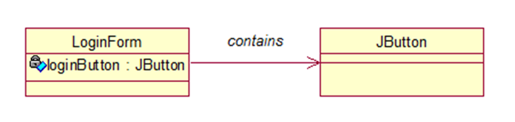
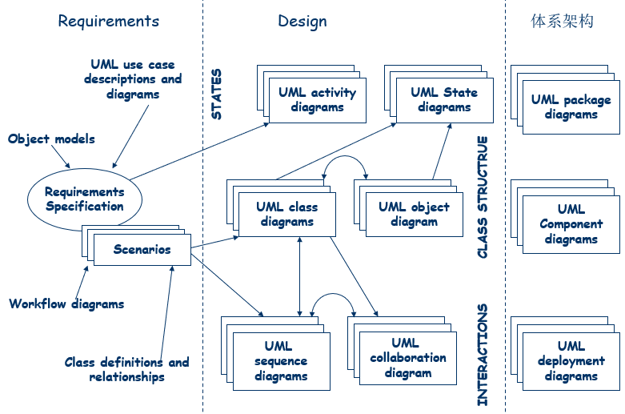

# 1

## 1 SE的定义、目的、方法及作用
- 软件工程 = 理解问题的本质，利用工具、技术来解决现实问题的综合过程

- SE 的方法：面向对象模式，结构化模式，基于过程的模式等。
- SE 的作用：付出较低的开发成本，达到要求的软件功能，取得较好的软件性能，开发的软件易于移植，需要较低的维护费用，能按时完成开发工作，及时交付使用


## 2 // 开发模式（paradiam）
开发软件时特定的方法、途径或哲学
面向对象开发的各种模式、结构化开发的模式、基于过程的模式等等

## 3 说明错误、缺陷、失败的含义与联系。（请举例说明）
- 错误error：在软件开发中产生的人为错误，一个错误可能产生多个缺陷，静态存在
例如：对需求产生了误解

- 缺陷fault：在功能实现过程中产生的问题
例如代码的判断逻辑缺陷

- 失败failure：由于缺陷导致的软件没能按照需求运行，动态存在
例如由于计划阶段的项目计划不周，从而导致软件运行失败；软件未能按照设计阶段预期地使用，从而导致失败。

- 联系
人为原因导致程序错误，错误编译到系统后会导致缺陷
开发者会观察到缺陷，缺陷是系统内部视图
用户会观察到失败，失败是系统外部视同
并不是所有缺陷都会导致失败（不执行故障代码，就不会失败）

## 4 软件质量应从哪几个方面来衡量？论述之

- 产品质量
	- 用户角度：有足够的功能，易于学习和使用
	关注failures的数量，外部因素
	- 开发者角度：内部特征、质量细则
	关注faults的数量和类型，faults在各个开发阶段分布的区间

- 过程质量：发和维护的过程中，许多活动都会对最终产品的质量产生影响

- 商业质量：将技术价值与商业价值统一起来，将工作量视为投资
	- 技术价值：用技术指标衡量 (速度、正确运行时间、维护成本等)
	-  商业价值：软件是否与战略意义相吻合


## 5 // 软件系统的系统组成

系统 = 对象（实体）+ 活动 + 关系 + 边界

## 6 现代软件工程大致包含的几个阶段及各个阶段文档

*SRS: Software Requirement Specification*
*SAD: Software Architecture Diagrams and reports*

<span id = "过程的9个阶段">过程的几个阶段</span>

1. 需求分析和定义
问题定义、可行性研究、需求分析、【SRS软件需求规格说明书】、所有参与者复审

2. 系统设计
用户界面、【SAD系统结构图】、开发人员和客户复审

3. 程序设计
【模块功能的算法与数据描述文档】、开发人员复审

4. 程序实现
编程和debug、【源代码和注释】、开发人员或码农复审

5. 单元测试
模块功能与性能测试、【测试报告】、测试团队复审

6. 集成测试
按照《SAD系统结构图》进行集成测试、【测试报告】、测试团队复审

7. 系统测试
按《SRS软件需求规格说明书》对系统总体功能进行测试、【测试报告】、开发者与客户复审

8. 系统提交
交付产品、【用户手册和操作手册】、复审

9. 系统维护
为了改错或满足新需求，进行修改软件的过程，【维护报告】、维护团队复审

## 7 //使现代SE实践发生变化的（七个）关键因素是什么？

- 商业软件投放市场的时间具有紧迫性
- 计算经济学发生改变：硬件成本低，更高的开发和维护成本
- 瀑布模型无法预测软件开发
- 局域网和广域网的广泛使用
- 面向对象技术的出现和采用
- 使用窗口、图标、菜单和指针等图形用户界面
- 出现了强大的桌面计算平台：终端应用开放给用户

## 8 什么是重用、抽象等现代软件工程Wasserman所述的主要概念？

- **抽象： **对问题的某一层次进行概括化的描述，关注问题的关键部分而不是细节
    - 在OO中抽象出类class，明确类的属性或特征、属性和类的关系、不同类之间的交互
    - 可以形成抽象的层次

- **符号描述系统：**采用标准的符号表示系统
	- 利于交流
	- 利于建模，并检查是否具有完整性、一致性
	- 易于对需求和部件进行重用

- **用户界面原型化：**
	- 原型系统prototyping：系统的小型版，具有关键功能
	- 利于用户评价、选择、决定关键需求
	- 证明设计的可行性

- **软件体系结构：**将系统定义为一组子结构单元 + 单元之间的相互关系；关注模块的独立性
	- 简化系统实现和系统测试
	- 提高系统维护和更新所带来的效益
	- 一个系统可由不同的体系结构来组成

- **软件过程：**软件开发过程中的组织和规范方法

- **重用：**重用以前软件系统中有共性的部件，用到新的开发项目中

- **度量/测度：**用类数学的语言来描述行动和结果，比较不同项目中的过程

- **工具和集成环境：**比较不同框架下，不同的软件环境所提供的服务质量，以此来决定在程序开发中选择哪个环境；选择不同的工具集成到一个完整的开发环境

# 2 过程建模

## 什么是软件过程？软件过程的重要性是什么？包含几个阶段？软件生命周期？

- 过程：一系列涉及活动、约束、资源的有序步骤，可以产生所期望的输出结果
- 过程的重要性
	- 通用：在一系列活动上保持了一致性和结构性
	- 自我指导：分析、检查、理解、管理、改进过程中的活动
	- 在各个过程编写文档
- [过程的9个阶段](#过程的9个阶段)
- 软件生命周期：软件的开发过程——产生直到成熟的全部过程

## 瀑布模型及各阶段文档，优缺点？


- 特征
    - 一个阶段需要在下一个阶段开始之前完成（依赖性与连续性）
    - 尽可能推迟程序的物理实现
    - 每个阶段完成对应的文档；阶段结束前完成文档的评审

- 优点
    - 每个阶段过程都有结束标志和可交付的产品，利于对进度进行评估
    - 简单，易于对客户进行解释
    - 是其他复杂模型的基础

- 缺点
    - 无法应对软件的变动，而现实中软件会进行大量的迭代开发、不断调整
    - 文档之间难以转换

## //原型的概念与用途

- 原型：开发出产品的一部分，让开发者和用户据此进行沟通、提出意见，为最终产品定型
- 原型化：为开发过程加入一个子过程——制作原型产品
- 原型化的用途
	- 确保可以在测试阶段之前进行修正
	- 提供多个可选策略

## 论述分阶段开发模型的含义, 其基本分类及特点是什么？ 

- 分阶段开发模型：系统被设计成部分提交，用户可以得到部分功能，剩余的系统仍在开发过程中
	- 目的：降低从整理需求文档到系统提交之间的时间差
	- 产品系统：客户和用户正在使用的版本 
	开发系统：准备替换当前系统的下一系统版本
- 分阶段开发的方法
	- 增量式开发：最开始的版本是只有部分功能的子系统，每发布一个新版本，就加入一个有新功能的子系统，最终版本包含了全部功能
	- 迭代式开发：最开始的版本中提供系统的整体框架，每个新版本增强各个子系统的功能，最终版本使各个子系统的功能达到最强性能
	- 现实中多将增量开发和迭代开发结合：新版本发布时，可能会加入新的功能，也可能会对现有的功能进行增强

## 什么是UP， RUP，进化式迭代等市场流行的过程模型?

- 统一过程：用例驱动、以架构为中心、迭代和增量式软件开发过程
	- UP：Unified Process
	- 系统开发期间有一系列重复的生命期，每个生命期都以向客户推出一个产品版本而结束
- 统一开发过程RUP：IBM提供支持和包装的UP系统
- 进化式迭代开发
	- 统一开发过程的实践，UP的市场化定义
	- 将开发组织成一系列固定的短期小项目；每次迭代都具有各自的需求分析、设计、实现和测试，产生局部系统；随着时间和一次次迭代，系统增量式完善

## 螺旋模型四个象限的任务及四重循环的含义？ 

- 四个任务
	- 计划
	- 产生目标/可选方案
	- 风险评估
	- 开发和测试

- 四次迭代
	- 操作概念：确定基本软件操作和流程
	- 软件需求
	- 软件设计
	- 系统实现与部署

## 什么是敏捷方法？以及其代表性方法？

- 敏捷方法：新型开发方法，快速开发，灵活有效地适应变化，迭代和增量开发，尽早地、持续交付系统，积极与用户和开发人员沟通协作
- 代表性方法：极限编程、测试驱动开发

## //------ 习题2， 3

针对本章描述的每一种过程模型，讨论使用该模型的优点和缺点分别是什么？

针对本章描述的每一种过程模型，讨论该模型是如何处理开发后期重要的需求变化的？

## // 在所有的软件开发过程模型中，你认为哪些过程给予你最大的灵活性以应对需求的变更？

1. 设计对于分析模型应该是可跟踪的：软件的模块可能被映射到多个需求上。
2. 设计结构应当尽可能的模拟实际问题。
3. 设计应当表现出一致性。
4. 不要把设计当成编写代码。
5. 在创建设计时就应该能够评估质量。
6. 评审设计以减少语义性的错误。

# 3 项目计划和管理

## 什么是项目进度？活动？里程碑？项目成本？

- 项目进度：对软件项目开发周期的刻画，每个阶段分解成离散的任务或活动，描述活动之间的交互关系，估算各个活动和整个项目的完成时间
- 活动：项目的一部分，一般占用一段时间，有明确的开始和结束
- 里程碑：特定时间点，标志一个活动完成，通常伴随提交物
- 项目成本
	- 设施成本：提供工作的物理环境
	- 项目本身的成本：购买支持开发的软件和工具 + 工资
	- 工作量：项目成本中的大头


## 如何计算软件项目活动图的关键路径？（习题2，3）冗余时间？最早和最迟开始时间（课堂习题讲解） 

**关键路径**：最晚开始时间 = 最早开始时间的路径


弄懂活动图基本原理（参考课本），找出课后练习题--图3.23和3.24的关键路径。

## // 软件团队人员应该具备的能力是什么？

- 完成工作的能力
- 对工作的兴趣
- 经验：开发类似应用、使用类似工具或语言、使用类似开发环境的经验
- 培训
- 与其他人交流的能力
- 负责人的能力
- 管理技能

## 软件项目团队组织的基本结构？

- 主程序员负责制：由一个主程序员负责系统涉及和开发，其他的成员向其汇报，主程序员对每一个决定有绝对决策权
	- 优势：交流最小化；快速决策
	- 缺点：创造性低；对主程序员要求高；个人主观性强

- 忘我方法：全体成员共同决策，每个成员平等的承担责任

**项目组织的结构化与创造性**

- 结构化较强的团队
    - 按时完成任务，但工作比较循规蹈矩，项目普通但功能完备
    - 适合人员较多，项目稳定性和一致性高，使用较正规的结构

- 结构化较弱的团队
    - 可能不能按时完成任务但创造性强
    - 涉及大量的不确定性因素时，采用较为民主的方法和相关的团队结构

一下两问为工作量估算
## //专家估算法的大致含义？算式估算法的大致含义？

- 专家估算法：工作量估计依赖于专家的判断，预测的精准性基于估算者的能力、经验、客观性和洞察力
- 算式估算法：方程式描述 工作量 和 影响工作量因素 的关系

## 试述COCOMO模型的三个阶段基本工作原理或含义。

Constructive Cost Model 构造成本模型

$$
E = bS^cm(X)
$$
$bS^c$是初始规模估算，成本因素向量$m(X)$对其进行调整

- 阶段一：计划阶段
	- 构建项目原型，解决高风险问题
	- 使用应用点进行规模估算

- 阶段二：早期设计阶段
	- 设计人员研究出可选的体系结构和操作概念
	- 使用需求文档中的功能点进行规模估算

- 阶段三：后体系结构阶段
	- 项项目已经开始开发，实现了一部分
	- 通过需求文档中的功能点 + 代码进行规模估算

## 什么是软件风险？了解主要风险管理活动？有几种降低风险的策略？

- 风险：在软件生产过程中不希望看到的、有负面结果的事件
	- 风险影响：与该风险事件有关的损失
	- 风险概率：风险事件发生的可能性；=1时风险被称为问题
	- 风险控制：可采取的一系列降低风险的行动
	- 风险成本：风险概率 * 风险影响


- 风险管理活动
	- 风险评估
		- 风险识别
		- 风险分析
		- 风险优先级分配：根据风险成本分配
	- 风险控制
		- 风险降低 (风险发生前)
		- 风险管理计划 (风险发生前)
		- 风险化解 (风险发生后)

- 降低风险的策略：
	- 避免风险：改变性能需求或功能需求
	- 转移风险：转移到其它系统，或者购买保险
	- 假设风险发生，利用项目资源控制风险


# 4 需求

## 1 需求的含义是什么? 

对用户期望系统有的行为进行描述，包括系统的对象、状态、约束、功能等

## 2 需求阶段作为一个工程，其确定需求的过程是什么？

1. 原始需求获取：客户给出的需求

2. 问题分析：理解需求并通过建模或模型化方式进行描述

3. 规格说明：利用符号描述系统将定义规范化表示

4. 需求核准：开发人员和客户检查规格说明，看是否与需求匹配

5. 最终产生正式的SRS(软件需求规格说明)


## 3 举例说明获取需求时，若有冲突发生时，如何考虑根据优先级进行需求分类

需求分类

1. 必须要被满足的需求
2. 非常值得但并不必须的需求
3. 可选择但可以不做的需求

## 4 // 如何使需求变得可测试？（sidebar4.4）

- 针对需求进行量化描述，避免模糊表达
- 将指代用词替换为实体的正式名称
- 每个名词或事项应在需求文档中给出唯一定义

## 5 需求文档分为哪两类？

- 需求定义：将用户期望系统可以达成的事物完整罗列出来
- 需求规格说明 SRS：用技术词汇或符号描述系统对需求定义进行重述，这样设计人员知道如果对系统进行构建

## 6 什么是功能性需求和非功能性需求/质量需求？ 设计约束？过程约束？如何区分？

需求的四种类型：

- 功能需求：描述系统内部的功能，系统和环境之间的交互
包含过程约束和设计约束

- 质量需求/非功能需求：软件方案必须具备的质量特征，如系统性能、安全性、响应时间等
- 设计约束：对系统设计和实施方案的限制和要求
物理环境：对环境或设备的限制，如安装及环境要求等
接口：对输入输出的限制
用户：限定几种类型的用户

- 过程约束：对构建系统的技术和资源方面的限制和要求
文档 ：文档类型、文档数量
资源 ：构建系统的材料、开发人员的技能
标准 ：比如阅读文档时的用户指派标准

## 7 // 需求的特性？（正确性、一致性、完整性）

- 正确性：符合对需求的理解
- 一致性：需求之间有没有冲突
- 完整性：预想到所有可能发生的情况，完整需求
- 无二义性；可行性；相关性；可测试性；可跟踪性

## 8 了解DFD图的构成及画法

Data Flow Diagram 数据流图：描述数据流入、转换、离开系统

图符：记住


示例：


## 9 // 在需求原型化方面，什么是抛弃型原型？什么是演化型原型？

在设计之前原型化需求，为理解需求提供帮助，以决定最终设计方案

- **抛弃式原型：**仅用于了解问题，探索可行性，用完扔掉

- **进化式原型：**用于了解问题，并作为将来系统的一部分一起提交


## 10 // 用DFD图简单描述ATM机的工作原理（主要功能和数据流）（习题7）


# 5 设计

## 1 什么是软件体系结构？设计模式？设计公约？设计？ //概念设计？技术设计？

- 体系结构 Architecture：解释如何将系统分解为单元，单元之间如何相互关联，描述单元的外部特性

- 设计模式 Design pattern：针对单个模块或模块(少量)集合的一般性解决方案，较低层次的设计决策

- 设计公约 Design Convention：用于提高设计质量的设计决策和设计建议
当一种设计公约发展成熟时，可以被封装成设计模式或体系结构风格，最后可能被内嵌为一种程序语言结构

## 2 软件设计过程模型的几个阶段？

1. 建模 Modeling：尝试可能的系统分解，根据需求确定软件的体系结构风格

2. 分析 Analysis：分析初步的体系结构，关注系统的功能、质量、约束等，关注系统级别的决策

3. 文档化 Documentation：确定各个不同的模型视图

4. 复审 Review：检查文档是否满足所有功能及质量需求

5. final output：软件体系结构文档SAD Software Architecture Document


## 3 // 三种设计层次极其关系？

- **体系结构设计 architecture design：**
	- 将软件需求 (SRS) 中描述的系统能力与系统部件关联起来 $\approx$ (过程九阶段中的)系统设计

- **代码设计 code design：**
	- 设计各个部件 (模块) 的算法、数据结构
	- 部件 = 编程原语 + 原始运算符 + 组成机制
	components = programming primitives + primitive operators + composition mechanisms

- **可执行设计 executable design：**最底层的设计，例如内存分配、数据格式、位模式、相关显示匹配等等

**设计层次的特点和关系**

- 自顶向下的设计：先设计体系结构，然后进行代码设计，最后是可执行设计
- 代码设计 + 可执行设计 $\approx$ 程序设计
- 可重复、多次修改：随着设计人员理解和创造得更深入，会对以上三种设计进行修改

## 4 //什么是模块化？什么是抽象？

- 模块化：把系统中各不相关的部分进行分离，模块有清晰的输入和输出，设计目的明确，功能独立，可以做独立检测
- 抽象：隐藏细节
	- 探讨或分析两个模块共享某数据时，模块各自的私有细节应隐藏
	- 抽象的层次：模块/部件以不同层次结构的抽象形式出现，越上层、越早期的模块层次或框架，设计越抽象；高层次提供一个决策视角(隐藏了细节)，其他层次更多得展示主要功能和实现细节


## 5 论述设计用户界面应考虑的问题

- 设计界面要注意解决的关键要素
    - 寓意/比喻 metaphors：将系统的操作和**界面模拟成用户熟悉的概念**或物体，使用户更容易理解系统；可识别和学习的基本术语、图像和概念等
    - 思维模型 mental model：数据、功能、任务的组织与表示，**如何呈现信息，让用户理解系统的结构和运作方式**
    - 模型的导航规则 navigation rules for the model：如何在数据、功能、活动和角色中**移动及切换**
    - 外观 look：系统向用户传输信息的**外观特征**
    - 感觉 feel：系统向用户提供有吸引力的体验的**交互**技术

- **文化差异**问题：需要考虑系统用户的信仰、价值观、道德规范、传统、风俗和传说
解决方法：使用**国际设计/无偏见设计** 或定制界面

- 用户**偏好**问题：提供**可以选择的用户界面**

- 界面设计原则
    - 一致性原则 
    - 及时提供信息反馈 
    - 合理布局、界面简洁 
    - 合理利用颜色 
    - 对用户出错的宽容性 
    - 减少重复的输入 
    - 支持快捷方式
    - 减少对用户记忆的要求 （逐次回退等）
    - 快速的系统响应 
    - 符合用户的工作环境与工作习惯 
    - 用户联机支持 


## 6 5.5节----模块独立性----耦合与内聚的概念及各个层次划分？
## 举例说明耦合与内聚的基本分类。以及各个分类的含义与特征

模块独立的程度取决于两个部分：耦合coupling和内聚cohesion，是设计质量测度的重要指标之一

**耦合 coupling：两个部件之间的相互关联程度**
追求尽量低的耦合度，以下层次由低到高

- 非直接耦合 uncoupled：模块相互之间**没有信息传递**
- 数据耦合 data coupling：模块间传递**数据**
- 特征耦合 stamp coupling：模块间传递**数据结构**
- 控制耦合 control coupling：模块间传递**控制量**
- 公共耦合 common coupling：不同模块访问**公共数据**
- 内容耦合 content coupling：一个模块**直接修改**另一个模块 (修改私有数据或直接转移到另一个模块中)

**内聚 cohesion：部件内部各组成成分的关联程度**
追求尽量高的内聚度，以下层次由低到高

- 偶然性内聚 coincidental：模块内各部分**不相关**，只为**方便或偶然性**原因放入同一模块
不相关的功能、过程、数据出现在同一个部件中

- 逻辑性内聚 logical：**逻辑上相关或相似**的功能或数据放置在同一个部件内

- 时间性内聚 temporal：部件各部分要求在**同一时间**完成
- 过程性内聚 procedural：有按照某个确定的**次序**执行一系列功能
- 通讯性内聚 communicational：各个部分访问**共享数据**
私有共享、远程共享、云共享等

- 顺序性内聚 sequential：各部分有**输入输出关系**，操作统一的数据集，并且操作有顺序
- 功能性内聚 functional：各部分组成**单一功能**

## 7 软件过程中复审的概念，设计复审的重要性。

- 复审：检查**文档**是否满足所有**功能及质量需求**
	- verification：复审设计
	- validation：复审需求

- **设计复审**
	- **概念设计**复审 preliminary design review：与客户、用户检查概念上的设计
	- **程序设计**复审 program design review：程序员在实施之前获得技术设计反馈
	- 重要性：复审讨论增强了成员之间的**交流**；发现**故障并改正**

# 6 面向对象

## // 什么是面向对象？OO有几个基本特征？如何使用高级语言实现这些基本特征？
// 掌握并使用高级语言的OO基本编程方法和技巧

面向对象：一种软件开发方法，将问题及其解决方法组织成一系列独立的对象，数据结构和动作都被包括在对象中

七个基本特征

- 标识 identity：
identify an object：确定对象的身份，进行对象的命名
对象名称区分一个对象和另一个对象，或者区分对象自身的状态，使对象可辨别

- 抽象 abstraction：从不同的角度描述，形成层次
- 分类 classification：对有相同属性和行为的对象进行分类，然后抽象出类
实体 instance：每个对象都是类的一个实体

- 封装 encapsulation：将属性和行为封装在对象内部，隐藏实现细节
- 继承 inheritance：根据类之间的相同和不同，层次化地对类进行组织
- 多态 polymorphism：子类对父类的一些动作进行重新定义
行为 behavior：由一个对象主动或被动实施的动作或转变
方法 method：对一个特定类的操作进行实现
在多态中：一个行为behavior可以有多个方法method；可以很容易地添加新的类

- 持久性 persistence：
一个对象的能力、名字、状态、行为，可以超越时间或空间的性质
模型可以映射为数据库中的关系模型
持久对象不随着进程的结束而消亡，可在外存中存贮 

## 什么是设计模式？

一套被反复使用的**代码设计经验的总结**，使用设计模式目的是为了**可重用代码**、让代码更容易被他人理解并且保证软件质量

## 了解 OO设计的基本原则？

①单一职责原则：一个类应该只有一项责任
②重用原则：类可以重用
③开闭原则：类可扩展但不可修改
④替换原则：继承、多态
⑤依赖倒置原则：依赖抽象，不要依赖具体
⑥接口隔离原则：分离接口比一个通用接口好
⑦迪米特法则：不通信的类，不要发生直接作用

## 了解 OO开发有何优势？

- 描述语言的一致性：对于问题和决策有相同的**语义结构**（类、对象、接口、属性、行为）
- 软件过程的一致性：所有的**过程** (制定需求、高层低层设计、编码、测试等待) 都使用相同的语义结构

## OO开发过程有几个步骤？

OO需求 + OO高层设计 + OO底层级设计 + OO Programing + OO测试

## 掌握用例图的组成和画法，用例的几个要素的含义
## 掌握用例图的实例解析方法，如何辨识和确定一个用例？
## 用例模型相关建模步骤是什么？

- **用例 use case：**描述系统提供的**特定功能**，用椭圆表示


- **执行者 actor：**和系统进行**交互的实体**，可以是一个用户、设备，用小人表示


- **包含 include/use：**对已定义用例的复用，用以**提取公共行为**，用带箭头的实线表示


- **扩展 extension：**对一个用例的**扩展使用**，通过扩展用例来展示一个不同的角度


- 示例：


## 用例图、类图等针对面向对象的项目开发的意义是什么？
## 熟悉类图中各个类之间的基本关系分类及其含义
## 绘制类图最常用的方法及步骤是什么？识别一个类的基本思路？

**① 继承 inheritance / 泛化generalization**

超类是子类的泛化，子类可以继承超类的属性和行为

java：`extends` ；C++/C#：`:`

用空心箭头表示：箭头所指的是被继承的超类


**② 关联 association**

两个类有语义上的关系，或者它们会一起发生并且关系会保留一段时间
关联是实体间关系的最一般刻画，随需求变化或时间推移，可能会有额外动作产生

java / C# / C++：将一个类的对象作为另一个类的成员变量

用普通箭头表示

以下为几种不同的关联分类：

- 双向关联：默认情况下关联是双向的


- 单向关联：箭头指向被拥有或被关联的类



- 自关联：某个类中的某个属性的对象类型为类本身 (递归定义)


- 多重性关联：又称重数性关联关系，表示两个关联对象在数量上的对应关系

常见的多重性表示方式如下表所示：


- 关联的其他分类: 普通关联、递归关联、限定关联、有序关联、三元关联、聚合等

- 聚合关系 Aggregation：聚合关系表示部分与整体的关系，聚合关系中的成员对象是整体对象的一部分，但是成员对象**可以脱离**整体对象存在
用带空心菱形的箭头线表示：箭头指向成员对象

UML 2.0 去掉了聚合

- 组合关系 Composition：表示部分与整体的关系，整体对象可以控制成员对象的生命周期，一旦整体对象不存在，成员对象也不存在，两者是**共生**关系
用带实心菱形的箭头线表示：箭头指向成员对象

UML新版将聚合与组合合并

- 依赖关系 Dependency：一种使用关系，某个类 (依赖) 将另一个类 (被依赖) 的对象作为**自己一般方法的参数**
用虚线箭头表示：箭头由依赖类指向被依赖类


- 接口与实现关系：接口中没有属性，所有的接口都是抽象的；抽象之间由继承和依赖关系；类实现接口
用虚线空心箭头表示：空心三角箭头指向抽象的接口


## 熟悉用例图、类图、状态图的组成和画法

## 了解UML其他图示结构的基本用途

UML模型图的5类10种：

- 用例图
- 静态图（类图，对象图，包图）
- 行为图（状态图，活动图）
- 交互图（顺序图，合作图）
- 实现图（构件图，配置图）

**需求分析过程**

- 工作流图：数据流图DFD或UML中的活动图；概念类图加以补充

- UML用例图：通过用例图中的功能明确类

- 场景描述：一些包含在上述图中的文本描述或形式化的语言陈述

**设计过程**

1. 类图：对概念类图的增进
对象图：对所有对象的解释)

2. 活动图：展示系统中会发生的所有活动 (由一个对象的值改变而引起)
状态图：展示对象拥有的所有状态 (由消息引起)

3. 顺序图：展示数据如何从一个对象流向另一个对象，将需求中不正式的描述形式化
协作图：用对象和时序信息来展示对象之间的事件流

**架构和编码 (实现)**

- 包图：展示如何将类划分为不同的模块
- 组件图：展示系统最终的组件modules和依赖关系
- 部署图：展示与应用程序相关的网络连接





# 7 编写程序

## 1 //为什么说编码工作是纷繁复杂甚至令人气馁？

- 设计并不能直接用于编写代码
- 代码要易于理解
- 代码要可以重用
- 需要比照着设计进行检查

## 2 一般性的编程原则应该从哪三个方面考虑？

- **控制结构：**程序结构需要反映设计的控制结构，可以轻松地从上到下阅读一个组件的代码
    - 对不好理解的代码控制进行重组 *重新调整一下结构*
    - 根据模块化的代码块来构件程序：通过使用宏、方法、继承等隐藏细节
    - 组件通用性：一个组件还可以再次用于其他的类似过程
    - 组件之间的耦合和依赖关系要可见

- **算法**
	- 将算法转换为代码时有很大的灵活空间
    - 选择算法时要在效率、设计质量、标准、客户需求之间平衡考虑

- **数据结构：**安排数据的格式并进行存，使数据管理和操作简明易懂
	- 设计好的数据结构，简化程序计算，保持程序简单
	- 数据结构可以影响程序结构和编程语言的选择

## 3 //论述编码阶段实现某种算法时所涉及的问题。

- 追求效率时可能会带来潜在的代价：写代码和读代码的时间更长，代码不能清晰易懂
- 一般情况下，清晰度第一，效率第二
- 可以学习如何通过编译器优化代码

## 4 在编写程序内部文档时，除了HCB外，还应添加什么注释信息？注意什么？

内部文档：在源代码中的描述性内容，为读者提供注释信息，包括头部注释板块和其他程序注释

**头部注释版块 HCB**

- 总结性信息：identify程序的一些信息、对数据结构、算法、控制流进行描述

- 说明性文件（如头文件.h文件、.inc文件、.def文件、编译说明文件.cfg等）头部应进行注释：
	- 版权说明、**版本**号、生成**日期、作者**
	- 文件**内容、主要功能**、与其它模块或函数的**接口**
	- 输出值、取值范围、含义及**参数**间的控制、顺序、独立或依赖等关系
	- 头文件的注释中还应有**函数功能**简要说明
	- 修改历史记录列表

**其他程序注释：**帮助读者理解源代码的其他描述信息

- 对程序正在做什么提供逐行的解释
- 分阶段注释：将代码分解成表示主要活动的段，每个活动再分解成更小的步骤
- 注释有意义的信息，而不是陈述从代码中可以看出的显而易见信息
- 记录数据结构和用途：OO中的信息隐藏会让数据是如何发生变化的更难以理解

**注意**

- 程序改变时，注释也要做相应修改
- 编写代码的同时写注释，而不是在之后
- 有意义的变量名和标注
	- 选择表达特定意义或用途的名字
	- 最好按字母顺序标注
- 注释格式化以增强理解：有缩进和间距


## 5 敏捷方法的大致思想？什么是极限编程(XP)? 以及派对编程？

敏捷方法：新型开发方法，灵活有效地适应变化

- 极限编程 Extreme Programming：是敏捷方法的一种具体形式，**轻量级**软件开发
	- 主要特征：适应环境和需求**变化**，充分发挥开发人员的**主动**精神
	- 优点：**降低软件项目风险**，改善业务变化的**反应能力**，提高开发期间的**生产力**，为软件开发过程增加**乐趣**等
	- 四个准则
		- **沟通：**客户与开发者之间持续的交流
		- **简单性：**选择简单的设计或实现来应对客户需求
		- **反馈：**指在软件开发过程中的各个活动中，包含的各种反馈循环工作
		- **尽早的和经常性**的交付软件功能的承诺
- 派对编程 Pair Programming：也属于敏捷开发方法，**两个**程序员共同开发程序，且**角色分工明确**，如一人负责编写程序、另一人复审与测试，两人定期**交换**角色

# 8 程序测试

单元测试 + 集成测试

## 了解 产生软件缺陷的原因？

- 软件本身的问题：系统处理大量的状态，复杂的公式、活动、数据、算法等
- 由客户和设计人员造成：需求的不清晰、无法实现、错误理解，设计错误等
- 其他因素：项目规模、众多参与者导致的复杂性

## // 将软件缺陷进行分类的理由？

知道正在处理的是什么类别的故障 (缺陷) 对于我们具体的测试，以及之后的故障 改正都是有很大帮助的

## 有几种主要的缺陷类型？

- 算法缺陷 algorithmic fault：**算法**的某些**处理步骤或逻辑**有问题，导致给定的输入数据无法产生正确的输出 
检查方法：读程序，也成为桌上检查desk checking；提交分类的输入数据

- 计算和精度缺陷 computation and precision faults：**计算公式**在编程实现时是错误的，或者计算结果达不到要求的**精度**

- 文档缺陷 Documentation Faults：**文档与程序实际**做的不匹配

- 过载缺陷 Stress or overload Faults：程序运行时，**数据结构** (如队列、缓冲区、表、数组等) 接受的数据超出了所规定的能力
程序功能上出现故障，此时无法执行功能

- 能力缺陷 / 容量缺陷 Boundary or Capacity Faults：系统**活动到达指定的极限**，系统的性能变得不可接受
性能上出现故障

- 时序性缺陷 timing faults：同时执行或有**执行顺序**的进程之间，协调不当

- 性能缺陷 performance faults：在正常条件下，系**统不能以需求规定的速度执行**
上面的能力缺陷则是条件超出了正常的极限

- 恢复性缺陷 recovery faults：系统无法按照期望的要求，从运行的**故障中恢复**

- 硬件和系统软件缺陷 hardware and system software faults：提供的硬件或软件没有按照文档中的操作条件和程序工作

- 代码的标准和规程缺陷 Standards and Procedure Faults：代码没有遵循组织机构的标准和过程

## // 什么是正交缺陷分类？

被分类的**任何一项故障都只属于一个类别**，则分类方案是正交的
若一个缺陷可以属于不止一个类，则失去了度量的意义

## 测试的各个阶段及其任务？涉及的文档？（图8.3）

1. 单元测试 unit testing / 模块测试 (module testing) / 构件测试 (component testing)：
根据程序设计，将每个程序构件与系统中的其他构件隔离，对功能进行测试
2. 集成测试 integration test：根据系统设计和程序设计，验证系统构件是否可以在一起工作
3. 功能测试 function test：根据SRS检查功能
4. 性能测试 performance：根据SRS检查性能
5. 验收测试 acceptance test：检查客户的需求定义
6. 安装测试 installation test：在真实的环境中检查系统


## // 测试的态度问题？（为什么要独立设置测试团队？）

测试态度

- 将测试看成为一个发现的过程，而不是验证自己代码的正确性、技术、能力
- egoless programming：将程序视作整个系统的一部分，而不属于那个写程序的人
- 不能只关注被测试的程序是否满足了解决方案，而是同时考虑问题本身

独立的测试团队

- 开发人员可能担心发现系统故障影响自己的业绩，独立的测试团队避免了故障的个人责任与尽可能多的发现故障的需要之间的冲突
- 独立团队因为和代码不是太过紧密，所以能更加的**客观**，有更多的机会发现细微的故障
- 独立的测试团队可以参与软件开发的整个过程，测试可以和编码**并行**的进行

## 掌握测试的方法----黑盒、白盒的概念？

- 黑盒：不知道程序的内部逻辑结构和内部特性，参考系统需求、系统设计、程序设计文档，测试程序的功能是否符合它的功能说明
	- 优点：不会受到测试对象的内部结构和逻辑所带来的**约束**，只使用**有代表性的**测试用例
	- 缺点：**不完备，**即无法生成一组用例证明所有情况下功能都是正确的
	以SRS和SAD等文档作为依据，有一定的**盲目性和不确定性**，不可能揭示所有的错误

- 白盒：以测试对象的**内部结构为基本依据**，手工或自动的展开各种测试
	- 优点：可以测试到模型的**细节**
	- 缺点：内部逻辑过于**复杂**时，想要测试所有的分支不太现实


## 什么是单元测试？  

- 根据程序设计，将每个程序构件与系统中的其他构件**隔离**，对**功能**进行测试

// 什么是走查和检查？

- 代码走查 code walkthrough：**非正式，**只标注
- 代码检查 code inspection：**正式**；评审小组根据准备好的**关注点列表**检查**代码和文档**

## 黑盒、白盒方法各自的分类？测试用例的设计方法和给出方法。
## 黑盒、白盒方法的分类原则，各种覆盖方法等。（课件等）
## 如何面对一个命题，设计和给出测试用例的问题。（课件）

**测试用例 test case：**以**测试**程序为目的，而挑选的**输入数据**和其对应的**期望结果**

**黑盒：根据SRS和其他文档**

- **等价分类法：**把输入分割成等价类，每一个测试用例都代表了一类与它等价
的其他例子；如果测试用例没有发现错误，那么对应的等价例子也不会发生错误；
分类满足以下标准：
    - 每个可能的输入一定属于某个分类
    - 各个分类之间没有交集
    - 每个类的特定测试用例可以代表这个类

- **边界值分析法：**把测试值选在**等价类的边界**上
- **错误猜测法：**猜测程序中哪些地方**容易出错**，并据此设计测试用
- **因果图**法：适用于被测试程序有很多输入条件，程序的输出又依赖输入条件的各种组合

**白盒：根据模块的内部逻辑**

- 4种**逻辑覆盖**方法：语句覆盖、判定(分支)覆盖、条件覆盖、条件组合覆盖
- 3种**路径覆盖**方法：节点、边、路径

白盒测试用例设计方法

**1.逻辑覆盖法**

```
if (A and B) then Action1
if (C or D) then Action2
```

- 语句覆盖：每个**语句**至少被执行一次
	- `A and B`为真
	- `C or D`为真

- 判定覆盖：每个**判断**的真假均被满足一次
	- `A and B`为真
	- `A and B`为假
	- `C or D`为真
	- `C or D`为假

- 条件覆盖：每个**条件**取一次真和假
	- A、B、C、D均取一次真和假
	testcase1: `A=true, B=true, C=true, D=true`
	testcase2: `A=false, B=false, C=false, D=false`
	所有的测试用例共同满足即可
	
- 条件组合覆盖：在**不同判定中，每个条件的所有组合**至少要出现一次
	- 判定`A and B`：$2 \times 2$ 种
	- 判定`C or D` ：$2 \times 2$ 种
	testcase1: `A=true, B=true, C=true, D=true`
	testcase2: `A=true, B=false, C=true, D=false`
	testcase3: `A=false, B=true, C=false, D=true`
	testcase4: `A=false, B=false, C=false, D=false`
	所有的测试用例共同满足即可，判定内部是乘法，判定之间是加法

**路径测试法**
借助流程图：节点是判断语句和执行语句，边是真值结果或流程方向

- 完全覆盖：同时满足节点覆盖和边覆盖
	- 节点覆盖：每个节点至少经过一次 = 语句覆盖
	- 边覆盖：每条边至少经过一次 = 判定覆盖

- 路径覆盖：程序图中**每条路径**都至  少经过一次

## ------课堂练习的测试题目和讲解内容
## 集成测试及其主要方法的分类？（驱动模块、桩模块的概念）

- 根据系统设计和程序设计，验证系统构件是否可以在一起工作

### 由底向上集成测试

**含义：**模块结构图**最底层的构件先被单独测试**，**由下而上**测试那些调用已测试构件的构件，重复执行直到全部模块组装完毕

**构件驱动模块 component driver：**

**代替上层模块，**对特定构件进行**调用并传递测试用例**的程序


**优点：**

- **容易生成测试用例：**因为每次测试的底层模块都是真实的
- 很**适合面向对象**的程序：每次加入的是经过测试的真实对象，符合消息的正向传递方式
- 适合大多数底层构件经常被别的模块调用的场景

**缺点：**顶层构件通常是最重要的，但是却是最后测试的，最重要的高层故障**无法得到尽早地修正**

### 自顶向下集成测试

Top-Down Integration

**含义：**从**顶层控制组件开始，**首先对它本身进行测试，然后将被测组件调用的**下级组件组合**起来，对这个更大的子系统进行测试，反复采用这种组装方法，直到包含了所有组件为止

**桩 stub：**

正在测试的构件可能会调用还未测试的构件
编写一种专用程序，用于模拟测试时缺少构件时的活动，**代替下层模块进行应答**
桩会应答调用序列，并传回输出数据，使测试能够正常的进行下去


**优点：**或**主要问题可以在测试的早期得到处理**

**缺点：**

- 会很**难生成测试用例**
- 会需要**编写很多桩程序**

### 莽撞测试 / 一次性集成测试

Big-bang Integration

含义：**分别测试每一个**构件，然后将所有构件**组合一次性**地进行集成测试

缺点：

- 测试一个构件可能**同时需要桩和程序驱动**
- 发生**故障时很难找**到原因
- 很难讲**接口故障和其他故障区分**开

### 混合方式测试 / 三明治集成测试

含义：

- 将系统**分成三层，**目标层处于中间、目标层上有一层，目标层下有一层
- 在**顶层采用自顶向下**的方式集成
在较**低层采用自底向上**的方式集成

- **测试集中于目标层**

**集成策略的比较**

集成策略的选择不仅依赖于系统特性，还依赖于客户的期望

### 集成测试中的具体措施

Integration Test practical Strategies 

- 深度优先策略：首先集成一个**主控路径下的所有模块**，然后选择其他路径进行集成，直到全部模块集成完毕
- 广度优先策略：将软件结构中**每一层**次所有直接隶属于上层的模块集成起来进行测试，然后进行另一个层次的测试，直到全部模块集成完毕

以上两种策略并不区分是自顶向下还是自底向上，根据两者其一的选择，要采用相应的驱动模块或桩模块


## 传统测试和OO测试有何不同？OO测试有何困难？

- 系统发生变动时
传统测试：测试发生**变化的代码 + 原先**的测试用例
OO测试：重新测试那些对父类进行**override重载**的子类，可能会用到**不同的测试用例**

- 面向对象趋向于小粒度：**单元测试较容易**
传统：构件内部的**复杂性转移到构件之间的接口上**，集成测试更广泛

**OO测试难处 = 传统和OO的区别**

- 需求分析和验证：需求**文档的验证缺乏工具**支持 (依赖人工)
- 测试用例生成：用**测试工具**生成的测试用例，处理OO模型中的对象和方法时，会缺少针对性
- 源代码分析：传统的测试方法在评价OO系统的规模和复杂性时，不是很有效
- 覆盖分析：**对象的交互**是OO系统复杂性的根源，传统覆盖分析等测试方法的作用有限

## // 测试计划涉及的几个步骤？  （了解）

1. 指定测试目标：
2. 用例的分类设计
3. 书写测试用例
4. 编写测试用例
5. 运行测试用例
6. 评价测试结果 

# 9 系统测试

## 1 系统测试的主要步骤及各自含义？（图9.2）

- **功能**测试：由开发人员检查\<SRS>中的功能需求
- **性能**测试：由开发人员检查\<SRS>中的性能需求
- **验收**测试：由开发人员和用户检查\<需求定义>
- **安装**测试：在用户环境中测试

## 2 // 什么是系统配置？软件配置管理？  // 基线？（或见课件）

- 系统配置：交付给特定客户的一系列**部件的集合**
- 配置管理：对系统**不同软件配置的管理及控制**方法，通过控制系统差别以**降低风险，减少错误，**获得**测试的准确性和及时性**
- 基线：**软件文档和其他资料的集合，**代表了产品在某**一时间点**的情况
- 版本和改进版本
	- 版本 version：针对特定系统的**特定配置**
	- 改进版本 / 发布release：针对旧版本的**改进**版本
	Version n.m=Version n and release m 

## 3 什么是回归测试？

- 用于**新版本或者改进版本**的一种测试，确保**新旧功能**的正确运行，同时使用**新、旧测试用例**
- 大型系统的配置更动测试只是“部分”回归测试

## 4 功能测试的含义极其作用？

- 含义：对**SRS中的功能需求**进行测试 (黑盒)
- 作用：有很大的可能性**找到缺陷**

## 5 软件功能测试的基本指导原则？

- 较高的**查错概率**
- **独立的测试团队**
- 了解**预期的输出结果**
- 对**合法与非法的输入**都予以测试
- 不能仅仅为了测试的方便而**修改**系统
- **停止**测试应该有前提条件

## 6 性能测试的含义与作用？

- 含义：对**SRS中的非功能需求**进行测试
- 确保这个系统的**可靠性、可用性与可维护性**
- 由测试小组进行设计和执行并将结果**提供给客户**

## 7 性能测试的主要分类？

- **压力**测试：在短时间内加载极限负荷, 以验证系统能力
- **容量**测试：验证系统处理巨量数据的能力
- **配置**测试：构建测试用例，对系统软硬件的各种配置(最小到最大)进行测试
- **兼容性**测试：测试接口等
- **回归**测试：使用新的和旧的测试用例
- **安全**测试：根据安全需求
- 计时测试
- 环境测试
- 质量测试
- **恢复**测试
- **人为因素**测试：用户界面；可使用性

## 8 // 什么是可靠性、可用性和可维护性？

- **可靠性：**软件系统在给定的**时间间隔和给定条件**下**运行成功的概率** **0~1**
- **可用性：**软件系统在给定的**时间点**（按SRS要求）成功运行的概率 **0/1**
- **可维护性：**在给定的**使用条件**（预定的时间间隔、维护程序、维护资源之下进行维护）下，**维护活动能被执行的概率 0~1**


## 9 确认测试概念，确认测试分类？（基准测试和引导测试）
## 10 什么是alpha测试？β测试？

**确认测试 = 验收测试**

- 含义：客户在**需求定义**中检查系统是否满足需求
- 确认测试分类
	- **基准测试** benchmark test：客户准备**正式的测试用例**，在**实际安装**后的系统运作，**用户**对执行情况进行**评估**
	- **引导测试** pilot test：在**试验的环境**上安装系统，**依赖于日常工作，没有正式**的测试用例
    $\alpha$测试：在**组织内由开发人员**实施的引导测试
    $\beta$测试：在**工作场所进行由客户**进行的引导
	- **并行测试**：**新老版本并行运转，**使用户逐渐适应新版软件系统
	适用于分阶段的开发模型，新系统与先前版本并行运行（没有正式的测试用例）

## 11 什么是安装测试？

- 在**用户的环境中**进行测试，解决由开发环境和用户环境之间差异所引起的问题