# 1 Why Software Engineering

## 1.1 什么是软件工程 What is SE

1. 理解问题的本质
2. 用技术工具实现解决方法

### 用系统科学的方法解决问题

Solving Problems

1. 分析 analyzing：把问题拆分成若干子问题和这些子问题之间的相互关系
2. 合成synthesis：将子问题的解决办法组合成完整问题的解决办法

**问题求解过程中的一些概念**

- 工具 tool：可以更好完成某些事物的器具或自动化系统，提高准确率、更有效、更高产、增强质量
- 过程 procedure：将工具和技术组合起来，从而得到的产品
- 范式 paradigm：开发软件时的一种特定方法或理念
= “模式”，如面向对象开发的MVC模式、分布式的开发模式Hadoop

### 软件工程师的任务

将计算机科学的理论与计算机功能作为基础，理解问题的本质，利用相应的技术和工具，实现设计方案，推出高质量的软件产品

软件工程 = 利用工具、技术来解决现实问题的综合过程

## 1.2 软件工程方面的进展

软件工程围绕着如何设计和开发出高质量软件而展开
是一门学问，需要创新力和技能
代码和软件需要稳定、有效、精确、容易理解、容易使用、好维护和发展

### 软件出问题了

- 错误error：在软件开发中产生的人为错误
如对需求产生了误解、代码错误等

- 故障fault：在功能实现过程中产生的问题
故障会出现在开发和维护的产品中，静态存在
一个错误可能产生多个故障

- 失效failure：系统背离了需求规定的行为（没能按照需求运行）
可能会在系统交付的前后、测试中、运行中、维护中出现，动态存在

- 联系
人为原因导致程序错误，错误编译到系统后会导致故障
开发者会观察到故障，故障是系统内部视图
用户会观察到失效，失效是系统外部视同
并不是所有故障都会导致失效（不执行故障代码，就不会失效）

### 零缺陷软件

零缺陷无法实现，因为市场促使软件开发人员快速交付产品，无法做到完整地测试软件

### 关于bug

- 有些时候改正代码要比重写代码要难
- 错误修正有成本，修正得越晚、成本越大
- 复审很重要
正式开发团队的行为规范
自己检查出1/5错误
同行评审检查出4/5错误

## 1.3 什么是高质量软件

从三方面考虑：产品质量、过程质量、商业价值

### 产品质量

- 用户角度：有足够的功能，易于学习和使用
关注failures的数量，外部因素

- 开发者角度：内部特征、质量细则
关注faults的数量和类型，faults在各个开发阶段分布的区间

### 过程质量

- 开发和维护的过程中，许多活动都会对最终产品的质量产生影响

- 对过程进行建模
三个模型：CMM、ISO900、SPICE

### 商业质量

**技术价值与商业价值的联系和区别**

- 技术价值
用技术指标衡量：速度、正确运行时间、维护成本等

- 商业价值
软件是否与战略意义相吻合

- 将技术价值与商业价值统一起来
提高技术质量不会自动转化到商业价值

**过程改进带来的商业价值**

- 传统公式：投资回报ORI
**R**eturn **O**n **I**nvestment = 资本+利润+风险津贴

- 软件生产：将工作量视为投资
投资 = 普通工作量+提高过程质量的工作量
通过减少工作量来降低成本

## 1.4 软件工程涉及的人员

- 客户 customer：为将要开发的软件系统支付费用的公司、组织或个人
- 开发者 developer：为客户构建软件系统的公司、组织或个人
- 使用者 user：软件的直接使用者

## 1.5 系统的开发方法

软件制作时的规划与部件划分

### 系统的要素

系统 = 对象（实体）+ 活动 + 关系 + 边界

**活动和对象**

- 活动：在系统中被触发的一个事件，通过改变某一个特征，把一个事物变成另一事物
- 对象objet或实体entity：在活动中涉及到的元素
	- 一组记录
	- 由一些特征+动作组成（独立的）
	对象之间会有关联

**关系和系统边界**

- 关系：实体和活动之间在数据项和动作上的相互关系
- 系统边界：用于描述系统中包含什么，不包含什么

### 相互关联的系统

- 几乎不存在与其他系统没有关联的系统 => 刻画系统边界很重要
系统 = {小的子系统和 它们之间的关系}

- 考虑一个逐层包含的系统
开发的顺序是由内而外，但设计最好由外到内（不好构建内层的对象和活动），这带来了挑战

- 增量式开发方法
有一系列阶段，每个阶段都让前面的阶段不受到现有硬件和软件的约束
系统逐渐从旧的软件和硬件中脱离开，直到它体现出新系统的设计

## 1.6 工程化的方法

大型软件开发过程中的工程化途径与方法

以下为九个阶段和各阶段的文档

1. 需求分析和定义
问题定义、可行性研究、需求分析、【SRS软件需求规格说明书】、所有参与者复审

2. 系统设计
用户界面、【SAD系统结构图】、开发人员和客户复审

3. 程序设计
模块功能的算法与数据描述、开发人员复审

4. 程序实现
编程和debug、【源代码和注释】、开发人员或码农复审

5. 单元测试
模块功能与性能测试、【测试报告】、测试团队复审

6. 集成测试
按照《SAD系统结构图》进行集成测试、测试团队复审

7. 系统测试
按《SRS软件需求规格说明书》对系统总体功能进行测试、开发者与客户复审

8. 系统提交
交付产品、【用户手册和操作手册】、复审

9. 系统维护
为了改错或满足新需求，进行修改软件的过程
【维护报告】、维护团队复审

注意：以上阶段是大致划分，实际执行更加复杂，有辅助性过程和阶段，一些阶段相互重叠、相互影响

## 1.7 开发团队中的成员

活动|人员|角色
-|-|-
需求|分析员、客户|分析，将事物分解成组成部分
系统设计|分析员、设计员|生成系统层描述
程序设计|设计员、程序员|详细的描述（算法、数据等）
程序实现|程序员|写代码
单元测试|程序员、测试员|发现测试
集成测试|测试团队|根据系统设计检查功能
系统测试|测试团队、客户、培训员|根据SRS检查需求
系统交付|培训员|培训用户
系统维护|维护团队 |寻找故障、根基需求变化对系统进行修改

资料管理员：维持软件不同版本之间各文档的对应关系 
配置管理员：维护需求、设计、实现和测试之间的对应关系
软件架构师：高级程序员，侧重开发过程和模式的选择和论证

## 1.8 软件工程发生的变化及其起因

软件工程变得更加复杂：系统之间相互依赖、系统接口之间的协调
新的改变：高速、并发的系统环境，同步性等

### 变化的本质

**早期的应用程序**

- 线性输入（单处理器、大型主机）
- 输出为字母
- 系统设计方式
转换transformation：将输入转换为输出
事务transaction：由输入决定哪个功能将被执行

- 可以利用瀑布模型

**现在的程序**

- 多系统运行，跨平台运行
- 基础功能，网络控制，安全性，用户界面，数据和对象管理等
- 瀑布模型（假定开发活动为线性）以及不再试用

**使现代软件工程实践发生变化的七个关键因素**

- 商业软件投放市场的时间具有紧迫性
- 计算经济学发生改变
硬件成本低，更高的开发和维护成本

- 出现了强大的桌面计算平台
终端应用开放给用户

- 局域网和广域网的广泛使用
- 面向对象技术的出现和采用
- 使用窗口、图标、菜单和指针等图形用户界面
- 瀑布模型无法预测软件开发

>	瀑布模型沿袭了传统系统工程的理念——“大规模批发制造”，假定生产活动为线性，与现代软件的生产方式相矛盾
>		不再具有足够的灵活性和适应性，无法满足并行开发或并行运行的商业软件需求

=》需要一个（瀑布模型）不同的开发模型，以便并行开发一个系统划分的子系统

### 软件工程的 Wasserman 规范

**1. 抽象 Abstraction**

- 对问题的某一层次进行概括化的描述，关注问题的关键部分而不是细节
- 抽象出类class，明确类的属性或特征、属性和类的关系、不同类之间的交互
- 形成抽象的层次

**2. 分析、设计方法和符号描述系统 Analysis and design methods and notations**

- 采用标准的符号表示系统
- 作用
利于交流
利于建模和检查完整性、一致性
易于对需求和设计部件进行重用

**3. 用户界面原型化 User interface prototyping**

- 原型系统prototyping
系统的小型版，具有关键功能

- 作用
利于用户评价、选择、决定关键需求
证明设计的可行性

**4. 软件体系结构**

- 将系统定义为一组子结构单元 + 单元之间的相互关系
关注于模块的独立性

- 作用
简化系统实现和系统测试
提高系统维护和更新所带来的效益

- 一个系统可由不同的体系结构来组成
- 单元分解的方法
基于功能的模块化分解：基于模块的功能
基于数据的分解： 基于外部数据结构
面向事件的分解：基于必须处理的事件
由外到内的分解：基于用户的输入
面向对象的设计：基于对象的类和它们之间的相互关系

**5. 软件过程 Software process**

- 软件开发过程中的组织和规范方法

**6. 重用 Reuse**

- 重用以前软件系统中有共性的部件，用到新的开发项目中

**7. 度量/测度 Measurement**

- 用类数学的语言来描述行动和结果
- 比较不同项目中的过程
- 包括量化描述系统和量化审核系统

**8. 工具和集成环境 Tools and integrated environments**

- 比较不同框架下，不同的软件环境所提供的服务质量，以此来决定在程序开发中选择哪个环境
- 选择不同的工具集成到一个完整的开发环境
厂商很少面向整个开发生命周期，工具比较集中于小的活动集

以上八个概念将软件工程作为一门科学学科，也是本书的八个线索

# 2 Modeling the Process and life cycle

## 2.1 过程的含义

### 过程的定义

- 过程：一系列涉及活动、约束、资源的有序步骤，可以产生所期望的输出结果

- 特征：
过程可以分解为其中的一系列动作（活动）
使用资源，收到约束，产生中间的最终的结果
一个过程可以看作是多个子过程的连接
more explaining......

- 生产产品时：过程 = **生命周期**
软件生命周期：软件的开发过程

### 过程的重要性

- 通用性 generality：在一系列的活动上强制了一致性和结构性
知道如何很好地完成工作
当个人进行同一项工作时，人们之间可以保持工作的一致

- 指导性 guidance：检查、理解、控制、提高过程中到的活动

- 获取经验并传递给其他人

### 过程的几个阶段

**见1.6节：工程化的方法——软件开发的9个阶段**

- 每个阶段本身是一个过程，由一系列活动组成
- 每个活动都涉及输入、子活动、约束、输出、资源
- 讲过程阶段化的目的：通用化，确保高质量的最终产品

## 2.2 软件过程模型

### 为过程建模的原因

- 达成共识：对软件所涉及到的活动\资源、约束等达成共识，共识就是”模型”
- 发现过程层面的缺陷：找到过程实施时的不一致性、多余部分、缺省部分、不完善部分，从而让过程更有效
- 评价侯选活动的有效性和正确性：构建高质量软件并达到开发目标
- 为特殊情况定制一个通用的过程

### 瀑布模型

**定义**

线性安排每一个阶段，软件开发的阶段如同瀑布般从一个切换到下一个
每个阶段都有相应的文档

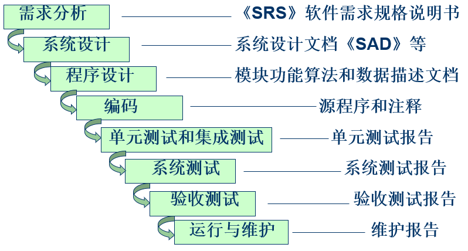

**特征**

- 一个阶段需要在下一个阶段开始之前完成（依赖性与连续性）
- 尽可能推迟程序的物理实现
- 每个阶段必须完成对应的文档
阶段结束前都要完成文档的评审

**优点**

- 每个阶段过程都有结束标志和可交付的产品，便于项目经理对进度进行评估
- 简单，易于对客户进行解释
- 是其他复杂模型的基础：之后会加入反馈环和其他活动

**缺点**

- 无法应对软件的变动，违背了实际过程中的反复开发问题
软件会进行大量的迭代开发、不断调整

- 文档之间难以转换
文档说明了每个阶段的产品（如需求、设计、代码等），但是没有揭示如何将需求文档转化为设计文档

**瀑布模型的优化——原型化**

- **原型**：开发出产品的一部分，让开发者和用户据此进行沟通、提出意见，为最终产品定型
- **原型化**：为开发过程加入一个子过程——制作原型产品
- 原型化的优点
确保可以在测试阶段之前进行修正
提供多个可选的策略

- 核准Validation与检验Verification
核准 Validation：确保系统实现了所有的需求（检查SRS文档）
检验 Verification：确保系统的每个功能正确运行（检查SAD系统设计描述）

### V模型

- 定义：瀑布模型的变种，规定了测试活动如何与分析和设计活动进行联系

- 编码位于V的中心点，分析和设计在左侧，测试和维护在右侧：
单元和集成测试对应程序设计（verify）
系统测试对应系统设计（verify）
验收测试对应需求分析（validate）

**V模型与普遍模型的区别**

- V模型中的迭代和重复活动更明确
- 瀑布模型关注（每个阶段的）文档和可交付产品
V模型关注开发活动的正确性

### 原型化模型

原型化模型不依附于瀑布模型，反而是其他（有效的）过程模型的基础，
对每一阶段地原型（样品），不断明确需求和设计，对原型进行修改，直到开发人员、用户、客户达成共识
目的：降低开发时的风险和不确定性

当软件规模较大时，大型变更会很复杂，于是产生分阶段开发的模型

### 可操作规格说明模型

- 通过一个软件包对需求进行展示和评价
在设计阶段之前完成需求评估

- 与传统模型的区别类似于原型系统

### 可变换模型

- 通过去除一些开发阶段来减少错误

### 分阶段开发模型

- 循环时间 cycle time：软件开发的过程中，从整理需求文档到系统提交之间的时间差

- 分阶段开发模型：系统被设计成部分提交，用户可以得到部分功能，剩余的系统仍在开发过程中

- 目的：降低循环时间

**两个并行的系统**

- 产品系统 production system：客户和用户正在使用的版本 
- 开发系统 development system：准备替换当前系统的下一系统版本

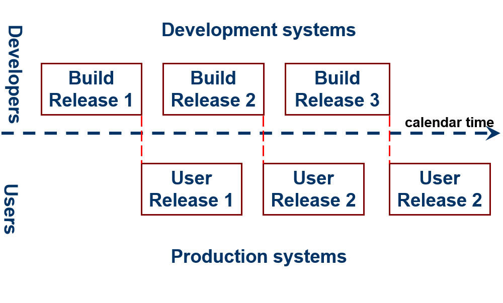

**两种分阶段开发的方法**——增量式和迭代式

- 增量式开发 incremental development 
在需求文件中，系统按照功能分成若干子系统
最开始的版本是规模小的部分功能子系统
每发布一个新版本，就加入一个包含新功能的子系统
最终版本是包含了全部功能的子系统集

- 迭代式开发 iterative development
在最开始的版本中就提供了系统的整体框架
每个新版本都是在增强各个子系统的功能
最终版本使各个子系统的功能达到最强性能

- 现实中多将增量开发和迭代开发结合
	新版本发布时，可能会加入新的功能，也可能会对现有的功能进行增强
	两种开发方式结合的原因：
	- 观察用户反馈
	- 为新功能开拓市场
	- 及时修复问题
	- 针对不同版本设置不同专业领域技术的优化

### 补充：UP、 RUP、进化式迭代

**统一过程**（UP）

- 用例驱动、以架构为中心、迭代和增量式软件开发过程
使用对象管理组织（OMG）的UML，与OMG的软件开发过程元模型相兼容

- 有一系列重复的**生命期**，构成系统的开发寿命
  每个生命期都以向客户推出一个产品版本而结束
  每个生命期包括**四个阶段**：

  - 开始阶段
  - 确立阶段
  - 构建阶段
  - 移交阶段

  每个阶段可以进一步划分为多次迭代

- 三个**支持工序**
	- 配置变更管理工序：管理系统和需求变更的配置
	- 项目管理工序：管理项目
	- 环境配置工序：配置项目的环境，包括所涉及到的过程和工具

- 六个**核心工序**
	- 业务模型工序：通过业务模型获取相关知识，理解需要系统自动完成的业务
	- 需求工序：通过用例模型获取相关知识，理解自动完成业务的系统需求
	- 分析设计工序：通过分析/设计模型，分析需求、设计系统结构
	- 实现工序：基于实现模型对系统进行实现
	- 测试工序：通过测试模型，针对需求进行系统测试
	- 部署工序：通过部署模型，部署系统

**进化式迭代开发**

- 统一开发过程RUP的实践
RUP是IBM提供支持和包装的UP系统

- 开发被组织成一系列固定的短期小项目
- 每次迭代都产生经过测试、集成、可执行的局部系统
- 每次迭代都具有各自的需求分析、设计、实现和测试
- 随着时间和一次次迭代，系统增量式完善

### 螺旋模型

- 为了降低和控制风险，将开发活动与风险管理结合
- 适用于较大型软件工程项目
- 四个任务
	- 计划
	- 目标 / 可选方案
	- 风险评估
	- 开发和测试
- 四次迭代
	- 操作概念
	- 软件需求
	- 软件设计
	- 系统实现与部署

### 敏捷方法

- 敏捷方法：一种较新型软件开发方法，不要求遵循传统的软件开发流程，强调快速开发和有效适应需求变化

- 四条原则
个体和交互的价值胜过过程和工具
可以允许工作的软件胜过面面俱到的文档
客户合作胜过合同谈判
响应变化胜过遵循计划

- 敏捷开发过程的方法
极限编程：激发人员创造性，使管理负担最小的一组技术，是敏捷方法中最主要的流派
Crystal （水晶法）：每一个不同的项目都需要一套不同的策略、约定和方法论
SCRUM（并列争球法）：使用迭代的方法，其中把每 30 天一次的迭代称为一个“冲刺“，并按需求的优先级别来实现产品
Adaptive Software Development(ASD) (自适应软件开发)
Feature Driven Development(FDD) (特征驱动软件开发

**极限编程XP简介**

*7.4节中也有补充*

- 四个变量：成本、时间、质量、范围
研究变量之间的相互作用，透彻分析项目开发

- 四个准则
沟通：客户与开发者之间持续的交流意见
简单性：鼓励开发者选择最简单的设计或实现来应对客户的需求
反馈：指在软件开发过程中的各个活动中，包含的各种反馈循环工作
勇气：指尽早的和经常性的交付软件功能的承诺

- 十二条制作原则：计划游戏、小版本、隐喻、简单设计、测试、重构、结队编程、代码集体所有、持续集成、每周工作40小时、现场客户、编码标准 
小版本：系统设计要支持尽可能早的交付（测试要简单有效）
简单设计：只处理当前需求，使设计保持简单
编码标准：编码支持其他实践，例如测试和重构等

## 2.3 过程建模的工具和技术

**符号模型的分类**

- 静态模型：描述过程，展示出输入是如何转化成输出的
- 动态模型：指定流程，另用户和开发人员看到模拟结果

### 静态建模——Lai符号描述系统

- 综合的过程符号描述系统，可以在任何细节层次上对过程进行建模
- 人员完成角色，资源完成活动
- 展示出角色、活动、加工项之间的关联关系
- 状态表展示每个加工项在特定之间内的完成情况

**该符号描述模型下，七种过程元素：**

- 活动：会在过程中发生的事件
包括：活动前后发生的事件、所需要的资源、发生的原因、受管理的规则、对于算法的描述、与团队成员的联系

- 序列：活动顺序
- 过程模型
- 资源
- 控制：针对过程指定的外部影响
- 策略：指导原则
- 组织：各种层次化结构等描述，包括物理的和软件逻辑的结构

**描述过程**

多个抽象的层次——Lai符号包含一些模板
例如：ADT(artifact define template)，制品定义模板

### 动态建模

- 推演一个过程，用户和开发人员可以看到资源和工件项随着活动的发生山省了什么变化，中间产品和最终产品如何随着时间的推移进行转换，资源流（非一般性输入）如何通过活动成为输出

- 作用：可以模拟过程，在资源真正投入之前完成对修改

- 基于经验数据、研究报告、直觉等要素 => 识别出关系 =>量化关系 => 模拟 =>找到最好策略

- 该模型下影响生产力的四个原因
软件生产
人力资源管理‘计划
控制

- 动态模型是可扩展和复杂的

# 3  Planning and Managing the project

## 跟踪项目进展

### 关键概念

**项目进度 project schedule **

列举出项目的每个阶段，将每个阶段分解成离散的任务或活动，描述活动之间的交互关系，对各个活动以及整个项目的完成时间，进行初步估算

1. 列出项目**提交物 deliverable**：客户希望在项目开发时可以看到的东西
一般性文档，功能模块、子系统、精确度、安全性、可靠性、性能的说明或展示文档

2. 确定我们必须要执行的活动，以完成这些提交物

3. 弄清活动之间的依赖关系，与其他项目、资源的依赖关系

**活动 activity**

项目的一部分，一般占用一段时间，有明确的开始和结束

**里程碑 milestone**

一个特定的时间点，标志着一个活动完成，通常伴随提交物

### 工作分解和活动图

**工作分解结构**

- 工作分解 Work Breakdown：
分析软件开发或项目文虎的过程，识别出每个阶段phase、步骤step、活动activity
应该是甲乙双方认可的、合乎逻辑的任务分解结果

- 单纯的对工作进行分解，不能让我们知道活动之间的**相互依赖和关联**、哪些部分可以**并发**地开发

**描述活动的参数**

- 前驱 precursor：在本次活动完成之前，必须要完成的活动
- 工期 duration：完成本次活动所需要的时间
- 截止时间 due date：合同所规定的，本次活动的预定完成日期
- 终点endpoint：活动完成的标志，通常是里程碑/提交物

**活动图**

- 定义：描述活动和活动之间的依赖关系
结点：活动完成的标志（里程碑）——时间点
线段：活动本身——活动名称和说明

- 活动的阶段性和顺序性
按照结点和线段所指示的方向，按顺序完成
在前一个活动还没到达里程碑时，后续的活动不可以开启

- **活动的并行性：是活动图得本质**
一些相互独立的活动（一个活动的发生不依赖于另一个活动的完成，反过来也一样），可以并行得执行

- 虚线
如图1.2和1.1里程碑用虚线连接，excavation必须要在1.2和1.1都达到之后才能开始
但1.2和1.1之间没有伴随活动的关系

### 估算项目完成时间

边的**权值**：对应活动的估算时间

**关键路径法**：对每个活动的工期进行估算，标注在图上，最终可以得到完成项目的最短时间

几个概念：

- 真实时间 real time：对工期的估算时间
- 可用时间 available time：项目进度为活动规划出的可用时间
- **容余时间** slack time = available time – real time =最晚开始时间 - 最早开始时间

**关键路径**：最晚开始时间 = 最早开始时间的路径
项目完成时间受关键路径上的活动影响

### 跟踪进展的工具

- 使用项目管理软件绘制“工作分解图”
- 甘特图
- 资源直方图
- 开销对比图

## 3.2 项目人事组织

### 人员职责和特点

**人员选择的要求**（能力）

- 完成工作的能力
- 对工作的兴趣
- 经验：开发类似应用、使用类似工具或语言、使用类似开发环境的经验
- 培训
- 与其他人交流的能力
- 负责人的能力
- 管理技能

**用会议促进项目进展**

确保会议高效：交流之前要有充分的内容准备，会议积极、主动

- 明确参会人员和会议档期
- 实现明确会议议程
- 确保会议内容不偏离主体
- 会议决议得到实施

### 工作风格（方式）

- 交流思想和收集信息的方式
Extroverts：告知别人自己的想法
Introverts：寻找别人的指示意见

- 感情影响决策的程度
Intuitive：依据感觉做决策
Rationales：依据事实或逻辑做决策

- 了解工作风格的优势
有利于沟通交流和相互理解
通过人性化管理，进行合理安排

### 项目（团队）组织

为项目选择出什么样的结构，取决于以下三个因素：

- 团队成员的背景和工作风格
- 团队成员个数
- 客户和开发人员的管理方式

**主程序员负责制 chief programmer team**

- 由一个主程序员负责系统涉及和开发，其他的成员向其汇报，主程序员对每一个决定有绝对决策权
- 优势：
交流最小化
快速决策

- 缺点：
创造性低
对主程序员要求高
个人主观性强

**忘我方法 egoless approach**

全体成员共同决策，每个成员平等的承担责任

**项目组织的结构化与创造性**

- 结构化较强的团队
按时完成任务，但工作比较循规蹈矩，项目普通但功能完备
适合人员较多，项目稳定性和一致性高，使用较正规的结构

- 结构化较弱的团队
可能不能按时完成任务但创造性强
涉及大量的不确定性因素时，采用较为民主的方法和相关的团队结构

## 3.3 工作量估算

好的成本估算可以帮助管理者做出合理的安排

**软件项目成本的类型**

- 设施成本 facilities costs：提供工作的物理环境
- 项目成本 project costs：购买支持开发的软件和工具
- 工作量 effort

估算具有不确定性：成本估算应该在生命周期中反复进行

下面聚焦于工作量的估算技术

### 专家评判法

工作量估计依赖于专家的判断，预测的精准性基于估算者的能力、经验、客观性和洞察力

**类推法**

要实现的系统B，与已经构建好的系统A类似，将相似性作为估算的基础

专家要做出三种成本估计：

- x：悲观的估计
- y：乐观的估计
- z：最可能的估计

$$
( x + 4y + z ) / 6
$$

**Delphi 技术**

几组专家预测平均值的反复修正

**Wolverton 模型**

两种因素：

- 老问题O / 新问题N
- 容易E / 适中M / 困难H

将2\*3种组合和成本矩阵对应来看，确定成本

专家评判法的缺点：不同项目之间有差异性，专家的判断有主观性，对当前的数据具有依赖

### 算式估算法

工作量和影响工作量的因素关系的方程式描述
工作量是因变量，其他因素是自变量，大部分模型认为项目规模是方程式中影响最大的因素
$$
E = (a+bS^c)m(X)
$$

E：工作量
S：估算的系统规模
a, b, c：常数
X：从x1到xn的成本因素向量
m：基于X中成本因素的调整因子

**元模型**

计算估计工作量E‘：
$$
E' = 5.5 + 0.73S^{1.16}
$$

计算实际工作量E和估计工作量E’之间的比率：
$$
R = \frac{E}{E’}
$$

调整初始估计工作量：
$$
ER_{adj}=\begin{cases}
R-1 & R\geq 1 \\
1-1/R & R<1 \\
\end{cases}
$$
$$
E{adj}=\begin{cases}
(1+ER_{adj})E & R\geq 1 \\
E/(1+ER_{adj}) & R<1 \\
\end{cases}
$$

将调整后的$ER_{adj}$用于下一个项目

**COCOMOⅡ模型**

构造成本模型 Constructive Cost Model 的最新版本

于针对项目开发的不同阶段来设置工作量的衡量标准，逐步细化、准确
$$
E = bS^cm(X)
$$
$bS^c$是初始规模估算，成本因素向量$m(X)$对其进行调整

阶段一（计划阶段）：

构建项目原型，解决高风险问题（用户界面、软解和系统交互、性能、技术成熟风方面）
使用应用点AP（估算的屏幕数、报表数、组件数等）进行规模估算
将应用点的不同元素进行归类，形成m(X)的复杂性等级和权重，进行加权调整

阶段二（早期设计阶段）：

设计人员要研究可选的体系结构和操作概念
使用需求文档中的功能点进行规模估算
工作量因素：平台难度、人员能力和经验等

阶段三（后体系结构阶段）：

项目正在开发，软件已有一部分被实现了
通过需求文档中的功能点 + 代码进行规模估算
工作量因素：细化平台难度和人员经验等的校正参数，加入开发工具成熟度等待

### 找到适合自己情况的模型

评价模型的精准性

**相对误差的平均幅度 MMRE**

Mean magnitude of relative error
|E ( ( 实际 - 估计 ) / 实际)| $\leq$ 0.25

**Pred(x/100)**

估算值与实际值在x%以内的项目百分比 
$x \geq 0.75$

## 3.4 风险管理

风险：在软件生产过程中不希望看到的、有负面结果的事件
风险管理：了解和控制项目风险的各种活动

### 什么是风险

**将风险和其它项目事件区分开的三个方面：**

1. 与该风险事件有关的损失：风险影响 Risk impact
2. 风险事件发生的可能性：风险概率 Risk probability
风险概率=1，风险被称为问题 problem
3. 能改变结果的程度
风险控制 Risk control：降低风险的一系列行动
风险暴露/风险成本 Risk exposure：风险概率 * 风险影响

**Boehm的十大风险事项：**
人员短缺、不切实际的进度与预算、持续的需求变化、实时性能达不到要求等等

### 风险管理活动

- 1. 风险估算
	- a 风险识别
	- b 风险分析
	- c 风险优先级分配：根据风险暴露分配

- 2.风险控制
	- a 降低风险
		降低风险的三种策略：
		
		- 避免风险：改变性能需求或功能需求
		- 转移风险：转移到其它系统，或者购买保险
		- 假设风险发生，利用项目资源控制风险
		
		降低风险的成本：
		- 风险杠杆：（降低前的风险暴露 - 降低后的风险暴露）/（降低风险的成本）
		- 如果风险杠杆值不够高，寻找其他代价更低或更有效的风险降低技术
		
	- b 计划风险管理
	- c 化解风险

**主要的风险管理活动**

- 产品过大：从一个小的产品内核开始，在以后的开发循环中再添加各种功能
- 功能过难或复杂：工程开始时化简这些功能，再考虑它们的代替品
- 系统支持问题：建立一个早期原型或者小产品版本，以确定你了解支持系统是如何工作的（通过对核心功能的测试，可以确定其他系统对本软件的系统支持程度）
- 测试时间：按照TSPi进行工作，使用规范的PSP方法
- 产品控制：这就是在工程开始时进行配置管理的原因
- 协同工作问题：工作人员合理搭配问题

## 3.5 项目计划

**编写项目计划文档**

目的：与客户交流风险分析管理、项目成本估算、进度安排、项目的组织结构

# 4 Capturing the Requirement

## 4.1 需求的过程
The  Requirements Process

### 需求 requirement

定义：对用户期望系统有的行为进行描述，包括系统的对象、状态、约束、功能等
任务：理解用户的问题和需求，而不是如何实现

### 确定需求的过程

1. 引出 Elicitation：原始需求获取
客户给出的需求

2. 分析 Analysis
理解需求并通过建模或模型化方式进行描述

3. 规格说明 Specification
利用符号描述系统将定义规范化表示

4. 确认 Validation：需求核准
开发人员和客户检查规格说明，看是否与需求匹配

5. 最终产生正式的SRS(软件需求规格说明)

### 敏捷开发方法的需求建模

**敏捷开发**
适用于中小型团队或需求不确定的情况
增量式开发：递增地收集和实现需求
特点：确定好重要的需求后直接变成，通过测试确保系统的正确实现

**重量级过程**
适用于大团队开发或需求稳定的情况
特点：开发人员将编码推迟，在完成需求建模和分析、详细设计之后才进行编码。其中每一步都需要模型，模型间是相关的、相互配合的，以便于设计完全实现需求

## 4.2 需求的引出

Requirement elicitation 

需求的引出是极为重要的一部分，要使用各种技术来确定客户和用户到底想要什么
所有的风险承担者要对需求达成一致

### 风险承担者

Stakeholders包括：委托人、客户、用户、领域专家、市场研究人员、律师或审计人员、软件工程师等

**风险承担者之间的合作**

每一个风险承担者都有自己对于系统的观点
不同的参与者可能期望不从层次的需求细节
用户和开发人员可能对对方有一些先入为主的想法

$\Rightarrow$ 需求分析师需要理解每一个观点，收集到的需求应该反应每一个参与者的关注点

### 引出需求的方法

- 评审相关文档
- 观察当前系统或未来的应用场景
- 做用户的学徒，当用户进行任务时进行参观学习
- 以小组形式与用户和风险承担者交谈
- 使用特定领域的策略，聚焦特定需求。系统扩展与特殊处理等
- 就如何改进产品，与当前的和潜在用户进行集体讨论

### Volere需求过程模型

一些额外的提供给需求的资源，比如需求模板，已经开发过的相似系统的需求库，可以进行复用

## 4.3 需求的类型

### 需求的四种类型

**功能需求 functional requirement**

描述系统内部的功能，系统和环境之间的交互

**设计约束 design constraints**

设计决策，对问题的可选解决办法进行限制

物理环境：对环境或设备的限制，如安装及环境要求等
接口：对输入输出的限制
用户：限定几种类型的用户

**过程约束 process constraints**

对用来构建系统的技术和资源进行约束

文档 ：文档类型、文档数量
资源 ：构建系统的材料、开发人员的技能
标准 ：比如阅读文档时的用户指派标准

**质量需求/非功能需求 quality /nonfunctional requirement**

软件方案必须具备的质量特征

系统性能、安全性、响应时间等

### 解决冲突

在确定需求时一定会产生冲突，所以需要对需求**划分优先级**

1. 必须要被满足的需求
2. 非常值得但并不必须的需求
3. 可选择但可以不做的需求

**让需求可测试的方法**

- 针对需求进行量化描述，避免模糊表达
- 将指代用词替换为实体的正式名称
- 每个名词或事项应在需求文档中给出唯一定义

### 两种需求文档

**需求定义 Requirements definition**

将用户期望系统可以达成的事物完整罗列出来

**需求规格说明 Requirements specification (SRS)**

用技术词汇或符号描述系统对需求定义进行重述，这样设计人员知道如果对系统进行构建

需求定义可以出去环境域的任意位置，规格说明仅仅限制在环境域和系统域的交集处

**补充：软件配置管理**
*第9章中有深入介绍*

配置管理 Configuration management：
帮助上面的两个文档进行对应，使软件开发各阶段的文档保持版本一致，将系统各部件连接在一起、统一单独开发的组件

软件配置管理：

- 定义：软件配置管理是一种标识、组织和控制修改的技术，目的是最有效的提高生产率，可以协调软件开发，使混乱减少到最小

- 任务：制定软件配置管理计划；确定配置表示规则；实施变更控制；报告配置状态；进行配置审核；进行版本管理和发行管理

- 与软件开发过程的区别：
	变更的评估、批准、实施要由软件配置管理人员去做
	变更包括两类：
	- 开发阶段内部发生的变更
	- 开发过程解决不了的变更
	

开发过程应纳入配置管理过程的控制之下

- 忽视软件配置管理可能导致的混乱现象：发错了版本，安装后不工作，异地不能正常工作，已经解决的缺陷过后又出现错误，开发人员把产品拿出去出售赢利，找不到最新修改了的源程序，找不到编程序的人

## 4.4 需求的特征

- 正确性：符合对需求的理解
- 一致性：需求之间有没有冲突
- 无二义性：多个读者能够一致、有效地解释需求
- 完备性：明确了任何情况下（任何约束、任何状态、任何可能的输入）的输出和必要行为
- 可行性：针对需求的解决方案是否存在
- 相关性：是否包含不相关的限制或功能
- 可测试性：是否可以对需求进行测试、并明确证明系统是否满足需求
- 可跟踪性：是否可以对所有需求进行组织和唯一标识，以方便进行引用；需求定义中的每一条需求都在需求规格说明中有对应

## 4.5 建模符号描述系统

**Modeling Notation**

### 需求建模的原因

**软件工程原理的两个特征：**

- 过程可重复
- 建模有标准的符号描述系统(notation)

**需求建模的意义：**

- 通过用与客户原始需求完全不同的方式来重新描述需求，可以促使客户为了确认需求的准确性，仔细的检查我们的模型

**需求建模和设计建模的notations差异：**

- 需求中的分解是为简化问题
- 设计中的分解是为提高系统的模块化、可维护性、性能等质量属性

**面向对象建模**

- 面向对象：模拟人类认识客观世界的方式和法则，面向对象的分析和设计应从建模开始
- 面向对象建模的好处：
在解决复杂问题之前，对方案进行检测
OO建模接近自然，方便与客户或其他相关人员交流
加强视觉效果
对复杂问题进行量化和简化

### UML系列模型图

统一建模语言 UML

- 用面向对象的概念来构造系统模型
- 在概念模型和可执行体之间建立明显的对应关系
- 对人和机器都适用的建模语言

UML模型图的5类10种：

- 用例图
- 静态图（类图，对象图，包图）
- 行为图（状态图，活动图）
- 交互图（顺序图，合作图）
- 实现图（构件图，配置图）

#### 用例图 use-case  diagrams

**用例图**

- 描述系统外部的执行者与系统用例之间的联系
- 从系统外部执行者的角度来描述系统需要提供哪些功能
- **用例图驱动**的开发方法
从用户的利益角度出发进行考虑
驱动系统的需求定义、设计、实现和测试

**组成介绍**

- 用例：系统提供的功能
用户 (角色) 与计算机之间为达到某个目的的一次典型交互作用 (功能实现) (对话模型)
	- 用例对应一个具体的用户目标
	- 用例描述用户提出的可见的需求，也要描述没有直接提出的需求
	- 用例可大可小

- 执行者：可以使用用例的人或外部系统
执行者与用例的联系：“谁使用了哪个用例”

**图符**

**实例**

- 刻画用例图的程度：画到接近系统内部实现就停止分解
用例只跟参与者打交道，不能把功能分解成大堆用例
用例不能是系统内部实现，也不能没有结果 

#### 类图 Class Diagrams

- 描述系统中的类和它们之间的各种关系
- 本质：反应系统中对象的类型以及对象之间的静态关系 (关联、子类型等)
- 类的种类：边界类，实体类，控制类
- 见第六章：需求及设计阶段类图的生成演化过程

#### 其他UML图

##### 包图

- 存在继承、引用等依赖关系
如图，D和E继承B，用实线箭头表示
C依赖于B和F，用虚线箭头表示

- 存在接口
接口与包之间用带小圆圈的实线相连
如图，G使用了系统A的接口

##### 序列图

- 序列图中的对象可以并发执行，每个对象有自己的线程
通过激活、异步消息、同步控制和活动对象来表示

- 两种序列图
一般序列图：是描述特定对象之间，在生存期中消息通信的所有情节
实例序列图：是描述消息通信的个别情节；需要多个实例序列图描述所有情节

- 消息发送：
在调用某个类或对象的方法时，系统自动发送消息给相关实体

简单画法：
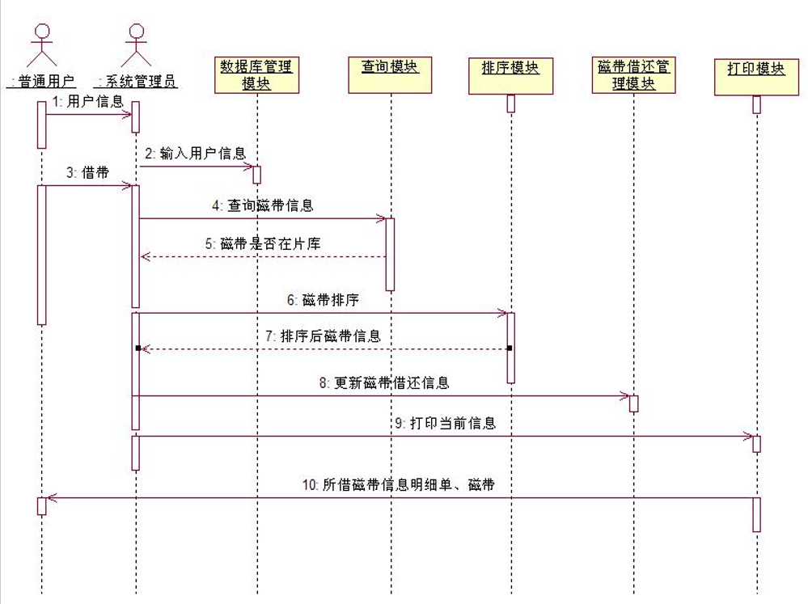

复杂画法：

M2和M3是有条件的互斥消息
M4消息创建了对象Obj5，Obj5的delete消息撤销了对象Obj6
M5消息进行递归调用
Obj1左面的标签和约束指明了a、b、c三点之间的时间约束要求

##### 部署图
构件图/组件图

**部署图**

- 描述系统在运行时的物**理结构、配置和关系**，涉及处理器、设备、通讯等硬件单元和软件部件
- 布署图的描述基于代表硬件单元的**节点**之上

**节点**

- 系统中计算资源的代表
是计算机设备，受其管理支配的、处理器、打印机、通讯设备等，在其上运行的类、对象等部件
识别以上部件，确认系统的组成、组成之间的关系、组成在硬件上的配置关系

- 节点描述：
位置（标识）
构成（包含的硬件设备和软件部件）
能力（计算能力、计算功能等）

- 可以把节点作为类或实例加以描述
节点类：一些具有相同特性、等待实例化的节点组成的类
实例：一个实际出现的节点可以看成实例

- 给节点分配部件要考虑的因素：
资源和能力的利用
地理位置对功能实现和系统性能的影响
资源配置与效率的发挥
保密和安全性的实现
系统综合性能的影响
可扩展和可移植等特性的影响

奥运福娃架构图及部署图 

##### 活动图

实心圆：起点
圆形矩形：活动
内部包含实心圆的圆：终点

### 需求的表达方式

- 利用自然语言描述需求的缺点：
所有使用者很难用同样方式解释含义
不易识别系统元素

- 使用符号描述系统的优点：
以严格可控的方式定义需求，使其易追踪和管理

#### **静态描述**

- 仅定义实体 (对象) 、属性、关系，不对关系随时间的变化进行描述
- 方式
间接引用
递归关系
公理式定义
形式化语言表达式
数据抽象：类似类图

#### **动态描述**

- 描述系统状态等随时间的变化
- 方式
判定表
功能性描述和变迁表

#### 面向对象的规格说明

功能的方法和面向对象的方法

- 功能的方法 functional approach：描述输入如何转化成输出
- 面向对象的方法 object-oriented approach：关注实体的指定

概念

- 对象 object：实体
- 方法或操作 method or operation：动作
- 封装 Encapsulation：protective boundary
- 类继承 Class hierarchies
多重继承 Multiple inheritance

- 多态 Polymorphism

三种对象建模

- object model：对象的继承关系等 (P160)
- dynamic model：状态图等 (P166)
- functional model：DFD (P172), use case 等

### 其他的需求描述系统

DFD数据流图 Data Flow Diagrams

- 描述数据流入、转换、离开系统
- 重点在于数据流，而不是控制流

图符：

示例：

### 对象约束语言（OCL）

Object Constraint Language

- 表述对象模型 (如ER 图) 上的约束
- 常态化的类图说明和注释

示例：

最左边约束：规定主顾的罚金不能是负数。(Fines>=0)
最上面约束：通过对某些实例和对象中属性和操作的一阶运算性说明，指出了其图书编目号码的唯一性
最下面约束：方法borrow()操作的前置条件和后置条件

## 4.6 需求和规格说明语言

- 统一建模语言 UML 
- 规格说明和描述语言 SDL

## 4.7 原型化需求

原因

- 用户不能严格确定自己的详细需求
- 开发者无法确定自己的方案是否真实可行
- 建立原型可以获取需求的更多细节：待改进、多余、缺失部分

快速原型化

特征：在设计之前原型化；为理解需求提供帮助，以决定最终设计方案
以下两种类型：

- **抛弃式原型**
仅用于了解问题，探索可行性，用完扔掉

- **进化式原型**
用于了解问题，并作为将来系统的一部分一起提交

目的

- 原型可以解决需求难用文字和符号说明的问题
- 可以对非功能性需求评价性能和效率

## 4.8 需求文档化

必要性：

- 数字化的需求有利于各个阶段之间进行交叉引用
- 帮助进行配置管理
- 需求说明的普遍问题：说明详细程度的不均衡性

**需求定义**

Requirements definition document 
用户想要什么

- 一般用途
- 系统的背景和目标
- 对用户建议的方法进行描述
- 细节特征
- 操作环境

**需求规格说明 SRS**

Requirements specification document 
设计人员需要知道的

- 文件系统接口
- 重新形式化描述功能要求
- 重新形式化描述质量要求

**补充：需求阶段的参与人员**

参与人员：合同监工、客户和用户、商业管理人员、设计人员、测试人员、需求分析师

分析师具备的素养：社交能力+技术能力

## 4.9 需求确认

**需求确认**

检查需求规格文档与需求定义的一致性

**需求复审**

回顾系统目标，将目标和需求进行比较

## 4.10 测量需求

关注于：产品、过程、资源

- 产品：测量需求的数量；评估需求文档
- 过程：需求变化的数量；引起需求变化的原因

## 4.11 选择需求规格说明技术

评估规格说明技术的标准

没有一项技术是使用于所有项目的
我们需要考虑项目的特征和开分人员、客户的偏好之间的界限

# 5 Designing the Architecture

## 5.1 设计过程

- 设计：将需求转变成解决方案的创造性过程

- 体系结构 Architecture：解释如何将系统分解为单元，单元之间如何相互关联，描述单元的外部特性

- 设计模式 Design pattern：针对单个软件模块或少量的模块集合的一般性解决方案，它提供较低层次的设计决策

- 设计公约 Design Convention：一些用于提高设计质量的设计决策和设计建议
当一种设计公约发展成熟时，可以被封装成设计模式或体系结构风格，最后可能被内嵌为一种程序语言结构

**利用现有的解决方案**

- 克隆 Cloning：借鉴整体设计/代码，做少许调整来解决特定问题
- 参考模型 Reference models：指导如何分解系统的体系结构

### 概念设计与技术设计

是两个迭代的过程

- 概念设计 conceptual design $\approx$ 系统设计
明确告诉客户系统要做什么：架构和功能

- 技术设计 technical design $\approx$ 程序设计
明确告诉开发人员系统将如何运转：功能和接口的实现方法

**技术设计的内容**

- 主要的硬件组件和它们的功能
- 软件组件的层级和功能
- 数据结构和数据流

### 设计过程模型

软件体系结构开发过程

1. 建模 Modeling：尝试可能的分解，根据需求中的系统关键特性等确定软件的体系结构风格

2. 分析 Analysis：分析初步的提示结构，关注软件系统的功能、质量属性 (性能、安全性、可靠性等)、约束等，关注系统级别的决策

3. 文档化 Documentation：确定各个不同的模型视图

4. 复审 Review：检查文档是否满足所有功能及质量需求

5. final output：软件体系结构文档SAD Software Architecture Document

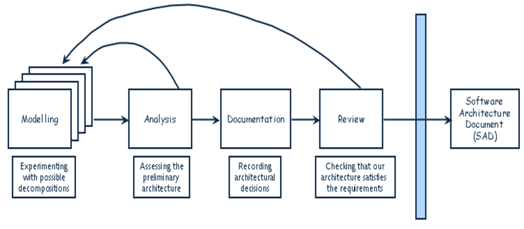

## 5.3 系统设计中的分解与模块化

### 6种设计方法

- 功能性分解 Functional decomposition：按照功能和需求进行分解
- 面向特征的分解 Feature-oriented design：功能分解的一种，为各个模块指定各自的特征
- 面向数据的分解 Data-oriented decomposition：制定数据结构
- 面向进程的分解 Process-oriented decomposition：将系统分解成为并发进程
- 面向事件的分解 Event-oriented decomposition：将事件分给不同的模块
- 面向对象的设计 Object-oriented design：把对象分配给模块

每种方法都有各自的层次结构和单元部分

**模块化 Modular**

系统的每个活动仅由其对应的一个部件完成，每个部件的输入输出都是明确定义的

### 体系结构视图

大部分可以用UML描述

- 分解视图：分层细化概念
- 依赖视图：依赖关系
- 泛化视图：泛化关系
- 执行视图：传统的执行体的次序与输入输出关系
- 实现视图：代码单元和源文件之间的传统映射对应关系
- 部署视图：节点的计算能力与节点资源的展示
- 工作分配视图：任务分配管理展示

## 5.4 软件结构风格和设计策略

Architecture Styles and Strategies

### 三个设计层次

**体系结构设计 architecture design**

- 将软件需求 (SRS) 中描述的系统能力与系统部件关联起来
$\approx$ 系统设计 (第1章)

- 体系结构 architecture：一种软件设计方案，说明如何将系统分解为单元、单元之间的关联方式、单元的外部可见特性

**代码设计 code design**

- 各个部件 (模块) 的算法、数据结构的设计
- 部件 = 编程原语 + 原始运算符 + 组成机制
components = programming primitives + primitive operators + composition mechanisms

**可执行设计 executable design**

- 最底层设计：内存分配、数据格式、位模式、相关显示匹配等等

设计层次的特点：

- 自顶向下的设计：先设计体系结构，然后进行代码设计，最后是可执行设计
- 代码设计 + 可执行设计 $\approx$ 程序设计
- 可重复、多次修改：随着设计人员理解和创造得更深入，会对以上三种设计进行修改

### 几种体系结构风格

体系结构风格 architectural style：

- 大规模系统结构模式，包括一系列定义好的规则、元素和技术
- 关于如何完成一般性设计所给予的建议，不是完整的、细节化的解决方案

**管道与过滤器 pipes and filters**

- 一种组件式设计，常用于语义分析、字典分析等设计 
- 管道 pipe：不对数据做更改，将数据从一个过滤器传输到下一个过滤器的连接部件
过滤器 filter：数据转换部件，读入数据流

**面向对象设计 object-oriented design**

- 用于一般软件设计

**隐含调用 implicit invocation**

- 是一种常见的**发布订阅** (publish subscribe) 体系结构
- 事件驱动：部件之间通过对事件广播/发布来实现交互
- 用于分组交换网络 (packet-switched networks) 软件设计等

**信息库/资源仓库 repositories**

- 中心数据存储 + 与其关联的访问构件
- 常用于信号处理、知识发现、模式识别系统等设计 
- black board system (一种信息库结构)
包括黑板本身、知识源、控制；黑板的状态变化时，知识源作出响应

**分层设计 layering**

- 层级结构，每一层为外面一层提供服务，同时作为内层的客户
层次桥接 Layer bridging：允许一个指定层访问所有的下层服务
协议 protocol：约定层与层之间如何交互

- 优点：
高度抽象
相同容易增加和修改层

- 缺点：
有时很难区分出系统层次
层与层之间的额外协调会影响系统性能

**解释器专用设计 interpreters**

**过程控制 process control**

- 将过程输出的指定属性，保持或接近一个指定的参考值
- 两种类型：反馈和前馈

**其他**

- 分布式体系结构
- 客户-服务器 client-server
服务器提供服务，客户通过请求/应答协议访问服务

**对等网络 peer-to-pee**

- 每个构件都只执行它自己的进程；对于其他同级构建，每个构件本身既是客户端又是服务器
有接口：可以提供服务，也可以接受服务

- 如文件共享网络

## 5.5 设计过程中的问题

### 涉及质量属性的几个概念

- 可修改性 Modifiability：对软件系统进行更改的难易程度
减少发生改变后受直接影响的单元：预测预期改变然后封装在软件单元内、增加软件单元的通用性
减少受间接影响的单元：降低耦合性、增加接口设计的多重性
设计自我管理软件：检测环境改变进而做出适当反应

- 可维护性 Maintenability：理解、改正、改动、改进软件的难易程度
改正性、适应性、完善性、预防性维护

- 性能 Performance：完成软件功能时展示出来的及时性、吞吐量等特性
	- 响应时间：请求的反映时间
	- 吞吐量：处理请求的速度
	- 负载量：并发用户数
	
	提高性能的策略：
	- 提高资源利用率：增加软件并行程度；复制数据；分布式共享数据
	- 有效管理资源分配：调度策略 (先到先服务、时限长段优先等)
	- 降低对资源的需求：设计适应性能要求的拓扑结构或允许有限变更等

- 安全性 Security：实现软件各种安全保密措施的有效性度量
	- 免疫力：系统阻挡攻击企图的能力
	通过更改体系结构保证系统安全特征、最小化系统安全漏洞
	
	- 弹性：快速从攻击中恢复的能力
	功能分段使攻击影响最小化、增加快速恢复能力
	
	- 其他措施：权限划分、软件加密、硬件加密、预警、查杀木马等
	
- 可靠性 Reliability：是软件产品在假设环境下，按照规定的条件和时间内完成规定功能的能力
主动故障检测：周期性检查或预测系统故障
故障恢复：实时处理故障的能力，如撤销事务，回退，备份等

- 健壮性 Robust：系统在不正确输入或意外环境条件下，依然保持正确工作的能力
- 易使用性 Usability：用户操作软件系统的容易程度
用户界面要用自己的软件单元或结构层次
有的用户命令需要体系结构支持，如撤销命令

- 商业目标：涉及购买与开发
开发成本与维护成本，新技术与已知技术的副作用

### 模块化与抽象的层次

Modularity and levels of Abstraction

- 模块化设计 modularity：把系统中各不相关的部分进行分离
模块有清晰的输入和输出，设计目的明确，功能独立，可以做独立检测

- 抽象 abstraction：细节的隐藏
探讨或分析两个模块共享某数据时，模块各自的私有细节应隐藏

- 抽象的层次
模块/部件以不同层次结构的抽象形式出现，越上层、越早期的模块层次或框架，设计越抽象
高层次提供一个决策视角(隐藏了细节)，其他层次更多得展示主要功能和实现细节

### 设计中的协作关系

开发团队的几个任务

- 人员选择与分工
- 问题的表达语言和文档组织形式
目标：每个团队成员都能理解他人的设计

- 设计部件之间的协调与有效交互

设计过程崩溃的主要原因

- 缺少具体的设计方案
- 缺少设计过程的元方案 (最高抽象模型---顶层设计)
- 问题和解决方案的优先级选择不合理
- 约束不明
- 没有可验证的模拟设计 (原型系统)
- 进度难以跟踪
- 解决方法不够完整

设计中协作关系中的主要问题

- 解决人员在经验、理解力、偏好上的差异
- 解决人员在团队行为方式和单独行为方式上的差异
- 设计是一个合作且迭代的过程

**Outsourcing 外包式协作设计**

分布式开发的四个阶段：

- 项目由来自国外的现场开发 (on-site) 人员在单一地点完成
- 现场分析人员确定系统需求，然后将其提供给非现场 (off-site) 小组
- 非现场开发人员构建通用的产品和组件
- 非现场开发人员利用各自的专业领域优势开发产品

外包式协作设计要注意的问题：

- 工程设计次序有新的要求：设计师反复与需求分析人员、测试人员、编程人员交流
- 时差与不稳定的网络
- 不了解当地的商业规则、客户、法律
- 多种语言交流的难度问题

### 设计用户界面要注意的问题

设计界面要注意解决的关键要素

- 寓意/比喻 metaphors：可识别和学习的基本术语、图像和概念等
- 思维模型 mental model：数据、功能、任务的组织与表示
- (模型的导航规则 navigation rules for the model：如何在数据、功能、活动和角色中移动及切换
- 外观 look：系统向用户传输信息的外观特征
- 感觉 feel：系统向用户提供有吸引力的体验的交互技术

文化差异问题：需要考虑系统用户的信仰、价值观、道德规范、传统、风俗和传说
解决方法：使用国际设计/无偏见设计 或定制界面

用户偏好问题：提供可以选择的用户界面

界面设计原则

- 一致性原则 
- 及时提供信息反馈 
- 合理布局、界面简洁 
- 合理利用颜色 
- 对用户出错的宽容性 
- 减少重复的输入 
- 支持快捷方式
- 减少对用户记忆的要求 （逐次回退等）
- 快速的系统响应 
- 符合用户的工作环境与工作习惯 
- 用户联机支持 

### 并发性

Concurrency

- 同步 synchronization：允许两个活动同时进行但互不干涉
- 互斥 mutual exclusion：当一个进程在访问数据时，确保另外一个进程不能修改这个数据元素

### 设计模式和重用

Design patterns and reuse

设计模式：见5.1
重用：对设计模式的重用

## 5.6 优秀设计的特征

含§6.2节

高质量设计需要有以下特征：容易理解、实现、测试、修改、正确反应需求

### 部件 / 模块独立性

模块独立的程度取决于两个部分：耦合coupling和内聚cohesion
是设计质量测度的重要指标之一

**耦合 coupling**

两个部件之间的相互关联程度

设计追求：尽量低的耦合度

根据模块之间依赖关系的多少，划分为六个等级：
（由低到高）

- 非直接耦合 uncoupled：模块相互之间没有信息传递
- 数据耦合 data coupling：模块间传递数据
- 特征耦合 stamp coupling：模块间传递数据结构
- 控制耦合 control coupling：模块间传递控制量
- 公共耦合 common coupling：不同模块访问公共数据
- 内容耦合 content coupling：一个模块直接修改另一个模块 (修改私有数据或直接转移到另一个模块中)

面向对象的设计中模块间耦合度较低

**内聚 cohesion**

部件内部各组成成分的关联程度

设计追求：尽量高的内聚度

内聚的几个等级
（由低到高）：

- 偶然性内聚 coincidental：模块内各部分不相关，只为方便或偶然性原因放入同一模块
不相关的功能、过程、数据出现在同一个部件中

- 逻辑性内聚 logical：逻辑上相关或相似的功能或数据放置在同一个部件内

- 时间性内聚 temporal：部件各部分要求在同一时间完成
- 过程性内聚 procedural：有按照某个确定的次序执行一系列功能
- 通讯性内聚 communicational：各个部分访问共享数据
私有共享、远程共享、云共享等

- 顺序性内聚 sequential：各部分有输入输出关系，操作统一的数据集，并且操作有顺序
- 功能性内聚 functional：各部分组成单一功能

面向对象的设计中内聚程度高

## 5.7 体系结构的评估和改进

### 意外的发现和处理

Exception Identification and handling 

意外 exception：没有预料到的动作 / 事件

意外类型

- 提供服务失败
- 提供错误的服务或数据
- 数据损坏

意外的处理方式：

- 重试
- 修正
- 报告：允许用户向系统报告异常
嵌入故障树分析、失效模式分析技术，来表示和识别异常，进行异常处理，甚至可以进行有限更正

最难处理的异常是不规律异常：无规律的错误服务和错误数据

**故障树分析**

故障树：

- 根节点表示想分析的故障/失效
- 其他节点表示事件或者表示导致根节点失效所发生的故障
- 边表示节点之间的关系：含有或、与等关系

割集树：对故障树的简化

### 错误预防和容错

正确区分错误、故障和失效：见1.2节

主动故障检测：定期检查故障症状或者进行故障预测

- mutual suspicion：mutual suspicion 
- redundancy：一个功能有多个预留的实现途径

被动故障检测：等待故障发生再处理

容错设计：当软件失败发生时，采取措施减少损失、将损害隔离开来，在用户接受的条件下使系统继续运行

### 安全性分析

- 软件特征化：深入理解分析系统的目标和实现方式。
- 威胁分析：针对威胁来源和各种威胁活动
- 漏洞评估：寻找系统设计的各种问题。
- 风险可能性分析：每个漏洞暴露的可能性大小
- 风险影响决策：攻击成功后，系统收到的影响评估，为制定对策积累素材
- 风险缓解计划：应对措施等

### 成本效益分析

软件设计本身带来的效益分析，涉及软件冗余度和硬件分配等

### 设计复审

- 概念设计复审 preliminary design review
与客户、用户检查概念上的设计

- 技术 / 程序设计复审 program design review
程序员在实施之前获得技术设计反馈

## 5.8 设计文档化

- 文档包括：设计原理、菜单和屏幕显示格式、故障处理方法等待

- 对于分布式网络，配置文档需要包括：拓扑结构、同步、控制、节点的路由消息等

- 设计的描述要通过配置管理技术工具与SRS交叉引用
即两个文档要完整且一致

## 5.10 软件产品线

- 软件产品线 software product line：指一组可管理的、有公共特性的软件密集性系统合集，这些系统满足特定的市场需求或任务需求，按预定义的方式从一个公共的核心资产集开发得到

- 核心资产库 core asset base：用一组可重复使用的资产集合来描述产品系列的共性 
库中可包括：需求、软件架构、模块和结果分析、软件单元、测试、项目计划、团队管理等

- 产品系列 product family：将产品线上的一系列衍生产品看作产品系列

**战略范围**

1. 规划战略业务，确定产品系列，判断市场趋势和需求
2. 划定计划范围，保证产品有毒狗多的共同的，确保产品线的开发方式

**产品线体系结构的优势**

提升项目计划的可修改性

- 部件替换 Component replacements
- 部件特化 Component specializations
- 产品线参数 Product-line parameters
- 体系结构的扩展和收缩 Architecture extensions and retractions

**产品线演化**

- 公司应该主要关注于产品线资产的开发和演化，而不是关注个别产品
- 通过产品线变动去提高衍生产品的能力
- 确保可以兼容以前的产品

# 6 Considering Object

## 6.1 什么是面向对象

### 面向对象的含义

Object Orientation (OO) : 

一种软件开发方法，将问题及其解决方法组织成一系列独立的对象，数据结构和动作都被包括在对象中

### 面向对象的七个特征

- 标识 identity：
identify an object：确定对象的身份，进行对象的命名
对象名称区分一个对象和另一个对象，或者区分对象自身的状态，使对象可辨别

- 抽象 abstraction：从不同的角度描述，形成层次
- 分类 classification：对有相同属性和行为的对象进行分类，然后抽象出类
实体 instance：每个对象都是类的一个实体

- 封装 encapsulation：将属性和行为封装在对象内部，隐藏实现细节
- 集成 inheritance：根据类之间的相同和不同，层次化地对类进行组织
- 多态 polymorphism：子类对父类的一些动作进行重新定义
行为 behavior：由一个对象主动或被动实施的动作或转变
方法 method：对一个特定类的操作进行实现
在多态中：一个行为behavior可以有多个方法method；可以很容易低添加新的类

- 持久性 persistence：
一个对象的能力、名字、状态、行为，可以超越时间或空间的性质
模型可以映射为数据库中的关系模型
持久对象不随着进程的结束而消亡，可在外存中存贮 

## 6.2 OO开发的过程

### 关于OO的几个问题

**OO开发的优势**

- 描述语言的一致性：对于问题和决策有相同的语义结构（类、对象、接口、属性、行为）
- 软件过程的一致性：所有的过程 (制定需求、高层低层设计、编码、测试等待) 都使用相同的语义结构

**通过OO描述类时的三个视角**

- 静态视角：对对象、属性、行为和关系进行描述
- 动态视角：对通信控制、时间控制、状态与状态的改变进行描述
- 约束：描述软件结构和动态行为的约束

**“OO过程”的定义**

OO需求 + OO高层设计 + OO底层级设计 + OOP + OO测试

OO的设计由粗到细演化而成

**OO开发过程的特点**

- 开发全过程一致 (不同的过程之间维持一致性)
这是区分OO开发和传统开发的关键

- OO是一种对问题和解决方案的展示，而不是一种生命周期
- 可以被应用于不同的软件周期
- 考虑了一些对象和类因为相似性的复用机制
- 缺点：在软件开发的全流程上缺乏理论支持

### OO的需求分析

- 使用自然语言进行定义
- 对象模型 object model：对象、属性、动作、关系等的图形表达
绘制用例图：确定系统的基本功能和边界，为系统设计做一定准备
绘制包图

- 类的层次图 class hierarchy diagram
俗称素描式类图

- 数据流图 data flow diagram
- 场景：用自然语言描述过程的逻辑，包括所有条件和约束

### OO设计

**系统设计**

- 描述整个软件系统的构成
- 确定类
- 确定对象、类的交互和关系
- 确定其他的一些图

**程序设计**

- 模型内部的计算特征，如算法
- 确定类库的细节：系统规模较大时，插入类库的设计细节存在次序
即较复杂的类图结构细节化时的次序问题

- 考虑非功能性需求：根据非功能性需求，对设计进行追加，确保软件设计质量
详细设计手段和附加说明要有对应
有时可能会修改系统设计：如权限改动，优先级调整，数据访问方式的扩充等

### OO的编码和测试

OO编码：将模型“翻译”成面向对象的程序语言

OO测试：一系列测试动作：单元测试、集成测试、系统测试、验收测试

单元测试包括：类 (和功能相关) + 类自身的层次结构

## 6.3 用例模型

**Use Cases (model)**

在OO的开发中，可以通过用例图来获取需求

用例图：通过对用户、外部系统、实体与系统之间的对话进行建模

### 用例图的组成

**用例 use case**

描述系统提供的特定功能，用椭圆表示

**执行者 actor**

和系统进行交互的实体：可以是一个用户、设备，用小人表示

**包含 include/use**

对已定义用例的复用：用以提取公共行为，用带箭头的实线表示：

**扩展 extension**

对一个用例的扩展使用：通过扩展用例来展示一个不同的角度

示例：

### 用例图的用途与作用

- 阐明需求
需求本身比较复杂，并且难以描述

- 有利于发现需求中的错误
- 有完整的功能描述：描述了任意实体的所有使用系统的方式
- 对用户、设计人员、测试人员之间的交流有帮助
- 是系统分析阶段其他模型图示的基础

### 采用OO方法做需求分析

1. 确定类
概念类图 conceptual class diagram：描述应用领域中的概念，这些概念和类有联系，但没有直接的映射关系
素描 sketch：描述本质或大致轮廓，不去确定细节

2. 类或一个领域domain中的动态行为
可以使用UML的活动图来描述行为，也可以使用状态图
领域模型domain model：对现实世界中的概念的表示

## 6.4 OO的表示：使用UML的例子

### UML介绍

UML统一建模语言：一种符号表示方法，在描述OO时很受欢迎，可以通过UML对一个问题进行可视化、明确、文档化

三个视角：(见6.2 OO开发有三个视角)

- 动态：用例图、活动图、顺序图、协作图、状态图
- 静态：类图、对象图、包图、部署图、组件图
- 约束和形式化：对象约束语言OCL

### 软件过程中UML的使用

**需求分析过程**

- 工作流图：数据流图DFD或UML中的活动图；概念类图加以补充

- UML用例图：通过用例图中的功能明确类

- 场景描述：一些包含在上述图中的文本描述或形式化的语言陈述

**设计过程**

1. 类图：对概念类图的增进
对象图：对所有对象的解释)

2. 活动图：展示系统中会发生的所有活动 (由一个对象的值改变而引起)
状态图：展示对象拥有的所有状态 (由消息引起)

3. 顺序图：展示数据如何从一个对象流向另一个对象，将需求中不正式的描述形式化
协作图：用对象和时序信息来展示对象之间的事件流

**架构和编码 (实现)**

- 包图：展示如何将类划分为不同的模块
- 组件图：展示系统最终的组件modules和依赖关系
- 部署图：展示与应用程序相关的网络连接

### 补充：顺序图和协作图的关系

- 共同点：都可以表示各对象间的**交互关系** 
- 不同点：
顺序图：用消息的几何排列关系来表达消息的**时间顺序**，各角色之间的相关关系是隐含的，优势用来描述重要任务

协作图：用各个角色的几何排列图形来表**达角色或实体之间的关系**，用消息说明这些关系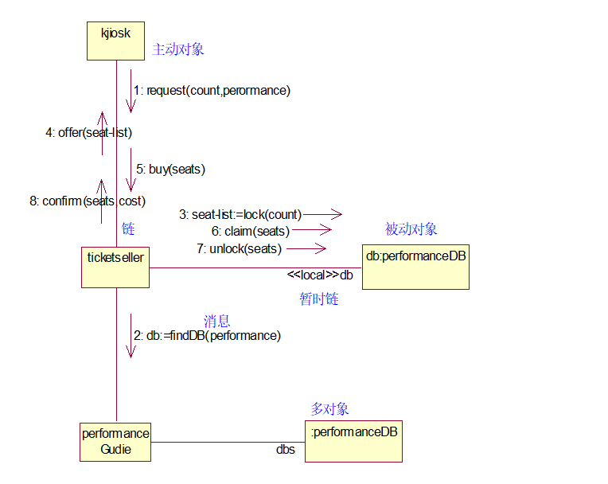

## 6.5 OO系统设计

OO设计从类图 (描述对象的类型和它们的静态关系) 开始

规模小时，无需考虑正规体系结构设计，可以直接尝试产生系统设计级别的类图

### OO系统设计过程 (类图)

先制作类图的第一版：

1. 确定类和属性
确定候选类：“名词及名词短语法” (从需求中抽取名词)
在候选类中进一步确定可能的类

2. 确定行为：“动词法” (从需求中抽取动词)
3. 绘制UML类图：类的结构 and 类之间的关系

#### UML类图的类结构

- 类名称：表示一个类
- 属性：属性名 + 类型 + 初始值
- 操作：操作名 + 参数列表 + 返回类型

#### UML类图中类之间的关系

**① 继承 inheritance / 泛化generalization**

超类是子类的泛化，子类可以继承超类的属性和行为

java：`extends`
C++/C#：`:`

用空心箭头表示：箭头所指的是被继承的超类
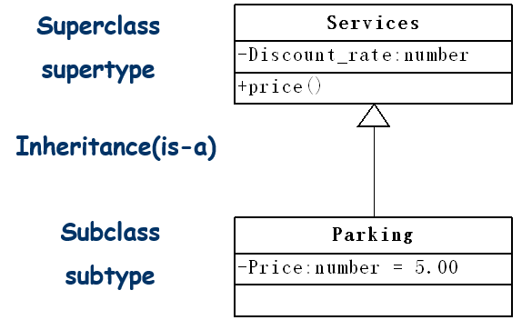

**② 关联 association**

两个类有语义上的关系，或者它们会一起发生并且关系会保留一段时间
关联是实体间关系的最一般刻画，随需求变化或时间推移，可能会有额外动作产生

java / C# / C++：将一个类的对象作为另一个类的成员变量

用普通箭头表示

以下为几种不同的关联分类：

- 双向关联：默认情况下关联是双向的

- 单向关联：箭头指向被拥有或关联的类

- 自关联：某个类中的某个属性的对象类型为类本身 (递归定义)

- 多重性关联：又称重数性关联关系，表示两个关联对象在数量上的对应关系
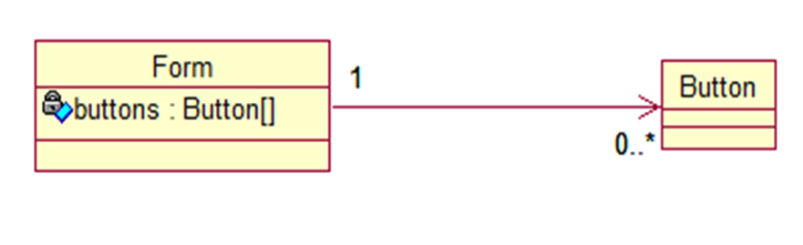
常见的多重性表示方式如下表所示：

- 关联的其他分类: 普通关联、递归关联、限定关联、有序关联、三元关联、聚合等

- 聚合关系 Aggregation：聚合关系表示部分与整体的关系，聚合关系中的成员对象是整体对象的一部分，但是成员对象可以脱离整体对象存在
用带空心菱形的箭头线表示：箭头指向成员对象

UML 2.0 去掉了聚合

- 组合关系 Composition：表示部分与整体的关系，组合关系中的整体对象可以控制成员对象的生命周期，一旦整体对象不存在，成员对象也不存在，两者是共生关系
用带实心菱形的箭头线表示：箭头指向成员对象
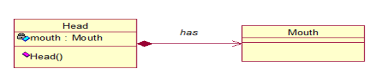
UML新版将聚合与组合合并

- 依赖关系 Dependency：一种使用关系，某个类 (依赖) 将另一个类 (被依赖) 的对象作为自己一般方法的参数
用虚线箭头表示：箭头由依赖类指向被依赖类

- 接口与实现关系：接口中没有属性，所有的接口都是抽象的；抽象之间由继承和依赖关系；类实现接口
用虚线空心箭头表示：空心三角箭头指向抽象的接口
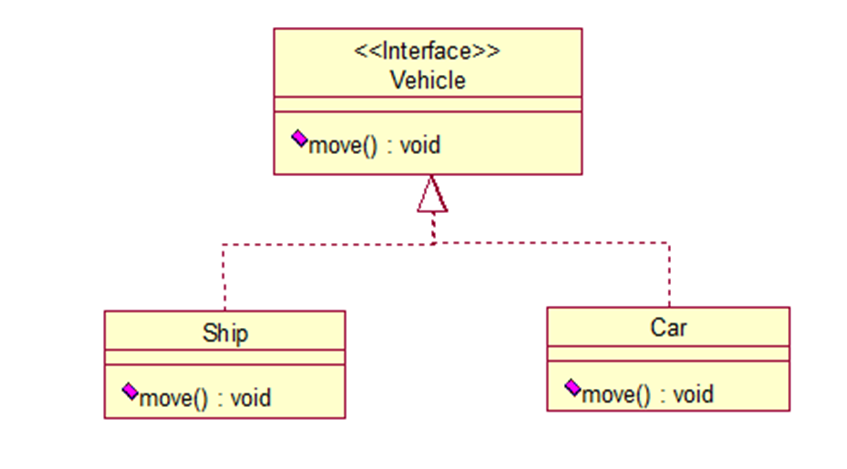

### 补充：面向对象设计的原则

OO设计目标之一：支持可维护性复用
实现设计方案或源码的重游 + 确保系统易扩展和修改、灵活性高

- 单一职责原则：一个类只负责一个功能领域中的相应职责
对职责分离，封装到不同的类中
类承担的职责太多时，职责耦合度太高，一个发生变化会影响到其他职责的运作

- 重用原则
- 开闭原则
- 替换原则
- 依赖倒置原则
- 接口隔离原则
- 迪米特法则：实体应当尽可能少地与其他实体发生相互作用
创建松耦合的类
类的交互复杂时，一个类的修改会影响与之交互的其他类

依照上述设计原则，得到初始类图 first-cut
根据不断改进，之后还会有类图的第二版、第三版等
用例图和包图绘制好后，也可以对类图做相应的调整：使之满足实现用例所示功能的方便性和系统效率等诸多因素要求；调整类图中的属性与方法的基本分布，满足包图指示的模块或构件间依赖

**使用类图的一些建议**

- 不要尝试用上所有的符号
- 在不同的阶段画类图：
分析阶段：概念类图 conceptual class diagram 
设计阶段：图解类图 illustrated class diagram 
实现阶段：实现类图 implemental class diagram

- 只画关键的图
- 遇到问题是考虑：模型本身的现实意义或粒度 (细节程度)

### Other UML Diagrams 

#### 类描述模板 class description template

描述程序设计program design的基础工作：类的层次、操作描述、各种状态、与外部的接口等

私有接口 + 共有接口

#### 包图package diagrams

类的集合形成一个包

用途：展示包、类之间的依赖；在测试时发挥重要用途

UML包图允许将系统看作一个小的包集合，每个包都可以扩展为一个更大的类的集合

#### 活动图 activity diagram

描述活动和过程流

组成：

示例：

## 6.6 OO Program Design (OO程序设计中的其他问题) 

### 从类和对象开始的程序设计

类和对象来自系统设计

对类和对象进行修改，以包含更多的细节：

- 非功能性需求，可复用的构建，界面需求，数据结构，运行于部署管理的细节等
- 在程序设计阶段，很多对象对用户不可见、在现实世界中没有对应物。如链表、图结构、临时性数据于对象等
- 本阶段，要对数据结构进行更详细的判断剖析，详细说明每个对象和其他对象交互的接口

系统设计的抽象描述，需要在程序设计阶段具象化，转化为陈述或伪代码级别的描述

**接口**

- 接口是操作的集合
- 含义1：对象之间起交互作用的接口
- 含义2：多态意义上的接口
见6.1节00特征中对多态的定义
动态绑定：程序运行时根据对象的类型，决定调用哪个类的方法

- 含义3：多继承意义上的接口
java以实现多个接口的形式实现多继承

### 支持实现的程序设计

本段强调*设计模式*在软件设计中的位置
*设计模式的定义见5.1节*

对象组装和类继承的选择：

- 继承 inheritance 被称为白盒复用
白盒复用：源代码可见、可修改、可扩展，继承中父类的方法对子类而言是可见的

- 组装 composition 被称为黑盒复用
黑盒复用：源代码不可见、不可修改，在组合中不管对象的方法如何实现、只关心对象上拥有的方法
*黑盒白盒的详细介绍见 8.2节*

- 缓和组装效果的方式：允许一个对象将自己的操作委托给另一个对象
- 细心设计对象的接口

### 程序设计助手
Design Aids

**准则：设计要适应变化**

提高系统灵活性和可维护性的OO相关技术：

- 工具包 toolkit：一组相关、可重用的类，它们提供了一些定义好的功能
- 框架 framework 与模式 pattern
框架和模式关注于设计的复用，而不是代码复用
框架是在一个特定领域下对其设计进行重用

### 用户界面设计

User Interface Design 

UI程序设计时考虑以下问题

- 定义使用系统的人群
- 扩充UI场景
- 用户命令的层次结构
- 交互之间的时序关系
- 定义一些相关的类
- 将类进行集成

用户界面设计的第一步是在纸面上展示出交互
之后设计出类图以实现这一用户界面
在生成UI设计的解决方案时，对象和类的集合通常会不断增长

### 数据管理设计

Data Management Design

程序设计强调存储和恢复持久性对象的方法

- 数据管理设计要考虑性能和空间方面的系统需求
- 数据管理设计的四个步骤：
	1. 识别数据、数据结构及其关系
	2. 设计出服务来管理数据结构和数据
	3. 找出实现工具，如数据库管理系统
	4. 设计类以检查管理功能

- OO解决方案：可以使用传统文件或关系数据库实现类

### 任务管理设计

Task Management Design

- 仔细检查需求，确定如何协调系统要执行的活动

- 任务 task：系统中的一项进程，可能是事件驱动或时间驱动
包括：任务名称，描述，优先级，服务，通信机制，在层级中的位置

- 任务管理设计的四个步骤：
	1. 识别任务，按照时间驱动和事件驱动进行分类
	2. 识别任务的优先级
	3. 创建任务来协调其他所有任务
	4. 为每个任务设计对象，并定义它们之间的关系

**观察者模式 The Observer Pattern**
又被称为发布-订阅（Publish/Subscribe）模式，属于行为型模式的一种

- 主题 subject：了解注册在自己这里的观察者，在发生某些事情时通知它们
- 观察者 observer：可以向一个主题注册，表示对主题感兴趣

## 6.7 OO Measurement （面向对象度量）

### OO系统规模的度量

OO Size Measures

- 对象和方法是最基础的规模度量
- Lorenz and Kidd’s nine aspects of size
场景脚本个数
关键类个数
支持类的数量----涉及低层设计
支持类平均值
子系统数量
类的规模 (类的种类的总数量）
覆盖操作数量
子类的附加操作的数量
专化指数：覆盖方法数量X深度/方法总数

### OO系统设计质量的度量

OO Design Quality Measures

- 每个类的方法权重 (复杂度)
- 继承的深度
- 子类数量
- 对象的耦合度：越少越好
- 类的响应度
- 内聚方面的度量

# 7 Writing the Programs

- 设计并不能直接用于编写代码
- 代码要易于理解
- 代码要可以重用
- 需要比照着设计进行检查

## 7.1 编程标准和过程

Programming Standards and Procedures 

团队过程中，需要了解每个人，理解组织变成标准和步骤很重要

### 编程标准对自身的作用

- 组织自己的想法，避免错误
- 编写代码文档，记录我们做过的工作
- 标准和过程有助于将设计转化成代码
维护设计构件和代码构件之间的一致性：改变设计时，知道应该修改哪里的代码

### 编程标准对其他人的作用

- 易于维护 (需求变化时)
- 易于测试 (独立的测试团队)
- 易于重用 (被其他团队使用)

### 设计与编程实现的匹配

- 在程序设计构件和程序代码构件之间的直接对应关系
- 设计特征 (如低耦合、高内聚、定义明确的接口) 也是程序特征

## 7.2 编程的指导原则

Programming Guidelines 

一般性编程指导原则关注以下三个方面：控制结构、算法、数据结构

### 控制结构 Control Structures

*包括条件结构 循环 分支 跳转 选择*

最高的编程准则：程序结构需要反映设计的控制结构
可以轻松地从上到下阅读一个组件的代码

- 对不好理解的代码控制进行重组 restructuring
*重新调整一下结构*

- 根据模块化的代码块来构件程序
通过使用宏、方法、继承等隐藏细节

- 组件通用性：一个组件还可以再次用于其他的类似过程

- 组件之间的耦合和依赖关系要可见

### 算法 Algorithms

- 将算法转换为代码时有很大的灵活空间

- 选择算法时要在效率、设计质量、标准、客户需求之间平衡考虑

- 追求效率时可能会带来潜在的代价：
更多时间写代码、读代码，会影响代码的清晰易懂

- 可以学习如何通过编译器优化代码

### 数据结构 Data Structures 

安排数据的格式并进行存，使数据管理和操作简明易懂

- 保持程序简单
对数据进行重新组合，设计好的数据结构，可以简化一个程序的计算

- 数据结构可以影响程序结构和编程语言的选择

### 其他通用编程策略

- 局部化地输入输出 / 单独设计IO，更加易于维护

- 设计阶段包含伪代码及其改进
伪代码可以保证更好的结构

- 改动时从需求改动，重新设计和编码, 不要打补丁

- 保持重用
重用类别：生产者自重用、外部用户重用
重用特征：1.良好的功能 2.易修改性 3.文档化水平 4.测试记录

## 7.3 文档化

程序文档：向读者解释程序做什么以及如何做的书面描述

- 内部文档：在源代码中的描述性内容
- 外部文档：所有的其他文档

### 内部文档

Internal documentation

为源代码读者提供的注释信息：包括头部注释板块和其他程序注释

**头部注释版块 HCB**

header comment block

- 总结性信息：identify程序的一些信息、对数据结构、算法、控制流进行描述

- 说明性文件（如头文件.h文件、.inc文件、.def文件、编译说明文件.cfg等）头部应进行注释：
	- 版权说明、版本号、生成日期、作者
	- 文件内容、主要功能、与其它模块或函数的接口
	- 输出值、取值范围、含义及参数间的控制、顺序、独立或依赖等关系
	- 头文件的注释中还应有函数功能简要说明
	- 修改历史记录列表

**其他程序注释**

帮助读者理解源代码的全部意图

- 分阶段注释 (行注释除外)
- 程序改变时，注释也要做相应修改
- 注释描述的是新的信息，而不是陈述从代码中可以看出的显而易见信息
- 编写代码的同时写注释，而不是在之后

**有意义的变量名和标注**

- 选择表达特定意义或用途的名字
- 最好按字母顺序标注

**注释格式化以增强理解**

- 有缩进和间距

**用文档记录数据**

- 内部文档要包括对数据结构和用途的描述
- OO中的信息隐藏会让数据是如何发生变化的更难以理解

### 外部文档

External Documentation

内部文档面向程序员，外部文档面向从没读过代码的人，如设计人员会在改进时参考外部文档

内容包括：

- 概括：算法出处、比较优势等
- 数据是如何共享和使用的
- 解释类与继承的层次

与设计文档不同，设计文档就好像骨架，而外部文档是血肉

1. 描述问题
	- 描述解决方案和选择这个方案的原因
	- 描述问题的背景
2. 描述算法
关注：出处、公式、边界、条件
对设计或其他文档中算法内容进行补充说明
3. 描述数据
在模型的层次描述数据流
解释OO组件中对象之间的交互 (依赖、序列处理、约束)

## 7.4 编程过程

*本节内容为编程过程的指导原则*

### 将编程作为问题求解过程

四个阶段：

- 理解问题的本质
- 指定计划
- 执行计划 (完成解决方案和实施)
- 回顾 (检查、修改)

### 极限编程 XP

Extreme Programming / XP *2.2节的敏捷方法中引入此概念*

- 轻量级的软件开发方法论，属于敏捷开发方式
- 主要特征：适应环境和需求变化，充分发挥开发人员的主动精神
- 优点：降低软件项目风险，改善业务变化的反应能力，提高开发期间的生产力，为软件开发过程增加乐趣等
- 两类参与者
	- 客户：定义系统特征；描述测试计划；对系统实现与测试的优先级做出分配
	- 程序员：将客户的上述诉求予以编程实现

**程序何去何从**

可以对极限编程增加额外的步骤来适应大规模、关键任务的软件
如加入文档化：定义基线体系结构、使用文档化场景、定义系统边界等

*基线：是指软件文档和其他资料的集合，它们代表了产品在某一时间点的情况(以及其他参考点)*

### 结对 (儿) 编程

Pair Programming

- 也属于敏捷开发方法
- 两个程序员共同开发程序，且角色分工明确：如一人负责编写程序、另一人复审与测试，两人定期交换角色

## 7.5 补充：代码复审

在代码编写完成后，由专门复审人员参照规范对源代码进行检查

**复审代码的意义**

- 是对编译、集成和测试等其他质量保证机制的补充
- 加强和鼓励在项目中使用一种共同的编码风格，让成员遵循编程指南
- 发现自动测试发现不了的错误

**复审代码的方法**

- 检查：详细检查 (正式)
- 走查：遍历代码 (走马观花)
- 阅读代码：正常性检查 (中等认真)

# 8 testing the programs

单元测试和集成测试

## 8.1 软件故障和失效

*见1.2节*
**故障 faults**

定义：由错误 error (人为造成) 引起的问题

引起故障发生的原因：

- 软件本身的问题：系统处理大量的状态，复杂的公式、活动、数据、算法等
- 由客户和设计人员造成：需求的不清晰、无法实现、错误理解，设计错误等
- 其他因素：项目规模、众多参与者导致的复杂性

**失效 failure**

定义：软件执行的与需求所描述的不相符

引起失效的原因：

- 错误的规格说明，或者遗漏了一些需求
- 软件需求无法实现
- 错误的设计 系统设计+程序设计
- 错误的代码
- 实现设计时的方法不当

**关于测试的一些概念和问题**

测试的目的：发现故障 (faults)，而不是验证正确性

故障识别 fault identification：确定由故障的过程
故障改正 fault correction： 通过修改系统来去除故障

软件的故障是由人为因素造成的

本章研究的技术是将程序代码本身的故障出现减到最少，对于需求和设计的缺陷并不设计

### 故障的类型

*与PPT一致，下面用缺陷指代故障*
**算法缺陷 algorithmic fault**

定义：算法的某些处理步骤或逻辑有问题，导致给定的输入数据无法产生正确的输出 
检查方法：读程序，也成为桌上检查desk checking；提交分类的输入数据

**计算和精度缺陷 computation and precision faults**

公式在编程实现时是错误的，或者计算结果达不到要求的精度

**文档缺陷 Documentation Faults**

文档与程序实际做的不匹配

**过载缺陷 Stress or overload Faults**

程序运行时，数据结构 (如队列、缓冲区、表、数组等) 接受的数据超出了所规定的能力
程序功能上出现故障，此时无法执行功能

**能力缺陷 / 容量缺陷 Boundary or Capacity Faults**

系统活动到达指定的极限，系统的性能变得不可接受
性能上出现故障

**时序性缺陷 timing faults**

同时执行或有执行顺序的进程之间，协调不当

**性能缺陷 performance faults**

在正常条件下，系统不能以需求规定的速度执行
上面的能力缺陷则是条件超出了正常的极限

**恢复性缺陷 recovery faults**

系统无法按照期望的要求，从运行的故障中恢复

**硬件和系统软件缺陷 hardware and system software faults**

提供的硬件或软件没有按照文档中的操作条件和程序工作

**代码的标准和规程缺陷 Standards and Procedure Faults**

代码没有遵循组织机构的标准和过程

### 正交缺陷分类

orthogonal defect classification

被分类的任何一项故障都只属于一个类别，则分类方案是正交的
若一个缺陷可以属于不止一个类，则失去了度量的意义

## 8.2 测试的有关问题

### 组织测试

**测试的几个阶段**

1. 单元测试 unit testing / 模块测试 (module testing) / 构件测试 (component testing)：
根据程序设计，将每个程序构件与系统中的其他构件隔离，对功能进行测试
2. 集成测试 integration test：根据系统设计和程序设计，验证系统构件是否可以在一起工作
3. 功能测试 function test：根据SRS检查功能
4. 性能测试 performance：根据SRS检查性能
5. 验收测试 acceptance test：检查客户的需求定义
6. 安装测试 installation test：在真实的环境中检查系统

**测试阶段之间的关系**

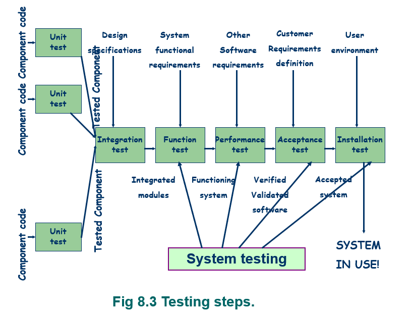

程序测试：单元测试 + 集成测试 (*本章*)
系统测试：功能测试 + 性能测试 + 验收测试 + 安装测试

### 测试态度

将测试看成为一个发现的过程，而不是验证自己代码的正确性、技术、能力
测试希望系统可以在任何情况下都能正常运行，但这有的时候与现实相违背

正确的态度：
egoless programming：将程序视作整个系统的一部分，而不属于那个写程序的人
不能只关注被测试的程序是否满足了解决方案，而是同时考虑问题本身

### 测试人员

——独立的开发团队

测试团队独立的原因：

- 开发人员可能担心发现系统故障影响自己的业绩，独立的测试团队避免了故障的个人责任与尽可能多的发现故障的需要之间的冲突
- 独立团队因为和代码不是太过紧密，所以能更加的客观，有更多的机会发现细微的故障
- 独立的测试团队可以参与软件开发的整个过程，测试可以和编码并行的进行

### 测试的方法

#### 黑盒 black box

定义：不知道程序的内部逻辑结构和内部特性，参考系统需求、系统设计、程序设计文档，测试程序的功能是否符合它的功能说明
向黑盒提供输入数据，记录产生的输出

优点：不会受到测试对象的内部结构和逻辑所带来的约束，只使用有代表性的测试用例

缺点：不容易用这种方法进行完备的测试，即无法生成一组用例证明所有情况下功能都是正确的；以SRS及SAD等文档作为依据，有一定的盲目性和不确定性，不可能揭示所有的错误

#### 白盒 white box

定义：以测试对象的内部结构为基本依据，手工或自动的展开各种测试

优点：可以测试一个模型的细节

缺点：内部逻辑过于复杂时，想要测试所有的分支不太现实

实际测试中，没有必要把黑盒测试和白盒测试严格的区分开来；具体的测试方法的选择受到很多因素的影响：

- 所有可能的逻辑路径数量
- 输入数据的代表性
- 功能的计算量
- 算法的复杂度

## 8.3 单元测试

Unit Testing

单元测试的步骤：
1. 静态检查代码，与需求设计比较
2. 对代码进行编译和debug
3. 寻找测试用例并测试

### 检查代码

Examining the Code

本过程称为**代码复审 code review**：

由一组客观的专家，对代码和其文档进行复审，找到误解、不一致、性能等故障

两类代码复审：

- 代码走查 code walkthrough：非正式，只标注
- 代码检查 code inspection：正式；评审小组根据准备好的关注点列表检查代码和文档
流程：开会、检查和标记、开会讨论故障

代码复审的好处：更早的检查出故障，带来更小的损失
*其实在哪个阶段都有复审：需求、设计、编码等等*

### 测试程序模块

Testing Program Components

#### 选择测试用例

测试用例 test case：以测试程序为目的，而挑选的输入数据和其对应的期望结果
下图为测试报告

**给出测试用例的方法**

黑盒：根据SRS和其他文档

- 等价分类法：把输入分割成等价类，每一个测试用例都代表了一类与它等价
的其他例子；如果测试用例没有发现错误，那么对应的等价例子也不会发生错误；
分类满足以下标准：
    - 每个可能的输入比属于某个分类
    - 各个分类之间没有交集
    - 每个类的特定测试用例可以代表这个类

- 边界值分析法：把测试值选在等价类的边界上
- 错误猜测法：猜测程序中哪些地方容易出错，并据此设计测试用
- 因果图法：适用于被测试程序有很多输入条件，程序的输出又依赖输入条件的各种组合

白盒：根据模块的内部逻辑

- 4种逻辑覆盖方法：语句覆盖、判定(分支)覆盖、条件覆盖、条件组合覆盖
- 3种路径覆盖方法：节点、边、路径

黑盒与白盒法相结合产生测试用例

#### 测试的彻底性

白盒测试，因为我们需要直到程序的内部结构

**语句 (覆盖)测试：**给出的测试用例能使模块中所有语句至少执行一遍
1 2 3 4 5 6 7

**分支测试：**对代码中的每个判断点，每个分支在测试中至少选择一次
1 2 3 4 5 6 7
1 2 4 5 6 1

**路径测试：**代码的每一条不同路径在测试中至少执行一次
1 2 4 5 6 1 
1 2 3 4 5 6 1
1 2 4 5 6 7
1 2 3 4 5 6 7

一般情况：语句测试的测试用例最少，分支测试较多，路径测试最多

## 8.4 集成测试

Integration Testing

目标：得到一个正常运作的系统

对构件组合和测试的策略很重要：

- 发生故障时，根据单元集成的方式找到原因
- 该策略会影响集成的时间和编码顺序
- 影响测试用例的选择
- 影响测试的成本和彻底性

### 由低向上集成测试

**含义：**模块结构图最底层的构件先被单独测试，由下而上测试那些调用已测试构件的构件，重复执行直到全部模块组装完毕

**构件驱动模块 component driver：**

代替上层模块，对特定构件进行调用并传递测试用例的程序

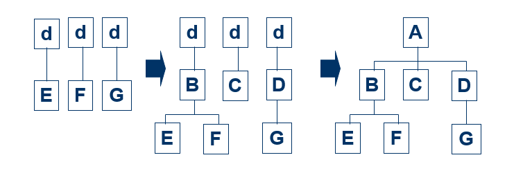

**优点：**

- 容易生成测试用例：因为每次测试的底层模块都是真实的
- 很适合面向对象的程序：每次加入的是经过测试的真实对象，符合消息的正向传递方式
- 适合大多数底层构件经常被别的模块调用的场景

**缺点：**顶层构件通常是最重要的，但是却是最后测试的，最重要的高层故障无法得到尽早地修正

### 自顶向下集成测试

Top-Down Integration

**含义：**从顶层控制组件开始，首先对它本身进行测试，然后将被测组件调用的下级组件组合起来，对这个更大的子系统进行测试，反复采用这种组装方法，直到包含了所有组件为止

**桩 stub：**

正在测试的构件可能会调用还未测试的构件
编写一种专用程序，用于模拟测试时缺少构件时的活动，代替下层模块进行应答
桩会应答调用序列，并传回输出数据，使测试能够正常的进行下去

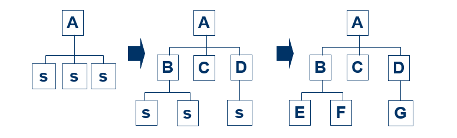

**优点：**或主要问题可以在测试的早期得到处理

**缺点：**

- 会很难生成测试用例
- 会需要编写很多桩程序

### 莽撞测试 / 一次性集成测试

Big-bang Integration

含义：分别测试每一个构件，然后将所有构件组合一次性地进行集成测试

缺点：

- 测试一个构件可能同时需要桩和程序驱动
- 发生故障时很难找到原因
- 很难讲接口故障和其他故障区区分开

### 混合方式测试 / 三明治集成测试

含义：

- 将系统分成三层，目标层处于中间、目标层上有一层，目标层下有一层
- 在顶层采用自顶向下的方式集成
在较低层采用自底向上的方式集成

- 测试集中于目标层

**集成策略的比较**

集成策略的选择不仅依赖于系统特性，还依赖于客户的期望

### 集成测试中的具体措施

Integration Test practical Strategies 

- 深度优先策略：首先集成一个主控路径下的所有模块，然后选择其他路径进行集成，直到全部模块集成完毕
- 广度优先策略：将软件结构中每一层次所有直接隶属于上层的模块集成起来进行测试，然后进行另一个层次的测试，直到全部模块集成完毕

以上两种策略并不区分是自顶向下还是自底向上，根据两者其一的选择，要采用相应的驱动模块或桩模块

## 8.5 测试面向对象系统

OO测试有独特的特点，测试的时候需要一些额外的步骤

###　代码测试

OO测试不仅仅局限于对象中方法本身的测试，还需关注界面类、控制类、实体类等的交互

**对象的缺陷 (故障)**

对象和类的检查不止在设计阶段的静态检查过程中，更多是在测试阶段才能发现不合理性，接着需要调整

- 不对称或不合理的关联 / 继承
- 一个类中存在关系不密切的属性和动作
- 一个类担任两个以上角色
- 操作目标不明确 (例如: 某个类没有合适的方法等)
- 发现两个同名的或同目的的关联关系
- 等等

**消息的测试**

OO测试中涉及到测试类所需的对象状态及其交互协作关系，需要对消息进行较全面的测试

### 传统测试和OO测试的区别

- 系统发生变动时
传统测试：测试发生变化的代码 + 原先的测试用例
OO测试：重新测试那些对父类进行override重载的子类，可能会用到不同的测试用例

- 面向对象趋向于小粒度：单元测试较容易
传统中在构件内的复杂性转移到构件之间的接口上：集成测试更广泛

**OO测试难处 = 传统和OO的区别**

- 需求分析和验证：需求文档的验证缺乏工具支持 (依赖人工)
- 测试用例生成：用测试工具生成的测试用例，处理OO模型中的对象和方法时，会缺少针对性
- 源代码分析：传统的测试方法在评价OO系统的规模和复杂性时，不是很有效
- 覆盖分析：对象的交互是OO系统复杂性的根源，传统覆盖分析等测试方法的作用有限

## 8.6 测试计划

对以下测试步骤做出测试计划：

1. 指定测试目标：总体计划、进度安排、优先级、量化指标等等
2. 用例的分类设计：选择分类方法、附加方法等，完成分类任务
3. 书写测试用例
4. 编写测试用例
5. 运行测试用例
6. 评价测试结果 

**测试计划：**描述我们将以何种方式向用户证明软件运转正确

**制定测试计划需要：**了解需求、功能规格说明、系统设计和代码的模块层次结构

**计划的内容**

① 测试目标和测试用例

量化的测试目标，针对测试目标制定的具体步骤，结束测试的原则等
分类、设计测试用例，选择有代表性的测试用例

② 方法和技术

集成方法、复审方法、各种的测试报告

③ 测试用例的细节

# 9 Testing the System

## 9.1 系统测试的原理

- 单元和集成测试的目标：确保程序满足设计师的设计要求
- 系统测试的目标：确保系统满足客户的需求

### 软件缺陷的来源

- 测试的目标：消除所有会导致失效 failure的缺陷 fault

- 软件缺陷可能存在于软件设计开发过程中的任何一个部分：

- 对测试的要求：彻底性；让用户、客户、开发任意满意

### 系统测试步骤

**系统测试步骤和各阶段的目标**

- 功能测试：由开发人员检查\<SRS>
- 性能测试：由开发人员检查\<SRS>
- 验收测试：由开发人员和用户检查\<需求定义>
- 安装测试：在用户环境中测试

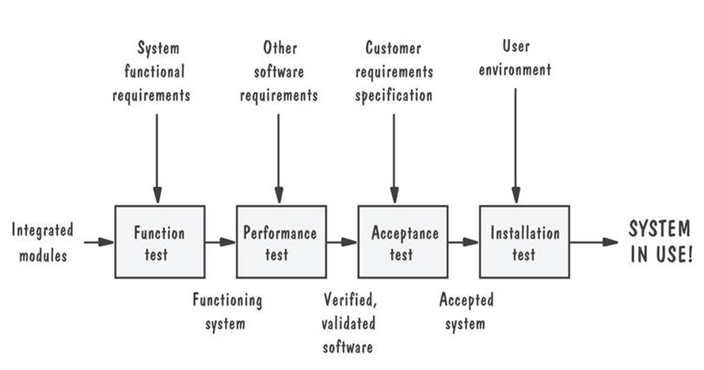

**构造计划**

- 对大型系统的系统测试：阶段化测试；划分成嵌套的子系统
- 构造计划：对大型系统构件增量式的测试计划

### 配置管理

- 系统配置：交付给特定客户的一系列部件的集合
- 配置管理：对系统不同软件配置的管理及控制方法，通过控制系统差别以降低风险，减少错误
重要性：协调测试人员与开发人员之间的工作，从而获取有效配置

**配置管理(SCM)计划**

SCM 流程旨在确保在任何时候产品的内容都是已知的、可用的，以及在设计到实施的过程中，产品的功能都是可跟踪的，可以完全控制和保护产品的内容。

基线：软件文档和其他资料的集合，代表了产品在某一时间点的情况

**版本和改进版本**

- 版本 version：针对特定系统的特定配置
- 改进版本 / 发布release：针对旧版本的改进版本
Version n.m=Version n and release m 

- 在系统测试中配置管理的目标：获得测试的准确性和及时性

**回归测试**

用于新版本或者改进版本的一种测试，确保新旧功能的正确运行，同时使用新旧测试用例
大型系统的配置更动测试只是“部分”回归测试

**变更控制**

系统测试发现缺陷之后会对其进行纠正，从而导致系统发生变更，这需要在配置管理团队的控制之下进行

变更带来的问题：

- 改变系统的所有部分：影响所有的文档和开发人员
- 多个开发人员共同更改系统时，一个人的工作可能会影响别人

变更控制：配置管理小组采取措施，使不同开发者各自修改后的版本统一为一个版本
开发者不同时修改的软件同一部分，或进行额外行为

### 测试团队

- 单元和集成测试：主要为开发人员
- 功能和性能测试：主要为开发人员
- 验收和安装测试：主要为用户
- 程序员不能参与测试自己负责的模块

**测试人员的几种类型**

- 专业测试人员：组织并运行测试，还需要包括参与前面工作的分析人员、程序员、设计人员
- 创建需求的分析员
- 了解SRS和解决方案的系统设计人员
*设计是将需求转变成解决方案的过程，见5.1*

- 控制软件边工的配置管理专家
- 用户：对新出现的问题进行评价

## 9.2 功能测试

### 含义和作用

含义：对SRS中的功能需求进行测试 (黑盒)

作用：有很大的可能性找到缺陷

指导原则 (功能测试应满足)：

- 较高的查错概率
- 独立的测试团队
- 了解预期的输出结果
- 对合法与非法的输入都予以测试
- 不能仅仅为了测试的方便而修改系统
- 停止测试应该有前提条件

### 因果图

## 9.3 性能测试

### 含义与作用

- 含义：对SRS中的非功能需求进行测试
- 确保这个系统的可靠性、可用性与可维护性
- 由测试小组进行设计和执行并将结果提供给客户

### 性能测试的类型

- 压力测试：在短时间内加载极限负荷, 以验证系统能力
- 容量测试：验证系统处理巨量数据的能力
- 配置测试：构建测试用例，对系统软硬件的各种配置(最小到最大)进行测试
- 兼容性测试：测试接口等
- 回归测试：使用新的和旧的测试用例
- 安全测试：根据安全需求
- 计时测试
- 环境测试
- 质量测试
- 恢复测试
- 人为因素测试：用户界面；可使用性

性能测试比功能测试更难，需求要足够清晰、易于测试，需求质量通常可以反映在性能测试的容易度上

## 9.4 可靠性，可用性，可维护性

- 可靠性：软件系统在给定的时间间隔和给定条件下运行成功的概率 0~1
- 可用性：软件系统在给定的时间点（按SRS要求）成功运行的概率 0/1
- 可维护性：在给定的使用条件（预定的时间间隔、维护程序、维护资源之下进行维护）下，维护活动能被执行的概率 0~1

失效数据：根据失效记录，来理解系统的不确定性，以此理解系统可靠性的改进程度

## 9.5 验收测试

- 含义：客户在需求定义中检查系统是否满足需求
- 客户的职责更大：对验收测试结果进行编写、执行和评估
开发人员职责较少：在客户需要的时候对技术问题进行解释

### 验收测试的种类

- 基准测试 benchmark test：客户准备测试用例 (正式的用例)，在实际安装后的系统运作，用户对执行情况进行评估
- 引导测试 pilot test：在试验的环境上安装系统，依赖于日常工作，没有正式的测试用例
$\alpha$测试：在组织内由开发人员实施的引导测试
$\beta$测试：在工作场所进行由客户进行的引导测试

- 并行测试：新老版本并行运转，使用户逐渐适应新版软件系统
适用于分阶段的开发模型
新系统与先前版本并行运行（没有正式的测试用例）

### 验收测试的结果

客户根据验收测试的结果，将告诉开发方哪些需求没有得到满足，哪些是因为需求变化而必须删除、修改或增加，配置管理人员将配合记录软件所有阶段的变更

## 9.6 安装测试

- 含义：在用户的环境中进行测试，解决由开发环境和用户环境之间差异所引起的问题
- 关注
	- 完整性：系统的功能和非功能特征
	- 验证：工作现场的最终检查

